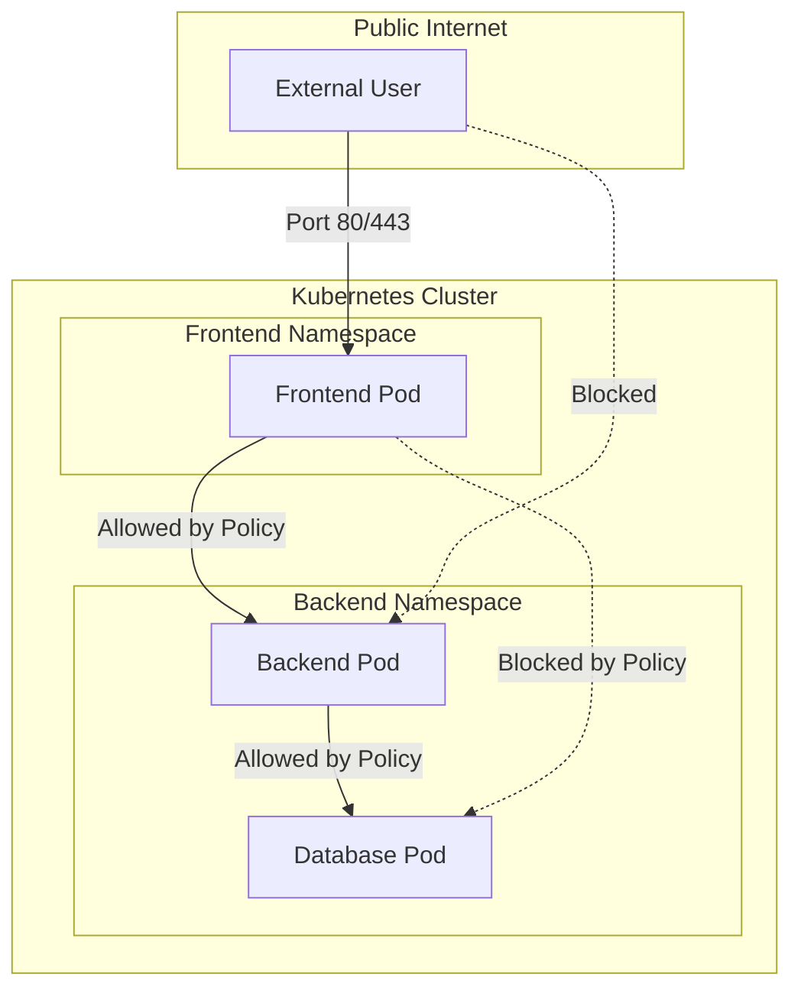

# Network Security (NetworkPolicies)

### **Summary**
Kubernetes **NetworkPolicies** are an application-centric firewall mechanism that controls traffic flow at OSI Layer 3 or 4. By default, pods are non-isolated and accept traffic from any source; however, once a `NetworkPolicy` selects a pod, it becomes isolated, rejecting all traffic not explicitly allowed. These policies use labels to select pods and define rules for allowed traffic, enabling a **Zero Trust** security model within the cluster.

---

### **Detailed Explanation**

#### **What are NetworkPolicies?**
NetworkPolicies are Kubernetes resources that allow you to control the flow of IP packets at the port level. They are similar to security groups in cloud providers but are managed via Kubernetes manifests.

#### **Why use them?**
- **Isolation**: Prevent a compromised frontend pod from reaching sensitive backend services or databases it shouldn't access.
- **Compliance**: Meet regulatory requirements by ensuring strict network boundaries between different application tiers.
- **Multi-tenancy**: Isolate namespaces or teams sharing the same cluster.
- **Zero Trust**: Move away from a "flat network" where everything can talk to everything.

#### **How they work**
1. **Pod Selection**: Uses `podSelector` (labels) to determine which pods the policy applies to.
2. **Policy Types**: Can be `Ingress` (incoming traffic), `Egress` (outgoing traffic), or both.
3. **Rules**: Defined using a combination of:
    - `podSelector`: Traffic to/from pods with specific labels.
    - `namespaceSelector`: Traffic to/from all pods in specific namespaces.
    - `ipBlock`: Traffic to/from specific IP ranges (CIDR).

> [!IMPORTANT]
> **Enforcement**: NetworkPolicies are **not** enforced by the Kubernetes API server itself. They require a **Network Plugin (CNI)** that supports enforcement, such as **Calico**, **Cilium**, **Antrea**, or **Kube-router**. If your CNI doesn't support them, the policies will be ignored.

#### **Visualizing Traffic Flow**



---

### **Go Application**

Go developers often interact with NetworkPolicies when building **Operators**, **Admission Controllers**, or **Automated Security Tooling**. The `k8s.io/api/networking/v1` package provides the necessary types.

#### **Example: Programmatically Creating a NetworkPolicy**

```go
package main

import (
	"context"
	"fmt"

	networkingv1 "k8s.io/api/networking/v1"
	metav1 "k8s.io/apimachinery/pkg/apis/meta/v1"
	"k8s.io/client-go/kubernetes"
)

// createDenyAllPolicy demonstrates how to define a 'Default Deny' policy in Go.
func createDenyAllPolicy(clientset *kubernetes.Clientset, namespace string) error {
	policy := &networkingv1.NetworkPolicy{
		ObjectMeta: metav1.ObjectMeta{
			Name: "default-deny-all",
		},
		Spec: networkingv1.NetworkPolicySpec{
			// Empty podSelector selects all pods in the namespace
			PodSelector: metav1.LabelSelector{},
			// Applying to both Ingress and Egress
			PolicyTypes: []networkingv1.PolicyType{
				networkingv1.PolicyTypeIngress,
				networkingv1.PolicyTypeEgress,
			},
		},
	}

	_, err := clientset.NetworkingV1().NetworkPolicies(namespace).Create(
		context.TODO(), 
		policy, 
		metav1.CreateOptions{},
	)
	return err
}

func main() {
	fmt.Println("This snippet shows the internal Go structure for K8s NetworkPolicies.")
}
```

---

### **Interview Questions**

1. **What is the default behavior for pod-to-pod communication in Kubernetes if no NetworkPolicies are defined?**
   - By default, all pods can communicate with all other pods in the cluster across all namespaces (non-isolated).

2. **How do you implement a "Default Deny" policy for a namespace?**
   - You create a NetworkPolicy with an empty `podSelector: {}` (which selects all pods) and specify `policyTypes: ["Ingress", "Egress"]` without defining any allowed rules.

3. **If a pod is selected by multiple NetworkPolicies, how are the rules applied?**
   - The rules are **additive**. If any policy allows the traffic, it is permitted. It is a logical `OR` across all applicable policies.

4. **Why might a NetworkPolicy appear to be ignored even if the syntax is valid?**
   - The most common reason is that the cluster's **CNI plugin** (e.g., standard Flannel) does not support NetworkPolicy enforcement. You must use a CNI like Calico or Cilium.

5. **Can a NetworkPolicy target a Service name instead of a Pod?**
   - No. NetworkPolicies target **Pods** via labels. While traffic might flow through a Service, the policy is enforced at the pod/interface level.
