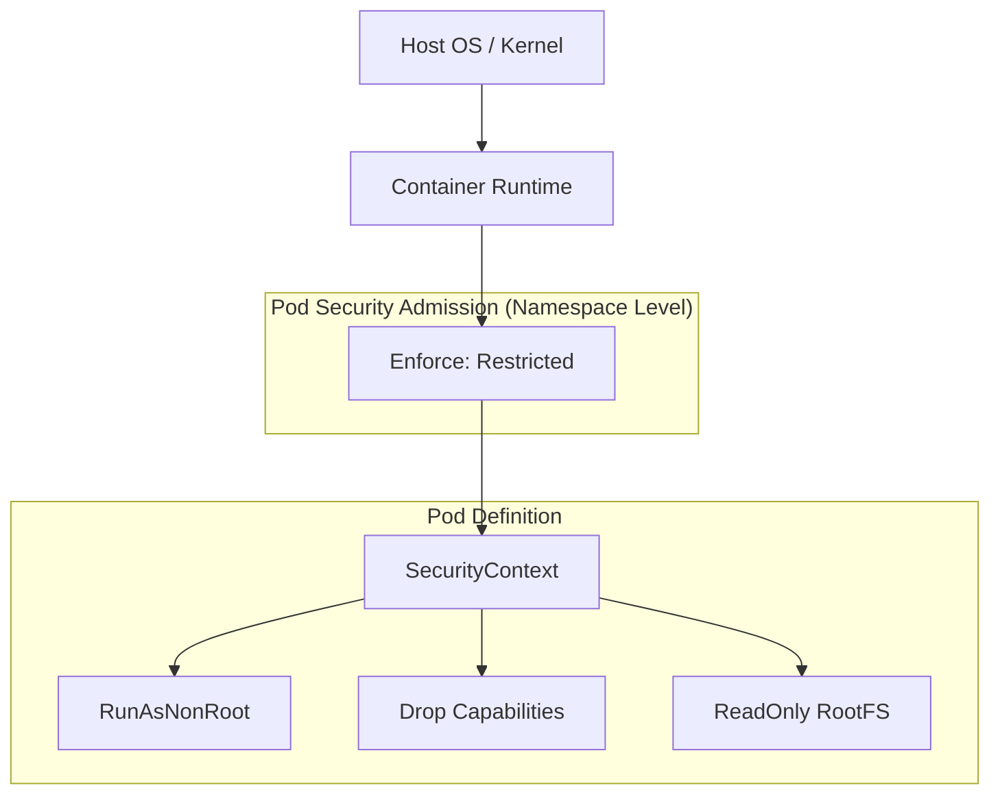

# Container and Pod Security

## Summary
Container and Pod security in Kubernetes is primarily managed through **SecurityContext** settings and enforced via **Pod Security Standards (PSS)**. A SecurityContext defines privilege and access control settings for a Pod or individual containers, such as user IDs, group IDs, and Linux capabilities. Pod Security Standards provide a framework of predefined security profiles (Privileged, Baseline, and Restricted) that are enforced using the built-in **Pod Security Admission** controller. Together, these tools ensure that workloads adhere to the principle of least privilege and prevent common attack vectors like container breakouts.

## Detailed Explanation

### **SecurityContext**
A `SecurityContext` defines privilege and access control settings for a Pod or Container.

*   **PodSecurityContext**: Applies to all containers in a Pod (e.g., `fsGroup`, `runAsUser`).
*   **Container SecurityContext**: Applies to a specific container (e.g., `capabilities`, `readOnlyRootFilesystem`).

**Key Settings:**
*   `runAsUser` / `runAsGroup`: Forces the container to run as a specific non-root user/group.
*   `allowPrivilegeEscalation`: Prevents a process from gaining more privileges than its parent (set to `false`).
*   `readOnlyRootFilesystem`: Mounts the container's root filesystem as read-only.
*   `capabilities`: Fine-grained control to add or drop Linux capabilities (e.g., `DROP ALL`).

### **Pod Security Standards (PSS)**
PSS defines three policies to broadly cover the security spectrum:

1.  **Privileged**: Unrestricted policy, typically for system-level logging agents or storage drivers.
2.  **Baseline**: Minimally restrictive policy which prevents known privilege escalations. Allows the default (minimally specified) Pod configuration.
3.  **Restricted**: Heavily restricted policy, following current Pod hardening best practices. Requires pods to drop capabilities, run as non-root, and disallow privilege escalation.

### **Pod Security Admission (PSA)**
PSA is the built-in admission controller that enforces PSS. It is controlled via namespace labels:

```yaml
apiVersion: v1
kind: Namespace
metadata:
  name: secure-ns
  labels:
    pod-security.kubernetes.io/enforce: restricted
    pod-security.kubernetes.io/enforce-version: latest
    pod-security.kubernetes.io/warn: restricted
```

### **Security Layers Diagram**



---

## Go Application

For Go developers, security starts with the **Dockerfile** and ends with the **Deployment manifest**. Since Go applications often compile into static binaries, they are perfect candidates for "Distroless" or "Scratch" images, which drastically reduce the attack surface.

### **1. Secure Dockerfile (Distroless)**
```dockerfile
# Build Stage
FROM golang:1.21 as builder
WORKDIR /app
COPY . .
# CGO_ENABLED=0 ensures static binary
RUN CGO_ENABLED=0 go build -o main .

# Runtime Stage - Distroless
# 'nonroot' user is built-in
FROM gcr.io/distroless/static:nonroot
WORKDIR /
COPY --from=builder /app/main .
USER 65532:65532
ENTRYPOINT ["/main"]
```

### **2. Secure Deployment Manifest**
This manifest is compatible with the **Restricted** PSS profile.

```yaml
apiVersion: apps/v1
kind: Deployment
metadata:
  name: secure-go-app
spec:
  template:
    spec:
      securityContext:
        runAsUser: 65532
        runAsGroup: 65532
        fsGroup: 65532
      containers:
      - name: app
        image: my-secure-go-app:v1
        securityContext:
          allowPrivilegeEscalation: false
          readOnlyRootFilesystem: true
          runAsNonRoot: true
          capabilities:
            drop:
            - ALL
```

---

## Interview Questions

**Q: What is the difference between `runAsUser` defined in the Pod security context vs. the Container security context?**
**A:** If `runAsUser` is defined in the Pod security context, it applies to all containers in the Pod. If it is also defined in a Container's security context, the Container setting takes precedence (overrides) the Pod setting for that specific container.

**Q: Why should you set `allowPrivilegeEscalation: false` even if you are not running as root?**
**A:** Even non-root processes can sometimes escalate privileges via setuid or setgid binaries present in the filesystem. Setting this to `false` ensures the `no_new_privs` flag is set on the container process, blocking any child process from gaining more privileges than its parent, regardless of the binary execution.

**Q: What happened to PodSecurityPolicies (PSP)?**
**A:** PodSecurityPolicies (PSP) were deprecated in Kubernetes 1.21 and removed in 1.25 due to usability issues and confusing authorization models. They have been replaced by **Pod Security Admission (PSA)**, which uses the simpler Pod Security Standards (PSS) profiles controlled via namespace labels.

**Q: How does `readOnlyRootFilesystem: true` improve security?**
**A:** It prevents the attacker from modifying the application binary or system files if they manage to break into the container. It forces the application to be stateless and write any temporary data to explicitly mounted volumes (like `emptyDir`), which is a security best practice.

**Q: What is a "Distroless" image and why is it good for Go apps?**
**A:** Distroless images contain only the application and its runtime dependencies, without package managers, shells, or any other programs found in a standard Linux distribution. For Go, `distroless/static` is ideal because it's extremely small and removes the shell, making it much harder for attackers to execute commands inside the container (e.g., no `/bin/sh`).
