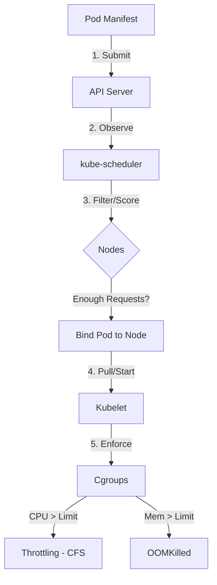

# Setting Resource Requests and Limits

## Summary
Resource requests and limits are the primary mechanism in Kubernetes for managing compute resources like CPU and memory. **Requests** represent the minimum guaranteed resources used for scheduling, while **Limits** define the maximum threshold a container can consume. Proper configuration prevents "noisy neighbor" effects, ensures system stability, and allows the Go runtime to optimize its garbage collection and scheduling behavior.

## Detailed Explanation

### What are Requests and Limits?

In Kubernetes, you define resource requirements at the container level:

- **Requests**: The amount of a resource that the system guarantees to a container. The `kube-scheduler` uses this value to determine which node has enough available capacity to host the Pod.
- **Limits**: The maximum amount of a resource that a container is allowed to use. The `kubelet` enforces these limits using Linux Control Groups (cgroups).

### Why use them?

1. **Scheduling Efficiency**: Prevents over-committing nodes by giving the scheduler accurate data.
2. **Predictability**: Ensures critical workloads have the resources they need.
3. **Cost Optimization**: Helps in right-sizing clusters based on actual usage.
4. **Stability**: Prevents a single misbehaving container from consuming all node resources (OOM-killing other processes or throttling the CPU).

### How it Works (Architecture)



### Resource Types

#### 1. CPU (Compressible)
- Measured in **millicores** (e.g., `500m` = 0.5 CPU).
- If a container exceeds its limit, Kubernetes **throttles** it using Completely Fair Scheduler (CFS) quotas. The process slows down but doesn't crash.

#### 2. Memory (Incompressible)
- Measured in bytes (e.g., `256Mi`, `1Gi`).
- If a container exceeds its limit, the kernel triggers an **Out-of-Memory (OOM)** event. The container is usually terminated with exit code 137 (`OOMKilled`).

---

## Go Application

For Go developers, Kubernetes resource limits have a profound impact on how the runtime behaves.

### 1. GOMAXPROCS and CPU Limits
By default, the Go runtime sees the total number of CPUs available on the node, not the container limit. If a Pod has a `limit: 1` but runs on a 64-core node, Go will spawn 64 P-threads, leading to massive CFS throttling as the OS tries to keep the process within its 1-core quota.

- **Solution (Go 1.25+)**: Go is now "container-aware" by default. It automatically detects the cgroup quota and sets `GOMAXPROCS` accordingly.
- **Solution (Pre-1.25)**: Use the `go.uber.org/automaxprocs` library.

```go
import _ "go.uber.org/automaxprocs"

func main() {
    // Your application code
}
```

### 2. GOMEMLIMIT (Go 1.19+)
Before Go 1.19, the Garbage Collector (GC) was unaware of memory limits, leading to many `OOMKilled` errors because the GC didn't trigger frequently enough.

Setting `GOMEMLIMIT` allows you to define a soft memory limit for the Go runtime. It should typically be set to ~90% of your Kubernetes memory limit.

```go
import "runtime/debug"

func init() {
    // Setting GOMEMLIMIT to 900MiB for a 1GiB K8s limit
    debug.SetMemoryLimit(900 * 1024 * 1024) 
}
```

---

## Interview Questions

### 1. What happens if you set a Limit but no Request?
Kubernetes will automatically set the Request equal to the Limit. This puts the Pod in the **Guaranteed** Quality of Service (QoS) class (if both CPU and Memory are set this way).

### 2. What is the difference between Throttling and OOMKilling?
**Throttling** applies to CPU (compressible resource). The process is slowed down but continues to run. **OOMKilling** applies to Memory (incompressible resource). The process is terminated by the kernel to protect the rest of the system.

### 3. Why might a Go application's latency spike when hitting CPU limits?
This is usually due to **CFS Throttling**. If `GOMAXPROCS` is higher than the CPU limit, the Go scheduler spreads work across many threads. The OS quota is consumed quickly, and the entire process is paused for the remainder of the CFS period, causing high tail latency (P99).

### 4. How does the "Guaranteed" QoS class differ from "Burstable"?
- **Guaranteed**: Requests == Limits for all containers. Highest priority; last to be evicted.
- **Burstable**: Requests < Limits. Some resources are guaranteed, but the Pod can burst.
- **BestEffort**: No requests or limits. Lowest priority; first to be evicted.

### 5. How does GOMEMLIMIT interact with GOGC?
`GOMEMLIMIT` acts as a soft floor for the GC. Even if `GOGC` (target percentage) hasn't been reached, the GC will trigger to prevent the heap from exceeding the `GOMEMLIMIT`, preventing OOM situations in memory-constrained environments.
