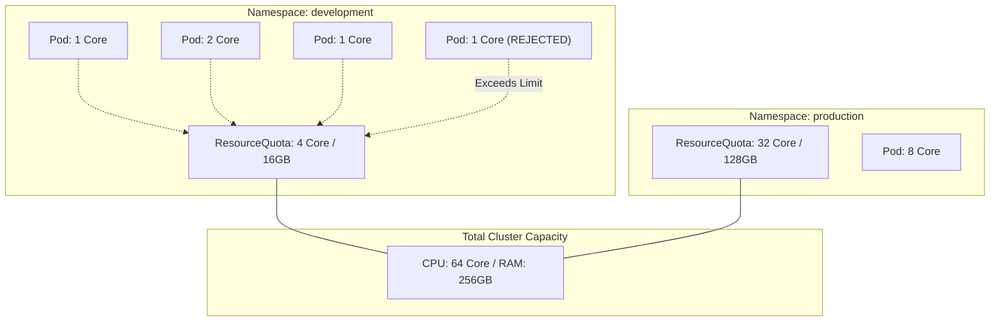

# Assigning Quotas to Namespaces

## Summary
Resource Quotas are a fundamental tool for Kubernetes administrators to manage and restrict aggregate resource consumption within a specific namespace. By defining a `ResourceQuota` object, teams can share a single cluster while ensuring that no single namespace consumes more than its fair share of CPU, memory, storage, or total object counts. This mechanism is essential for multi-tenant environments to maintain stability and prevent "noisy neighbor" issues where one application starves others of resources.

## Detailed Explanation

### What is a ResourceQuota?
A **ResourceQuota** is a namespace-scoped API object that provides constraints on the total resource consumption per namespace. It aggregates the requests and limits of all pods and other objects within that namespace and compares them against predefined thresholds.

### Why Use ResourceQuotas?
*   **Multi-tenancy**: Safely host multiple teams or projects on the same physical infrastructure.
*   **Prevent Resource Exhaustion**: Stop a single buggy application or aggressive development team from taking down the entire cluster.
*   **Cost Control**: In cloud environments, quotas help map resource allocation to budget constraints.
*   **Capacity Planning**: Allows administrators to divide a large cluster into smaller, manageable virtual "slices".

### How It Works
When a request to create or update an object (like a Pod) is made, the Kubernetes admission controller checks if the new resource requirements would cause the namespace to exceed its active `ResourceQuota`. If it does, the request is rejected immediately.

#### Types of Quotas
1.  **Compute Resources**: Limits for CPU and Memory (both `requests` and `limits`).
2.  **Storage Resources**: Limits on total storage requests and the number of PersistentVolumeClaims (PVCs).
3.  **Object Counts**: Limits on the number of Pods, Services, ConfigMaps, Secrets, etc.
4.  **Extended Resources**: Limits for custom resources like GPUs.

### Mermaid Diagram



## Go Application

Go developers interacting with Kubernetes clusters often need to programmatically inspect or manage quotas, especially when building custom CI/CD pipelines or internal developer platforms.

### Using client-go to Inspect Quotas
The following example demonstrates how to retrieve a `ResourceQuota` and compare its "Hard" limits against currently "Used" resources.

```go
package main

import (
	"context"
	"fmt"
	"log"
	"os"

	metav1 "k8s.io/apimachinery/pkg/apis/meta/v1"
	"k8s.io/client-go/kubernetes"
	"k8s.io/client-go/tools/clientcmd"
)

func main() {
	// Use kubeconfig from environment or default path
	kubeconfig := os.Getenv("KUBECONFIG")
	config, err := clientcmd.BuildConfigFromFlags("", kubeconfig)
	if err != nil {
		log.Fatalf("Error building kubeconfig: %v", err)
	}

	clientset, err := kubernetes.NewForConfig(config)
	if err != nil {
		log.Fatalf("Error creating clientset: %v", err)
	}

	ns := "team-alpha"
	quotaName := "compute-resources"

	// Fetch the ResourceQuota object
	rq, err := clientset.CoreV1().ResourceQuotas(ns).Get(context.TODO(), quotaName, metav1.GetOptions{})
	if err != nil {
		log.Fatalf("Failed to get ResourceQuota: %v", err)
	}

	fmt.Printf("Quota Status for Namespace: %s\n", ns)
	fmt.Println("-------------------------------------------------")
	
	// Iterate through all defined resources in the quota
	for resourceName, hardLimit := range rq.Status.Hard {
		used := rq.Status.Used[resourceName]
		fmt.Printf("Resource: %-15s | Used: %-10s | Limit: %-10s\n", 
			resourceName, used.String(), hardLimit.String())
	}
}
```

## Interview Questions

1.  **Q: What is the behavior of Kubernetes when a Pod creation request exceeds the ResourceQuota?**
    *   **A**: The API server returns a `403 Forbidden` response. The message will explicitly state which resource limit was hit (e.g., "forbidden: exceeded quota: compute-resources, requested: pods=1, used: pods=10, limited: pods=10").

2.  **Q: Can a ResourceQuota be applied to multiple namespaces simultaneously?**
    *   **A**: No. `ResourceQuota` is a namespace-scoped resource. To apply quotas across multiple namespaces, you must create a `ResourceQuota` object in each individual namespace or use a `ClusterResourceQuota` (available in OpenShift or via specific CRDs/Admission Controllers).

3.  **Q: How do ResourceQuotas interact with LimitRanges?**
    *   **A**: They are complementary. A **LimitRange** enforces constraints on *individual* containers (e.g., "no container can ask for more than 2 CPUs"), while a **ResourceQuota** enforces constraints on the *sum* of all resources in the namespace (e.g., "the total CPU used by all containers cannot exceed 20 CPUs").

4.  **Q: Does updating a ResourceQuota affect Pods that are already running?**
    *   **A**: No. ResourceQuotas are only checked during object creation or update. If you lower a quota below current usage, existing Pods will continue to run, but no new Pods can be created until enough existing ones are deleted to bring the total usage back under the new limit.

5.  **Q: What are 'Scopes' in a ResourceQuota?**
    *   **A**: Scopes allow you to apply quotas only to specific sets of resources. Common scopes include `Terminating` (pods with a `activeDeadlineSeconds` set), `NotTerminating`, `BestEffort` (pods with no requests/limits), and `NotBestEffort`.
