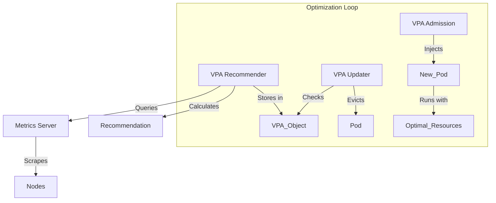

# Monitoring and Optimizing Resource Usage

## Summary
Monitoring and optimizing resource usage in Kubernetes is critical for ensuring application performance and cost efficiency. The **Metrics Server** serves as a lightweight, short-term storage for resource metrics like CPU and memory, enabling core components like `kubectl top` and autoscalers to function. Building on this, the **Vertical Pod Autoscaler (VPA)** automates the "rightsizing" of workloads by observing real-world usage and adjusting resource requests and limits accordingly. Together, these tools move clusters away from manual "guesstimation" toward data-driven, automated resource management.

## Detailed Explanation

### 1. The Foundation: Metrics Server
The Metrics Server collects resource metrics from Kubelets and exposes them via the `metrics.k8s.io` API.
*   **Purpose**: Enabling Autoscaling (HPA/VPA) and `kubectl top`.
*   **Limitation**: It is *not* a long-term storage solution (like Prometheus). It only holds recent data points.

### 2. Vertical Pod Autoscaler (VPA)
VPA frees users from manually setting CPU and memory requests. It has three components:
*   **Recommender**: Monitors history and calculates recommended values.
*   **Updater**: Evicts pods that need updates (e.g., if their current requests differ significantly from recommendations).
*   **Admission Controller**: Intercepts Pod creation to inject the recommended requests.

**Modes of Operation:**
*   `Off`: Only recommends values; does not apply them. Good for initial analysis ("Dry Run").
*   `Initial`: Applies recommendations only when a Pod is created.
*   `Auto`: Applies recommendations at creation and can evict running Pods to update them.

### Optimization Workflow



---

## Go Application Optimization

For Go developers, optimizing for Kubernetes involves tuning the runtime to match the container environment.

### 1. Profiling with pprof
Before letting VPA resize your app, you must understand *why* it consumes resources. Go has a built-in profiler.

```go
import _ "net/http/pprof"

func main() {
    // Expose pprof endpoint
    go func() {
        log.Println(http.ListenAndServe("localhost:6060", nil))
    }()
    // ... app logic
}
```
Use `kubectl port-forward` to access `http://localhost:6060/debug/pprof/` and analyze CPU/Memory hotspots.

### 2. Profile-Guided Optimization (PGO)
Starting with Go 1.20+, you can use production profiles to optimize your binary compilation.
1.  Collect a `cpu.pprof` from your production K8s pod.
2.  Build your app with `-pgo=cpu.pprof`.
3.  **Result**: Often 5-10% CPU reduction, allowing you to lower Kubernetes limits.

### 3. Automaxprocs
Ensure your Go app respects CPU quotas to avoid throttling latency spikes.
```go
import _ "go.uber.org/automaxprocs"
```

---

## Interview Questions

### 1. What is the difference between Metrics Server and Prometheus?
**Answer**: Metrics Server collects only core resource metrics (CPU/Memory) and stores them in memory for a short time, primarily to support HPA/VPA and `kubectl top`. Prometheus is a full monitoring system that stores a wide variety of metrics (including application-level custom metrics) over time for alerting and dashboarding.

### 2. Why might VPA evict my Pods in 'Auto' mode?
**Answer**: In 'Auto' mode, if the VPA determines that the current resource requests significantly deviate from the actual usage (the recommendation), it will evict the Pod so that it can be recreated by the controller (e.g., Deployment) with the new, optimized resource requests injected by the VPA Admission Controller.

### 3. Can I use VPA and HPA (Horizontal Pod Autoscaler) together?
**Answer**: Generally, no, not on the same metric (CPU/Memory). If both are trying to control the scale based on CPU, they will fight (thrashing). However, you can use VPA for CPU/Memory and HPA for *custom metrics* (like requests per second), or use VPA in `Off` mode just for recommendations while HPA handles scaling.

### 4. How does the Go Garbage Collector affect memory optimization in K8s?
**Answer**: Go's GC trades CPU for memory. A smaller heap (frequent GC) uses more CPU. In Kubernetes, if you set a tight memory limit, the GC runs more often, potentially causing CPU throttling. Setting `GOMEMLIMIT` (Go 1.19+) helps the runtime adhere to the container's memory limit without crashing, optimizing this trade-off.

### 5. What happens if Metrics Server is down?
**Answer**: Core Kubernetes functions work, but autoscaling (HPA/VPA) will stop functioning because they rely on the `metrics.k8s.io` API. `kubectl top` commands will also fail.
