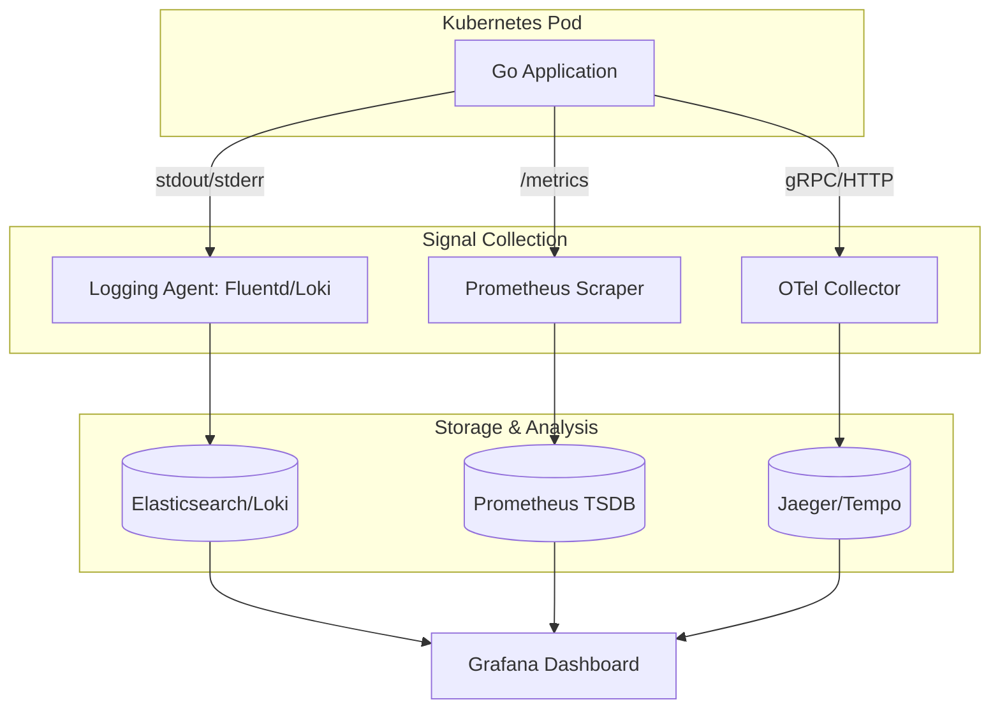

# Logs, Metrics, and Traces (The Three Pillars of Observability)

## Summary
The "Three Pillars of Observability" refer to **Logs, Metrics, and Traces**, which together provide a comprehensive view of a system's health and performance. In Kubernetes, where distributed systems are the norm, these signals allow operators to move from "monitoring" (is it working?) to "observability" (why is it failing?). **Logs** record discrete events, **Metrics** provide quantitative data over time, and **Traces** track the end-to-end journey of a request across service boundaries.

## Detailed Explanation

### 1. Logs (Discrete Events)
Logs are text-based records of events that occurred at a specific time. They are the most granular form of observability data and are essential for debugging and post-mortem analysis.
- **What**: Errors, warnings, info messages, or audit trails (e.g., "User 'admin' deleted Pod 'web-7f8b'").
- **Why**: To understand the "what" and "how" of a specific failure.
- **How in K8s**: Containers write to `stdout`/`stderr`. The Kubelet collects these and they are typically scraped by agents like **Fluentd**, **Promtail (Loki)**, or **Filebeat** and sent to storage like **Elasticsearch** or **Loki**.

### 2. Metrics (Quantitative Data)
Metrics are numeric measurements recorded over intervals of time. They are lightweight and ideal for dashboards and alerting.
- **What**: CPU usage, memory consumption, request count, error rate (e.g., "Service X is using 85% CPU").
- **Why**: To identify trends, performance bottlenecks, and trigger alerts when thresholds are breached.
- **How in K8s**: Most K8s components and applications expose a `/metrics` endpoint in **Prometheus** format. **Prometheus** scrapes these endpoints and stores them in a Time-Series Database (TSDB).

### 3. Traces (Request Lifecycle)
Traces follow a single request as it travels through a distributed system, showing the time spent in each component (spans).
- **What**: Timing data for database queries, external API calls, and internal function execution.
- **Why**: To identify latency bottlenecks in complex microservices architectures (e.g., "Why did this checkout request take 5 seconds?").
- **How in K8s**: Applications must be instrumented (often using **OpenTelemetry**) to inject and propagate trace headers. Backends like **Jaeger** or **Tempo** collect and visualize this data.

### Observability Pipeline Diagram



---

## Go Application Integration

For Go developers, implementing the three pillars involves specific libraries that have become industry standards.

### 1. Logging (Zap)
Uber's `zap` is preferred for its high performance and structured logging capabilities, which make logs easier to parse in K8s.

```go
package main

import (
	"go.uber.org/zap"
)

func main() {
	// Use Production config for JSON structured logging (best for K8s/ELK)
	logger, _ := zap.NewProduction()
	defer logger.Sync()

	logger.Info("Starting service",
		zap.String("version", "1.0.1"),
		zap.Int("port", 8080),
	)
}
```

### 2. Metrics (Prometheus)
Exposing metrics in Go is straightforward using the Prometheus client.

```go
package main

import (
	"net/http"
	"github.com/prometheus/client_golang/prometheus"
	"github.com/prometheus/client_golang/prometheus/promhttp"
)

var (
	httpRequestsTotal = prometheus.NewCounter(
		prometheus.CounterOpts{
			Name: "http_requests_total",
			Help: "Total number of HTTP requests.",
		},
	)
)

func init() {
	prometheus.MustRegister(httpRequestsTotal)
}

func main() {
	http.Handle("/metrics", promhttp.Handler())
	http.HandleFunc("/", func(w http.ResponseWriter, r *http.Request) {
		httpRequestsTotal.Inc()
		w.Write([]byte("Hello World"))
	})
	http.ListenAndServe(":8080", nil)
}
```

### 3. Tracing (OpenTelemetry)
OpenTelemetry (OTel) is the CNCF standard for tracing.

```go
package main

import (
	"context"
	"go.opentelemetry.io/otel"
	"go.opentelemetry.io/otel/trace"
)

var tracer = otel.Tracer("example-service")

func performWork(ctx context.Context) {
	ctx, span := tracer.Start(ctx, "performWork")
	defer span.End()

	// Business logic here...
	span.AddEvent("Finished heavy work")
}

func main() {
	// Note: In a real app, you must initialize the OTel Exporter (Jaeger/OTLP)
	performWork(context.Background())
}
```

---

## Interview Questions

**Q1: What is the main difference between Monitoring and Observability?**
*   **Answer**: Monitoring tells you *that* something is wrong (based on pre-defined symptoms like high CPU). Observability allows you to understand *why* it is wrong by providing deep context through correlated signals (logs, metrics, traces), even for issues you didn't anticipate.

**Q2: When would you prefer Logs over Metrics?**
*   **Answer**: Logs are better for troubleshooting specific, low-volume events or complex error sequences where you need text-based context. Metrics are better for high-volume data, alerting, and high-level health trends because they are much cheaper to store and process.

**Q3: How does Kubernetes handle container logs by default?**
*   **Answer**: Kubernetes expects containers to write logs to `stdout` and `stderr`. The container runtime (like containerd) intercepts these and stores them in files on the node (typically `/var/log/pods`). A logging agent then scrapes these files to send them to a central storage system.

**Q4: Why is OpenTelemetry significant for tracing?**
*   **Answer**: Before OTel, tracing was fragmented (Jaeger, Zipkin, SkyWalking had different APIs). OTel provides a single, vendor-neutral standard for instrumenting, generating, and collecting telemetry data, allowing you to switch backends without changing your application code.
