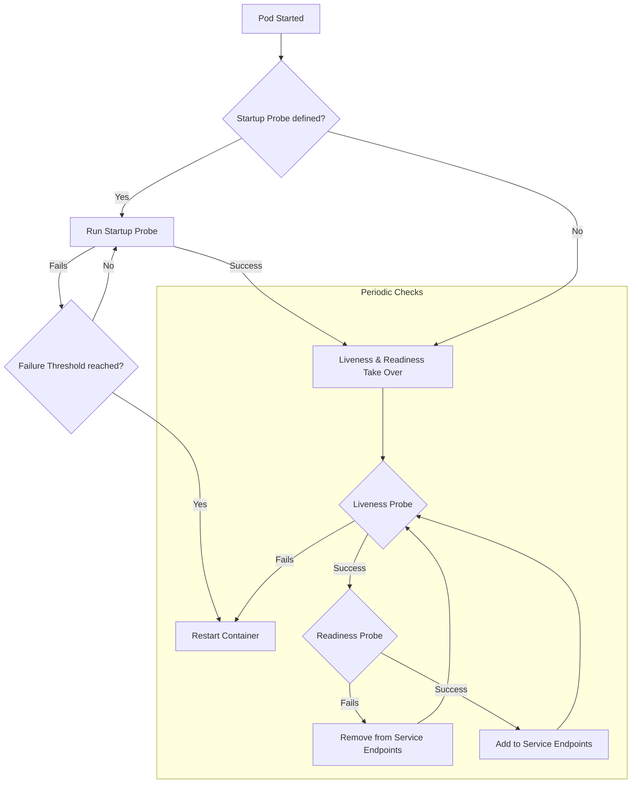

# Resource Health: Liveness, Readiness, and Startup Probes

Kubernetes health checks (Probes) are the foundation of self-healing systems. They allow the orchestrator to monitor the internal state of containers and take automated actions—restarting failing processes or shielding non-ready instances from traffic—to ensure high availability and reliability.

## Detailed Explanation

Kubernetes provides three types of probes to manage the lifecycle and health of a container. Each serves a distinct purpose in the "self-healing" loop.

### **1. Liveness Probe**
*   **What**: Checks if the application process is still healthy and running.
*   **Why**: To recover from situations where the app is "running" but stuck (e.g., a deadlock, infinite loop, or memory leak that prevents progress).
*   **How**: If the probe fails, the `kubelet` kills the container, and it is restarted according to its `restartPolicy`.

### **2. Readiness Probe**
*   **What**: Checks if the application is ready to serve incoming network traffic.
*   **Why**: To prevent sending requests to a pod that is still warming up (loading large caches, running migrations) or is temporarily overloaded.
*   **How**: If the probe fails, the Pod's IP address is removed from the Endpoints of all Services that match the Pod. No traffic is sent until it passes again.

### **3. Startup Probe**
*   **What**: Checks if the application has finished its initial startup sequence.
*   **Why**: For legacy or slow-starting applications that might take minutes to initialize. It prevents the Liveness probe from killing the container before it has even had a chance to start.
*   **How**: While the startup probe is running, Liveness and Readiness probes are disabled. Once it succeeds, the other probes take over.

### **Probe Mechanisms**
You can define probes using:
- **HTTP**: A GET request to a specific path (e.g., `/healthz`).
- **TCP**: Checking if a specific port is open.
- **gRPC**: Using the standard gRPC Health Checking Protocol.
- **Exec**: Running a command inside the container (success = exit code 0).

### **Visualizing the Probe Lifecycle**



---

## Go Application

For Go developers, implementing health checks usually involves exposing dedicated HTTP endpoints. It is best practice to keep these checks lightweight and avoid external dependencies for Liveness probes.

### **Implementation Example**

```go
package main

import (
	"encoding/json"
	"net/http"
	"sync/atomic"
	"time"
)

type HealthState struct {
	IsReady int32
}

func main() {
	state := &HealthState{}

	// Simulate a slow startup (e.g., loading config/cache)
	go func() {
		time.Sleep(10 * time.Second)
		atomic.StoreInt32(&state.IsReady, 1)
	}()

	// Liveness: Process is alive and not deadlocked
	http.HandleFunc("/healthz", func(w http.ResponseWriter, r *http.Request) {
		w.WriteHeader(http.StatusOK)
		w.Write([]byte("OK"))
	})

	// Readiness: App is ready to serve traffic
	http.HandleFunc("/readyz", func(w http.ResponseWriter, r *http.Request) {
		if atomic.LoadInt32(&state.IsReady) == 1 {
			w.WriteHeader(http.StatusOK)
			json.NewEncoder(w).Encode(map[string]string{"status": "ready"})
			return
		}
		w.WriteHeader(http.StatusServiceUnavailable)
	})

	http.ListenAndServe(":8080", nil)
}
```

---

## Interview Questions

### **Q1: What is the main difference between a Liveness and a Readiness probe?**
**A:** A failed **Liveness** probe causes the container to be **restarted**, as Kubernetes assumes the process is unrecoverable (zombie). A failed **Readiness** probe only **stops traffic** from being sent to the Pod (removes it from Service endpoints), assuming the app is temporarily busy or still initializing.

### **Q2: Why should you avoid checking external dependencies (like a database) in a Liveness probe?**
**A:** If the database goes down, all your application instances would fail their Liveness probes simultaneously. Kubernetes would then restart every pod at once (thundering herd), which doesn't fix the database but causes a massive cluster-wide restart loop. External dependencies should only be checked in **Readiness** probes.

### **Q3: When should you use a Startup Probe instead of `initialDelaySeconds`?**
**A:** `initialDelaySeconds` is a fixed wait time. If you set it to 60s but the app starts in 5s, you waste 55s. If you set it to 60s but the app takes 65s, it gets killed. A **Startup Probe** polls the app and allows the Liveness probe to start *exactly* when the app is ready, providing a safety net for slow starts without sacrificing efficiency.

### **Q4: What happens if you define a Readiness probe but no Liveness probe?**
**A:** The Pod will still be shielded from traffic if it's not ready, which is good. However, if the application enters a deadlocked state where it's "alive" but can't do anything, Kubernetes will never restart it automatically. It is generally recommended to use both for production workloads.

### **Q5: Can a Readiness probe fail after the Pod has already been receiving traffic?**
**A:** Yes. If an application becomes overloaded or loses a connection to a critical internal resource, the Readiness probe will fail, and Kubernetes will stop sending new traffic to that specific Pod until it recovers and the probe passes again.
