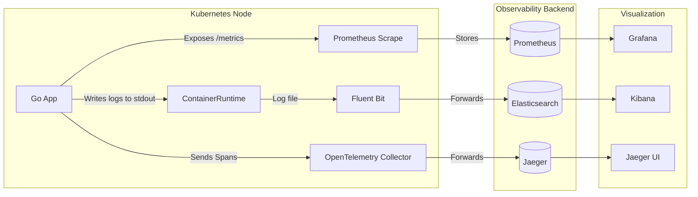

# Observability Engines

## Summary
Observability in Kubernetes is built on three pillars: metrics, logs, and traces. Observability engines like **Prometheus**, **Grafana**, the **EFK/ELK stack**, and **Jaeger** provide the critical infrastructure to collect, store, query, and visualize these data points. Prometheus is the de facto standard for storing time-series metrics, Grafana for visualization, Elasticsearch/Fluentd (or Fluent Bit) for log aggregation, and Jaeger for distributed tracing. Together, they allow engineers to move from simply knowing *that* a system failed to understanding *why* it failed.

## Detailed Explanation

### 1. Prometheus (The Metrics Engine)
Prometheus is an open-source systems monitoring and alerting toolkit. It uses a **pull model**, scraping metrics from HTTP endpoints (usually `/metrics`) exposed by Pods and Nodes.
*   **Key Concept**: Time-series database (TSDB) optimized for high-throughput writes.
*   **Query Language**: PromQL (Prometheus Query Language) is used to aggregate and analyze data.

### 2. Grafana (The Visualization Engine)
Grafana connects to datasources (like Prometheus, Loki, CloudWatch) and visualizes the data. It is the "single pane of glass" for Kubernetes observability.

### 3. EFK/ELK Stack (The Logging Engine)
*   **Elasticsearch**: Search and analytics engine (Storage).
*   **Fluentd / Fluent Bit**: Data collector (The Shipper). It runs as a DaemonSet, tailing container logs from the node.
*   **Kibana**: Data visualization dashboard for Elasticsearch.

### 4. Jaeger (The Tracing Engine)
Jaeger is used for monitoring and troubleshooting microservices-based distributed systems. It tracks the path of a request (a "Trace") as it propagates through various microservices.

### Data Flow Architecture



---

## Go Application

For Go developers, "instrumenting" code involves adding libraries that expose the inner workings of the application to these engines.

### 1. Metrics (Prometheus)
Use the official `prometheus/client_golang` library to expose custom metrics.

```go
package main

import (
	"net/http"
	"time"

	"github.com/prometheus/client_golang/prometheus"
	"github.com/prometheus/client_golang/prometheus/promauto"
	"github.com/prometheus/client_golang/prometheus/promhttp"
)

// Define a custom metric
var (
	opsProcessed = promauto.NewCounter(prometheus.CounterOpts{
		Name: "myapp_processed_ops_total",
		Help: "The total number of processed events",
	})
)

func recordMetrics() {
	go func() {
		for {
			opsProcessed.Inc()
			time.Sleep(2 * time.Second)
		}
	}()
}

func main() {
	recordMetrics()

	// Expose the registered metrics via HTTP
	http.Handle("/metrics", promhttp.Handler())
	http.ListenAndServe(":2112", nil)
}
```

### 2. Tracing (OpenTelemetry -> Jaeger)
Modern Go apps use OpenTelemetry (OTel) to generate traces, which can then be exported to Jaeger.

```go
// (Conceptual Snippet)
import "go.opentelemetry.io/otel"

func processRequest(ctx context.Context) {
    // Start a span
    tracer := otel.Tracer("my-app")
    ctx, span := tracer.Start(ctx, "processRequest")
    defer span.End()

    // Do work...
    span.AddEvent("Processing complete")
}
```

---

## Interview Questions

### 1. What is the difference between a "Pull" and "Push" model in monitoring?
**Answer**: In a **Pull** model (Prometheus), the monitoring system actively scrapes metrics from the application endpoints. This creates less coupling and allows the monitor to control the load. In a **Push** model (Graphite, InfluxDB), the application sends metrics to the monitor. Push is useful for short-lived jobs (like CronJobs) that might die before a scrape occurs; Prometheus handles this via a "Pushgateway."

### 2. Why is Fluent Bit often preferred over Fluentd in Kubernetes?
**Answer**: Fluent Bit is written in C, making it extremely lightweight and efficient (low memory/CPU footprint). Fluentd is written in Ruby and is heavier. In Kubernetes, where you run a log collector agent on *every* node (DaemonSet), resource efficiency is critical, making Fluent Bit the standard choice for the "edge" (node-level) collection.

### 3. How does Service Discovery work in Prometheus?
**Answer**: Prometheus is configured with `kubernetes_sd_configs`. It talks to the Kubernetes API server to discover targets (Pods, Services, Endpoints, Nodes). It uses Relabeling rules to filter which targets to scrape (e.g., only Pods with annotation `prometheus.io/scrape: "true"`) and to map metadata (like Pod name, Namespace) to metric labels.

### 4. What is cardinality in the context of Prometheus metrics?
**Answer**: Cardinality refers to the number of unique combinations of metric labels. High cardinality (e.g., including a UserID or IP address as a label) generates massive amounts of time-series data, which can crash Prometheus or severely degrade performance.

### 5. Explain the role of the OpenTelemetry Collector.
**Answer**: The OpenTelemetry Collector is a vendor-agnostic proxy that receives telemetry data (metrics, logs, traces) from applications, processes it (filtering, batching, obfuscation), and exports it to multiple backends (e.g., sending traces to both Jaeger and Datadog). It decouples the application instrumentation from the storage backend.
