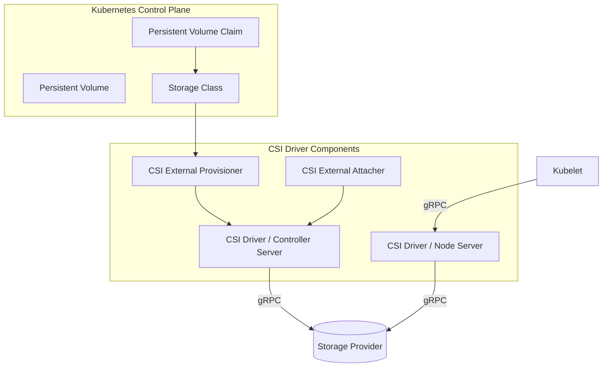

# CSI Drivers (Container Storage Interface)

## Summary
The **Container Storage Interface (CSI)** is a standard for exposing arbitrary block and file storage systems to containerized workloads on Container Orchestration (CO) systems like Kubernetes. It was developed to decouple storage driver development from the Kubernetes core, allowing storage providers to write and maintain their drivers "out-of-tree" without needing to touch the Kubernetes source code. CSI enables dynamic provisioning, attaching, and mounting of volumes, providing a unified interface for storage vendors to support multiple orchestrators simultaneously.

## Detailed Explanation

### What is CSI?
CSI is a specification that defines a gRPC-based protocol between a Container Orchestrator (CO) and a Storage Provider. Before CSI, Kubernetes storage drivers were "in-tree," meaning they were compiled into the Kubernetes binaries, which made it difficult for vendors to release updates and for Kubernetes to maintain a stable core.

### Why use CSI?
- **Out-of-tree development**: Storage vendors can release updates independently of the Kubernetes release cycle.
- **Security**: Drivers run as separate containers, reducing the attack surface of the Kubernetes control plane.
- **Interoperability**: A single CSI driver can work across Kubernetes, Nomad, Mesos, and other orchestrators that support the CSI spec.
- **Standardization**: Provides a consistent way to handle snapshots, cloning, and volume expansion.

### How it Works (Architecture)
A CSI driver typically consists of three main gRPC services:
1. **Identity Service**: Used by the CO to identify the driver and its capabilities.
2. **Controller Service**: Handles cluster-wide operations like volume creation, deletion, and attachment to nodes.
3. **Node Service**: Runs on every node and handles node-local operations like formatting and mounting volumes.



### Deployment Pattern
CSI drivers are usually deployed using two types of pods:
- **Controller Pod**: Often a Deployment with a single replica (or HA), containing the CSI driver container and sidecars like `external-provisioner` and `external-attacher`.
- **Node Pod**: A DaemonSet running on every worker node, containing the CSI driver container and the `node-driver-registrar` sidecar.

## Go Application

For Go developers, writing a CSI driver involves implementing the interfaces defined in the `container-storage-interface/spec`.

### Key Interfaces in Go
The `github.com/container-storage-interface/spec/lib/go/csi` package provides the generated gRPC code.

```go
package driver

import (
    "context"
    "github.com/container-storage-interface/spec/lib/go/csi"
    "google.golang.org/grpc/codes"
    "google.golang.org/grpc/status"
)

type ControllerServer struct {
    csi.UnimplementedControllerServer
}

// CreateVolume creates a new volume in the backend storage
func (cs *ControllerServer) CreateVolume(ctx context.Context, req *csi.CreateVolumeRequest) (*csi.CreateVolumeResponse, error) {
    if req.GetName() == "" {
        return nil, status.Error(codes.InvalidArgument, "Volume name is required")
    }
    
    // Logic to talk to storage API (e.g., AWS EBS, GCP PD, DigitalOcean Block Storage)
    volumeID := "vol-12345" 
    
    return &csi.CreateVolumeResponse{
        Volume: &csi.Volume{
            VolumeId:      volumeID,
            CapacityBytes: req.GetCapacityRange().GetRequiredBytes(),
        },
    }, nil
}

type NodeServer struct {
    csi.UnimplementedNodeServer
}

// NodePublishVolume mounts the volume to the pod's directory
func (ns *NodeServer) NodePublishVolume(ctx context.Context, req *csi.NodePublishVolumeRequest) (*csi.NodePublishVolumeResponse, error) {
    targetPath := req.GetTargetPath()
    
    // 1. Check if volume is already mounted
    // 2. Perform mount (e.g., mount -t ext4 /dev/sdb /var/lib/kubelet/pods/...)
    
    return &csi.NodePublishVolumeResponse{}, nil
}
```

### Common Sidecars
Go developers often use the following standard sidecar containers provided by Kubernetes SIG-Storage:
- **external-provisioner**: Watches for `PersistentVolumeClaims` and calls `CreateVolume`.
- **external-attacher**: Watches for `VolumeAttachments` and calls `ControllerPublishVolume`.
- **node-driver-registrar**: Registers the CSI driver with the Kubelet.
- **livenessprobe**: Monitors the health of the CSI driver.

## Interview Questions

1. **What is the difference between "in-tree" and "out-of-tree" drivers?**
   - **Answer**: "In-tree" drivers were part of the Kubernetes source code, meaning updates required a Kubernetes upgrade. "Out-of-tree" drivers (like CSI) are decoupled, allowing storage vendors to develop and release them independently as standard container images.

2. **Explain the role of the Identity service in a CSI driver.**
   - **Answer**: The Identity service allows the Container Orchestrator to query the driver for its name, version, and supported capabilities (e.g., whether it supports snapshots or volume expansion). It is the first service called when the driver starts.

3. **What is the purpose of the NodePublishVolume and NodeUnpublishVolume methods?**
   - **Answer**: `NodePublishVolume` is called by the Kubelet on a specific node to mount the volume to a directory where the pod can access it. `NodeUnpublishVolume` is the reverse, called when the pod is deleted to unmount the volume.

4. **How does Kubernetes know which CSI driver to use for a specific volume?**
   - **Answer**: The `StorageClass` object defines a `provisioner` field (e.g., `ebs.csi.aws.com`). When a user creates a `PersistentVolumeClaim` referencing that `StorageClass`, the corresponding CSI external-provisioner sidecar recognizes the provisioner name and triggers the driver.

5. **Why are sidecar containers used in CSI deployments?**
   - **Answer**: Sidecars (like `external-provisioner`) handle the Kubernetes-specific logic (watching APIs), while the CSI driver itself only needs to implement the CSI gRPC interface. This separation of concerns allows the same CSI driver to be used across different orchestrators with minimal changes.
