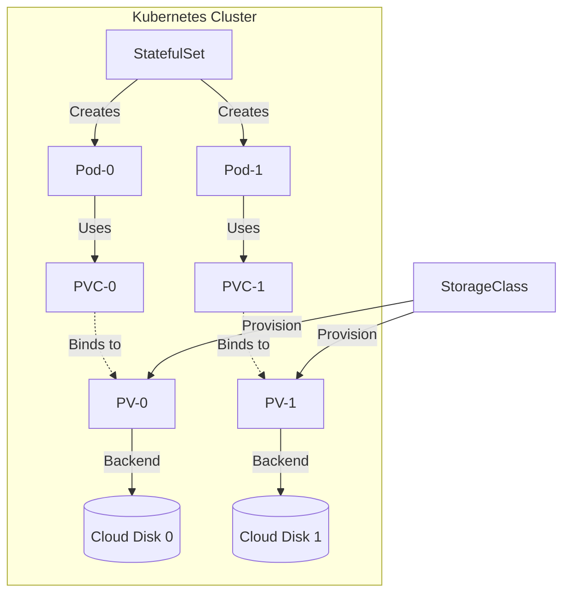

# Stateful Applications (Storage Persistence Patterns)

## Summary
Stateful applications in Kubernetes are workloads that require data persistence and stable network identities across Pod rescheduling and restarts. Unlike stateless applications, which can be easily scaled and replaced without data loss, stateful apps (like databases, caches, and message brokers) depend on maintaining state between executions. Kubernetes manages these workloads primarily through **StatefulSets**, which coordinate with the storage subsystem—including **Persistent Volumes (PV)** and **Persistent Volume Claims (PVC)**—to ensure that each Pod instance is consistently re-attached to its specific data volume.

## Detailed Explanation

### What are Stateful Applications?
In Kubernetes, a stateful application is one that saves data to persistent storage for use by the server, clients, and other applications. Examples include PostgreSQL, MySQL, Redis, and Kafka. These applications require that their storage and identity remain constant, even if the underlying infrastructure (the Node) fails.

### Why specific patterns are needed
1.  **Pod Ephemerality**: Standard Pods are designed to be destroyed and recreated. Any data stored in the Pod's local file system is lost when the Pod terminates.
2.  **Identity Stability**: Stateful apps often require a stable network identity (e.g., `db-0.mysql.default.svc.cluster.local`) to allow cluster members to discover each other and maintain a quorum.
3.  **Storage Binding**: A specific Pod replica (e.g., `redis-0`) must always be reconnected to the same physical storage volume even if it moves to a different worker node.

### The Storage Subsystem Components
*   **StorageClass (SC)**: An administrator-defined profile for storage (e.g., "fast-ssd", "slow-hdd"). It enables **Dynamic Provisioning**, where Kubernetes automatically creates physical storage when a user requests it.
*   **PersistentVolume (PV)**: A piece of storage in the cluster that has been provisioned. It is a resource in the cluster just as a node is a cluster resource.
*   **PersistentVolumeClaim (PVC)**: A request for storage by a user. It specifies size and access modes. Kubernetes matches the PVC to a PV and binds them.
*   **StatefulSet**: The controller that manages the deployment and scaling of a set of Pods, providing guarantees about the ordering and uniqueness of these Pods. It uses a `volumeClaimTemplate` to create unique PVCs for each Pod replica.

### Storage Lifecycle Diagram


### Common Persistence Patterns
*   **Dynamic Provisioning**: The "Standard" pattern. You define a `StorageClass` and let Kubernetes handle the creation/deletion of cloud disks or network volumes.
*   **Local Persistent Volumes**: Used for high-performance databases that need direct NVMe/SSD speeds. It binds a Pod to a specific physical node.
*   **Headless Services**: Used alongside StatefulSets to give each Pod a unique DNS entry, enabling peer-to-peer communication without a load balancer.

---

## Go Application Integration

For a Go developer, the interaction with persistent storage happens at the file system level. The application logic shouldn't care *how* the volume is provisioned, only *where* it is mounted.

### Key Considerations for Go Devs:
1.  **Mount Points**: Use environment variables or flags to define where the data is stored. This allows the same binary to work locally (e.g., `./data`) and in K8s (e.g., `/var/lib/myapp`).
2.  **Graceful Shutdown**: Always handle OS signals (`SIGTERM`) to ensure all database transactions are committed and file handles are closed before the container exits.
3.  **File Locking**: Be cautious with file locks. If a Pod restarts quickly, a stale lock on the network volume might prevent the new Pod instance from starting.

### Go Code Example: Persistent State Handler
```go
package main

import (
    "fmt"
    "log"
    "os"
    "os/signal"
    "path/filepath"
    "syscall"
)

func main() {
    // 1. Determine data directory (mounted via PVC in K8s)
    dataDir := os.Getenv("DATA_PATH")
    if dataDir == "" {
        dataDir = "/data" 
    }

    stateFile := filepath.Join(dataDir, "cluster_state.json")

    // 2. Load existing state
    if _, err := os.Stat(stateFile); err == nil {
        fmt.Println("Existing state detected, loading...")
        // ... logic to parse state ...
    }

    // 3. Setup Graceful Shutdown
    sigChan := make(chan os.Signal, 1)
    signal.Notify(sigChan, syscall.SIGINT, syscall.SIGTERM)

    go func() {
        sig := <-sigChan
        fmt.Printf("Received signal %v. Saving state and exiting...\n", sig)
        
        // Final state save
        err := os.WriteFile(stateFile, []byte(`{"status": "clean_shutdown"}`), 0644)
        if err != nil {
            log.Printf("Error saving state: %v", err)
        }
        os.Exit(0)
    }()

    // 4. Application Logic
    fmt.Println("Application is running and maintaining state at:", stateFile)
    select {} // Block forever
}
```

---

## Interview Questions

### 1. How does a StatefulSet differ from a Deployment?
**Answer:** A Deployment is for stateless apps where Pods are interchangeable and have random names. A StatefulSet provides stable, unique network identifiers (e.g., `web-0`, `web-1`) and persistent storage that stays with the Pod even if it is rescheduled to another node.

### 2. What is a "Headless Service" and why do we use it with StatefulSets?
**Answer:** A Headless Service is a Service with `clusterIP: None`. Instead of providing a single load-balanced IP, it allows DNS lookups to return the individual IP addresses of all Pods in the set. This is crucial for stateful apps (like MongoDB or Kafka) where nodes need to know the direct addresses of their peers to form a cluster.

### 3. What is the difference between a PersistentVolume (PV) and a PersistentVolumeClaim (PVC)?
**Answer:** A **PV** is the actual storage resource (like an AWS EBS volume or an NFS share) provisioned in the cluster. A **PVC** is a request for that storage by a user. You can think of a PV as a "Node" and a PVC as a "Pod" that consumes that resource.

### 4. What happens to the data if a StatefulSet Pod is deleted?
**Answer:** The data is preserved. The PVC associated with that specific replica remains in the cluster. When the StatefulSet controller recreates the Pod (to maintain the replica count), it will automatically re-attach the existing PVC and its data to the new Pod instance.

### 5. Explain "Dynamic Provisioning" in Kubernetes.
**Answer:** Dynamic provisioning eliminates the need for cluster administrators to pre-provision storage. When a developer creates a PVC that points to a `StorageClass`, Kubernetes automatically triggers the creation of the underlying storage (e.g., a GCE Persistent Disk) and the corresponding PV, binding them together instantly.
