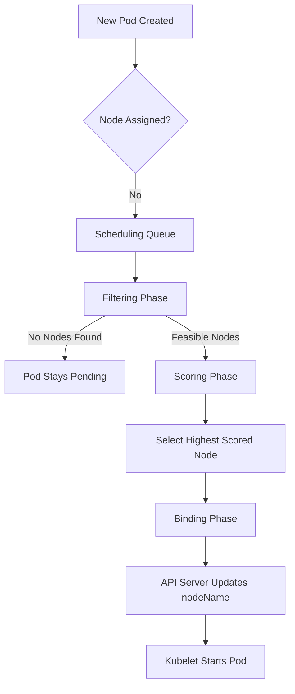

# Scheduling Basics

## Summary
The Kubernetes Scheduler (`kube-scheduler`) is a control plane process responsible for assigning newly created Pods to the most suitable Nodes in a cluster. It operates by watching the API server for Pods with an empty `nodeName` and then evaluates all available Nodes through a series of stages. The core logic involves two primary phases: **Filtering** (eliminating unsuitable nodes) and **Scoring** (ranking the remaining nodes to find the best fit). Once a decision is made, the scheduler performs a "Binding" operation to record the node assignment in the API server.

## Detailed Explanation

### What is Scheduling?
In Kubernetes, scheduling refers to the process of matching Pods to Nodes so that the `kubelet` can run them. It is not the process of actually starting the container, but rather the decision-making step of *where* it should live.

### Why is it needed?
A scheduler ensures that:
- **Resource Constraints** are respected (CPU, Memory, GPU).
- **High Availability** is maintained (e.g., spreading Pods across zones).
- **Workload Isolation** is enforced (e.g., dedicated nodes for specific teams).
- **Efficiency** is maximized (bin-packing vs. spreading).

### How it Works: The Scheduling Framework
The `kube-scheduler` follows a specific workflow for every Pod:

1.  **Queueing**: Newly created Pods are added to the Scheduling Queue.
2.  **Scheduling Cycle (Synchronous)**:
    *   **Filtering (Predicates)**: The scheduler runs a set of "Filters" to find "feasible" nodes. For example, it checks if a node has enough memory or if it matches the `nodeSelector`.
    *   **Scoring (Priorities)**: The scheduler ranks the feasible nodes using "Score" plugins. It might prefer nodes that already have the required container images or nodes that are less utilized.
3.  **Binding Cycle (Asynchronous)**:
    *   **Wait**: The scheduler waits for any prerequisite tasks (like volume binding).
    *   **Bind**: The scheduler sends a Binding object to the API server, which updates the Pod's `spec.nodeName`.

### Workflow Diagram


## Go Application

For Go developers, understanding the scheduler is crucial when building custom controllers or extending Kubernetes. The `kube-scheduler` itself is written in Go and uses the **Scheduling Framework**, which provides a set of interfaces for writing custom plugins.

### Implementing a Filter Plugin
A Go developer might implement the `FilterPlugin` interface to add custom scheduling logic.

```go
package myplugin

import (
    "context"
    v1 "k8s.io/api/core/v1"
    "k8s.io/kubernetes/pkg/scheduler/framework"
)

type MyFilter struct{}

func (f *MyFilter) Name() string {
    return "MyCustomFilter"
}

// Filter checks if the node is suitable for the pod
func (f *MyFilter) Filter(ctx context.Context, state *framework.CycleState, pod *v1.Pod, nodeInfo *framework.NodeInfo) *framework.Status {
    node := nodeInfo.Node()
    if node == nil {
        return framework.NewStatus(framework.Error, "node not found")
    }

    // Example: Only schedule pods on nodes with a specific label
    if val, ok := node.Labels["environment"]; !ok || val != "production" {
        return framework.NewStatus(framework.Unschedulable, "Node is not production")
    }

    return framework.NewStatus(framework.Success, "")
}
```

### Why Go Developers Care
- **Custom Schedulers**: You can write a complete scheduler in Go using `client-go` and `informers` to watch for Pods and handle the binding logic yourself.
- **K8s Internals**: If your Go application is sensitive to locality or resource contention, understanding how the scheduler makes decisions helps you write better `Affinity` or `TopologySpreadConstraints` rules.

## Interview Questions

1.  **What are the two main phases of the kube-scheduler?**
    *   **Answer**: The two main phases are **Filtering** (where the scheduler finds nodes that meet the Pod's requirements) and **Scoring** (where it ranks those nodes to find the best placement).

2.  **What happens if no nodes pass the Filtering phase?**
    *   **Answer**: The Pod remains in a `Pending` state. The scheduler will periodically retry scheduling the Pod as cluster state changes (e.g., nodes become available or resources are freed).

3.  **What is the difference between a Predicate and a Priority?**
    *   **Answer**: Predicate (now called Filter) is a hard requirement (Yes/No). If a node fails a predicate, it is disqualified. Priority (now called Score) is a soft preference (0-100). It helps pick the "best" node among those that passed the filters.

4.  **How does the scheduler know which node to pick after scoring?**
    *   **Answer**: It picks the node with the highest cumulative score. If there is a tie, it typically picks one at random (though this can be tuned).

5.  **What is the "Binding" phase in scheduling?**
    *   **Answer**: Binding is the final step where the scheduler communicates its decision to the API server. It creates a `Binding` object that links the Pod to the selected Node, which then triggers the `kubelet` on that node to start the containers.
