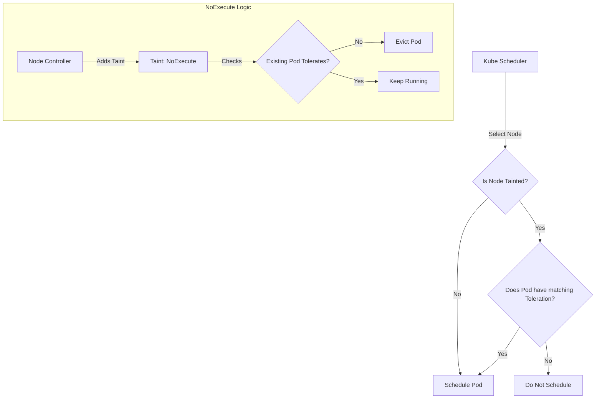

# Taints and Tolerations

## Summary
Taints and Tolerations are a core Kubernetes scheduling mechanism used to control which Pods are allowed to be scheduled on which Nodes. They function as a **lock and key** system: a **Taint** is applied to a Node to repel Pods, and a **Toleration** is applied to a Pod to allow it to schedule onto a tainted Node. This mechanism is primarily used to dedicate Nodes to specific workloads (e.g., GPU nodes, high-memory nodes) or to evict Pods from malfunctioning nodes.

## Detailed Explanation

### **What are Taints?**
A Taint is a property applied to a Node that allows the Node to repel a set of Pods. It consists of a `key`, `value`, and `effect`.

**Format:** `key=value:effect`

### **What are Tolerations?**
A Toleration is a property applied to a Pod that allows (but does not require) the Pod to schedule onto a Node with a matching Taint.

### **Taint Effects**
The `effect` field determines what happens to Pods that do **not** tolerate the taint:
1.  **`NoSchedule`**: The Kubernetes Scheduler will NOT schedule new Pods onto the Node unless they tolerate the taint. Existing Pods are unaffected.
2.  **`PreferNoSchedule`**: The Scheduler will *try* to avoid scheduling Pods that don't tolerate the taint, but it's not a hard requirement.
3.  **`NoExecute`**: The Scheduler will NOT schedule new Pods, AND it will **evict** (terminate) existing Pods on the Node if they do not tolerate the taint.

### **How it Works (Decision Flow)**



### **Common Use Cases**
*   **Dedicated Nodes**: ensuring only specific teams or applications (e.g., ML jobs) use expensive GPU nodes.
*   **Node maintenance**: `kubectl drain` adds a `NoSchedule` taint to prepare a node for updates.
*   **Node problems**: The Node Controller automatically adds taints like `node.kubernetes.io/not-ready` or `node.kubernetes.io/unreachable` with `NoExecute` to evict workloads from broken nodes.

---

## Go Application

For Go developers writing Operators or Controllers, managing Tolerations programmatically is common.

### **Defining Tolerations in Go**
When creating a Pod using `client-go`, you define Tolerations in the `PodSpec`.

```go
package main

import (
	corev1 "k8s.io/api/core/v1"
	metav1 "k8s.io/apimachinery/pkg/apis/meta/v1"
)

func createPodWithToleration() *corev1.Pod {
	return &corev1.Pod{
		ObjectMeta: metav1.ObjectMeta{
			Name: "gpu-job",
		},
		Spec: corev1.PodSpec{
			Containers: []corev1.Container{
				{
					Name:  "cuda-container",
					Image: "nvidia/cuda:11.0",
				},
			},
			Tolerations: []corev1.Toleration{
				{
					Key:      "dedicated",
					Operator: corev1.TolerationOpEqual,
					Value:    "gpu",
					Effect:   corev1.TaintEffectNoSchedule,
				},
				// Tolerate Node NotReady for 300 seconds before eviction
				{
					Key:               "node.kubernetes.io/not-ready",
					Operator:          corev1.TolerationOpExists,
					Effect:            corev1.TaintEffectNoExecute,
					TolerationSeconds: ptrInt64(300),
				},
			},
		},
	}
}

func ptrInt64(i int64) *int64 { return &i }
```

---

## Interview Questions

**Q: What is the difference between Node Affinity and Taints/Tolerations?**
**A:** Node Affinity is used to **attract** Pods to a specific set of Nodes (e.g., "Schedule this Pod on a Node in availability zone A"). Taints and Tolerations are used to **repel** Pods from Nodes (e.g., "Don't schedule any Pod on this Node unless it explicitly tolerates the 'gpu' taint"). They are often used together to create dedicated node pools.

**Q: What happens to a running Pod if I add a `NoSchedule` taint to its Node?**
**A:** Nothing happens to the running Pod. `NoSchedule` only affects *new* Pods trying to schedule onto the Node. The existing Pod will continue to run. To evict existing Pods, you must use the `NoExecute` effect.

**Q: Can a Pod have multiple Tolerations?**
**A:** Yes. A Pod can have an array of Tolerations. For the Pod to be scheduled onto a Node, it must tolerate **all** the Taints present on that Node (or a subset, depending on how specific the Taints are). If the Node has a Taint that the Pod does not tolerate, the Pod will not be scheduled there.

**Q: What does the `Exists` operator do in a Toleration?**
**A:** The `Exists` operator allows a Toleration to match a Taint based only on the `key`, ignoring the `value`. This acts as a wildcard. For example, a Toleration with key "foo" and operator "Exists" will tolerate any taint with key "foo", regardless of whether the value is "bar", "baz", or empty.

**Q: How does Kubernetes handle node failures automatically using Taints?**
**A:** When the Node Controller detects that a Node is unresponsive, it automatically adds the `node.kubernetes.io/unreachable` or `node.kubernetes.io/not-ready` taint with the `NoExecute` effect. This triggers the eviction of all Pods on that Node (unless they have a specific toleration to stay longer) so they can be rescheduled on healthy Nodes.
