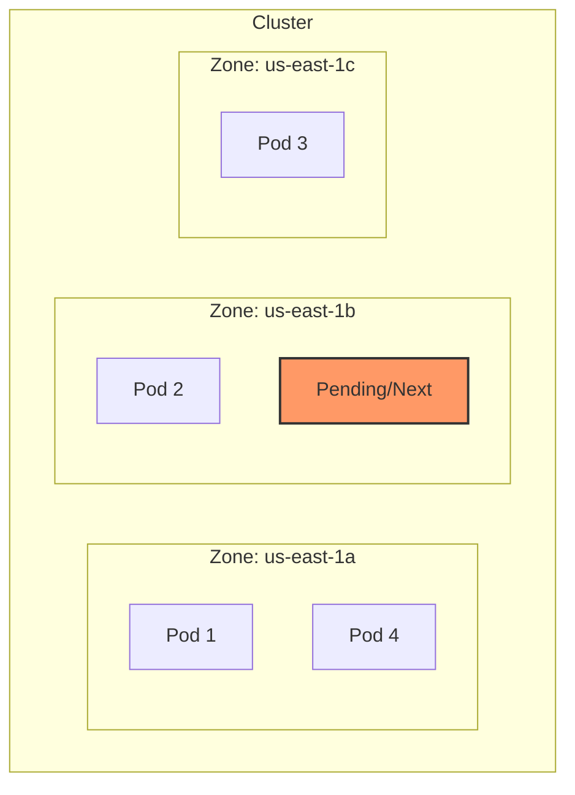

# Topology Spread Constraints

## Summary
Pod Topology Spread Constraints (PTSC) are a sophisticated Kubernetes scheduling mechanism designed to distribute Pods evenly across failure domains such as nodes, zones, regions, or racks. Unlike Pod Anti-Affinity, which is binary (allow or disallow co-location), PTSC allows for a fine-grained "evenness" control using the `maxSkew` parameter. This ensures High Availability (HA) by preventing a single failure domain from hosting too many replicas of a specific workload.

## Detailed Explanation

### What are Topology Spread Constraints?
Topology Spread Constraints allow cluster administrators and developers to define how Pods should be spread across the cluster based on node labels. They are defined in the `spec.topologySpreadConstraints` field of a Pod (or Pod template in a Deployment/StatefulSet).

### Why use them?
1. **High Availability**: Ensures that if a zone or rack goes down, only a fraction of your pods are lost.
2. **Resource Utilization**: Prevents "hotspots" where too many pods are crowded onto a single node or zone.
3. **Granularity**: Provides better control than Pod Affinity/Anti-Affinity, which can often be too restrictive or too loose.

### Key Parameters
- **`maxSkew`**: The maximum degree to which Pods can be unevenly distributed. A `maxSkew` of `1` means the difference between the most populated domain and the least populated domain cannot be more than 1.
- **`topologyKey`**: The label key on nodes that defines the domain (e.g., `topology.kubernetes.io/zone` or `kubernetes.io/hostname`).
- **`whenUnsatisfiable`**: 
    - `DoNotSchedule` (Hard): Pod remains pending if the constraint cannot be met.
    - `ScheduleAnyway` (Soft): Schedules the pod while trying to minimize skew.
- **`labelSelector`**: Used to identify the set of Pods to be counted for the skew calculation. Usually matches the labels of the Deployment's pods.

### Visual Representation (maxSkew: 1)


*In the diagram above, if a 5th Pod is scheduled with `maxSkew: 1` across zones, it must go to Zone B or Zone C to keep the counts (2, 2, 1) or (2, 1, 2). Placing it in Zone A would result in (3, 1, 1), a skew of 2.*

### Example YAML Configuration
```yaml
apiVersion: apps/v1
kind: Deployment
metadata:
  name: my-go-app
spec:
  replicas: 3
  selector:
    matchLabels:
      app: my-go-app
  template:
    metadata:
      labels:
        app: my-go-app
    spec:
      topologySpreadConstraints:
        - maxSkew: 1
          topologyKey: topology.kubernetes.io/zone
          whenUnsatisfiable: DoNotSchedule
          labelSelector:
            matchLabels:
              app: my-go-app
      containers:
      - name: app
        image: my-go-app:latest
```

## Go Application

For Go developers building Kubernetes Operators or managing infrastructure programmatically, you'll use the `k8s.io/api/core/v1` package to define these constraints.

### Defining PTSC in Go Code
When creating a Deployment or Pod spec using the `client-go` library, you define the `TopologySpreadConstraint` struct.

```go
package main

import (
	metav1 "k8s.io/apimachinery/pkg/apis/meta/v1"
	corev1 "k8s.io/api/core/v1"
)

func createTopologyConstraint(appName string) corev1.TopologySpreadConstraint {
	return corev1.TopologySpreadConstraint{
		MaxSkew:           1,
		TopologyKey:       "topology.kubernetes.io/zone",
		WhenUnsatisfiable: corev1.DoNotSchedule,
		LabelSelector: &metav1.LabelSelector{
			MatchLabels: map[string]string{
				"app": appName,
			},
		},
	}
}

// Inside your Deployment spec generation:
// podSpec.TopologySpreadConstraints = []corev1.TopologySpreadConstraint{
//     createTopologyConstraint("my-go-service"),
// }
```

### Why it matters for Go Devs
Go developers often write **Custom Controllers** or **Operators**. Understanding PTSC is crucial when your controller needs to ensure that the resources it manages (like a distributed database or a cluster of workers) are resilient to infrastructure failures. By programmatically injecting these constraints, you ensure that your application stays up even if an entire cloud provider zone fails.

## Interview Questions

**Q: What is the main difference between Pod Anti-Affinity and Topology Spread Constraints?**
**A:** Pod Anti-Affinity is binary (a pod can either be co-located or not). Topology Spread Constraints allow for a "balanced" distribution, where you can specify exactly how much "skew" or imbalance is acceptable (e.g., allowing one zone to have 1 more pod than another).

**Q: What does `maxSkew: 1` signify in a multi-zone cluster?**
**A:** It means the difference in the number of matching pods between any two zones (the most populated and the least populated) cannot exceed one. This forces the scheduler to fill up zones as evenly as possible.

**Q: How does `whenUnsatisfiable: ScheduleAnyway` differ from `DoNotSchedule`?**
**A:** `DoNotSchedule` is a hard requirement; the pod will stay in the `Pending` state if the constraint cannot be met. `ScheduleAnyway` is a soft requirement (preferred); the scheduler will attempt to minimize skew but will still schedule the pod if an even distribution isn't possible.

**Q: Can you apply multiple Topology Spread Constraints to a single Pod?**
**A:** Yes. Multiple constraints can be defined (e.g., one for `hostname` and one for `zone`). The scheduler will only place the pod on a node that satisfies all the defined constraints (an "AND" operation).

**Q: What happens if a node is missing the label specified in `topologyKey`?**
**A:** Nodes that do not have the specified `topologyKey` label are ignored for that constraint. The scheduler will not count pods on those nodes nor consider them as candidates for scheduling that specific pod.
