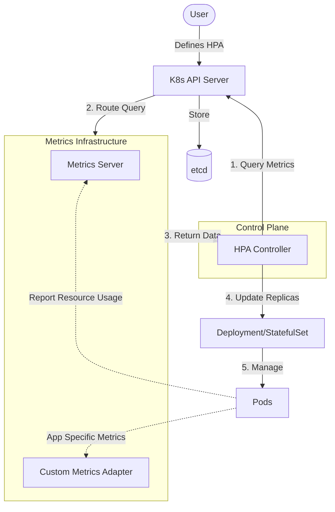

# Horizontal Pod Autoscaler (HPA)

## Summary
The **Horizontal Pod Autoscaler (HPA)** is a Kubernetes controller that automatically scales the number of Pods in a workload (Deployment, ReplicaSet, or StatefulSet) based on observed resource utilization. It continuously monitors metrics like CPU or memory usage and compares them against target values defined by the user. By dynamically adjusting replicas, HPA ensures application performance during traffic spikes while optimizing infrastructure costs during idle periods. In recent Kubernetes versions (v1.33+), HPA has introduced more granular controls like **Configurable Tolerance** to further refine scaling behavior.

## Detailed Explanation

### What is HPA?
HPA is a fundamental component of Kubernetes autoscaling that operates at the **pod level**. Unlike the Vertical Pod Autoscaler (VPA), which changes the resource requests/limits of existing pods, HPA changes the *count* of pods.

### Why use HPA?
1. **High Availability**: Automatically handles unexpected traffic surges by spinning up more instances.
2. **Cost Efficiency**: Reduces resource footprint by scaling down when demand is low.
3. **Operational Simplicity**: Removes the need for manual intervention during varying load patterns.

### How it Works
HPA runs as a control loop (typically every 15 seconds). It follows these steps:
1. **Metric Collection**: Queries the Metrics API (`metrics.k8s.io`, `custom.metrics.k8s.io`, or `external.metrics.k8s.io`).
2. **Calculation**: Uses the scaling formula to determine the required number of replicas.
3. **Action**: Updates the `replicas` field in the target resource (e.g., a Deployment).

#### The Scaling Algorithm
The basic formula used by the HPA controller is:
`desiredReplicas = ceil[currentReplicas * (currentMetricValue / desiredMetricValue)]`

*Example*: If current CPU usage is 200m and the target is 100m, and you have 2 replicas:
`desiredReplicas = ceil[2 * (200 / 100)] = 4`

#### Stabilization and Policies
To prevent **thrashing** (rapidly scaling up and down), HPA uses:
- **Stabilization Window**: A period (default 5m for scale-down) that keeps the highest recommendation seen during that window.
- **Scaling Policies**: Since v1.23, users can define `behavior` to limit how fast a deployment scales (e.g., "don't scale down more than 10% per minute").

#### New in 2025: Configurable Tolerance (v1.33+)
Previously, HPA had a hardcoded 10% tolerance (it wouldn't scale if the change was within 10% of the target). v1.33 introduced alpha support for **Configurable Tolerance**, allowing developers to set `behavior.scaleDown.tolerance` and `behavior.scaleUp.tolerance` per HPA object.

### Mermaid Diagram: HPA Architecture


## Go Application

For Go developers, HPA is most powerful when used with **Custom Metrics**. Instead of just CPU/RAM, you can scale based on HTTP requests per second (RPS), queue depth, or custom business logic.

### 1. Exposing Metrics with Prometheus
Go applications typically use the `prometheus/client_golang` library to expose a `/metrics` endpoint.

```go
package main

import (
	"net/http"
	"github.com/prometheus/client_golang/prometheus"
	"github.com/prometheus/client_golang/prometheus/promhttp"
)

var (
	httpRequestsTotal = prometheus.NewCounter(
		prometheus.CounterOpts{
			Name: "http_requests_total",
			Help: "Total number of HTTP requests.",
		},
	)
)

func init() {
	prometheus.MustRegister(httpRequestsTotal)
}

func main() {
	http.HandleFunc("/", func(w http.ResponseWriter, r *http.Request) {
		httpRequestsTotal.Inc()
		w.Write([]byte("Hello, HPA!"))
	})

	http.Handle("/metrics", promhttp.Handler())
	http.ListenAndServe(":8080", nil)
}
```

### 2. HPA Manifest with Custom Metrics
Once the `prometheus-adapter` is installed in your cluster, you can target the `http_requests_total` metric:

```yaml
apiVersion: autoscaling/v2
kind: HorizontalPodAutoscaler
metadata:
  name: go-app-hpa
spec:
  scaleTargetRef:
    apiVersion: apps/v1
    kind: Deployment
    name: go-app
  minReplicas: 2
  maxReplicas: 10
  metrics:
  - type: Pods
    pods:
      metric:
        name: http_requests_per_second # Derived from http_requests_total
      target:
        type: AverageValue
        averageValue: 50
```

## Interview Questions

### 1. How does HPA handle multiple metrics?
If multiple metrics are specified (e.g., CPU and RPS), HPA calculates the desired replicas for **each** metric and chooses the **largest** value. This ensures that the application has enough resources to satisfy the most demanding constraint.

### 2. What is "thrashing" and how do you prevent it in HPA?
Thrashing (or flapping) occurs when an application scales up and down rapidly due to volatile metrics. HPA prevents this using the **Stabilization Window** (`stabilizationWindowSeconds`). For scale-down, the default is 300 seconds (5 minutes), meaning HPA will wait and observe if the load remains low before removing pods.

### 3. Can HPA and VPA be used together?
Generally, **no**, you should not use HPA and VPA on the same resource (CPU or Memory). If both are active, they might conflict: VPA might increase limits while HPA adds pods, leading to inefficient resource usage. However, you can use HPA for custom metrics (like RPS) and VPA for resource optimization (CPU/Mem), or use HPA on CPU and VPA on Memory if carefully configured.

### 4. What happens if the Metrics Server is down?
If the HPA controller cannot retrieve metrics, it will not make any scaling decisions (the replica count remains unchanged). In some cases, it may report an `Unknown` status for the HPA resource. This is why high availability for the Metrics Server or Prometheus Adapter is critical.

### 5. What is the difference between `AverageUtilization` and `AverageValue`?
- `AverageUtilization`: Used for resource metrics (CPU/Mem). It is the percentage of the pod's **requested** resources.
- `AverageValue`: Used for custom metrics. It is the raw value of the metric averaged across all pods (e.g., "50 requests per second per pod").
