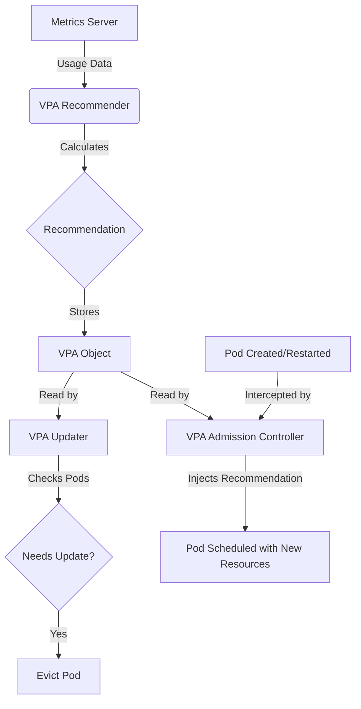

## Summary
The Vertical Pod Autoscaler (VPA) is a Kubernetes component that automatically adjusts the CPU and memory resource requests and limits for containers in a pod. It frees users from the burden of manual resource tuning by observing real-world usage and rightsizing the workloads accordingly. This leads to better resource utilization and stability, preventing OOM (Out Of Memory) kills due to under-provisioning or waste due to over-provisioning.

## Detailed Explanation

### How it Works
VPA consists of three main components:
1.  **Recommender**: Monitors the actual resource usage history (from the Metrics Server or Prometheus) and provides recommendations.
2.  **Updater**: Checks if the running pods have resource requests that deviate significantly from the recommendation. If so, it evicts (restarts) them.
3.  **Admission Controller**: Intercepts the creation of new pods (or restarted ones) and injects the recommended resource request values into the Pod spec.

#### VPA Workflow Diagram


### Modes of Operation
*   **Off**: Calculates recommendations but does not apply them. Useful for "dry run" analysis.
*   **Initial**: Applies recommendations only when a pod is created. It will never evict a running pod.
*   **Auto**: Applies recommendations at creation and can actively evict running pods to update their resources (disruptive).

---

## Go Application

For Go developers, VPA is particularly relevant because of how the Go Runtime manages memory. Since Go 1.19, the `GOMEMLIMIT` environment variable allows you to set a soft memory limit that the Garbage Collector respects.

### Integrating VPA with Go Runtime
If VPA resizes your memory limit dynamically, your Go app needs to be aware of it to avoid OOM kills.

1.  **Use `automemlimit`**: A Go library that automatically detects the container's memory limit (cgroup) and sets `GOMEMLIMIT` accordingly.

```go
import _ "github.com/KimMachineGun/automemlimit"

func main() {
    // Your app logic
}
```

2.  **Handling CPU Throttling**: VPA might reduce your CPU request. Ensure your `GOMAXPROCS` is aligned with the container's CPU quota (use `automaxprocs`).

```go
import _ "go.uber.org/automaxprocs"

func main() {
    // ...
}
```

---

## Interview Questions

**Q: What is the main difference between HPA and VPA?**
**A:** HPA (Horizontal Pod Autoscaler) scales the **number** of replicas based on load (scaling out). VPA (Vertical Pod Autoscaler) scales the **size** (CPU/RAM) of the existing pods (scaling up/down). Generally, you shouldn't use both on the same metric (CPU/Memory) to avoid race conditions.

**Q: Why does VPA need to restart pods to apply changes?**
**A:** In Kubernetes, resource requests and limits for a running pod are immutable (mostly). To change them, the pod must be recreated. However, "In-place Update" of Pod resources is a feature currently in alpha/beta that aims to remove this limitation.

**Q: What happens if VPA recommends a resource size larger than the Node capacity?**
**A:** The Pod will become **Pending**. The Kubernetes Scheduler will not be able to find a node with enough capacity to fit the resized pod. This is a risk of using VPA in 'Auto' mode without setting `maxAllowed` constraints in the VPA policy.

**Q: Can VPA handle custom metrics?**
**A:** No. VPA focuses solely on CPU and Memory usage to rightsize the container. HPA is the tool used for scaling based on custom metrics (like requests per second).

**Q: How does VPA interact with the Go Garbage Collector?**
**A:** If VPA reduces the memory limit of a Go app, the app might get OOMKilled if the Go GC doesn't run aggressively enough to stay under the new limit. Setting `GOMEMLIMIT` (or using `automemlimit`) is crucial so the runtime knows the new boundary and triggers GC more frequently as usage approaches the limit.
