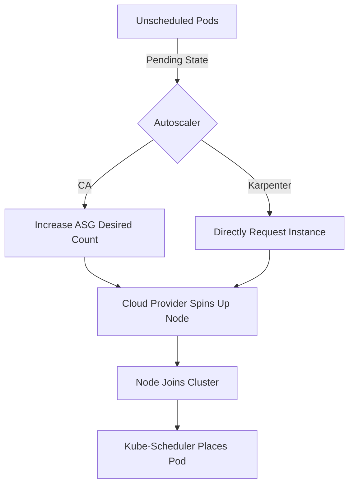

# Cluster Autoscaler (CA) and Karpenter

## Summary
Cluster Autoscaling is the process of automatically adjusting the number of nodes in a Kubernetes cluster to match workload demand. The **Cluster Autoscaler (CA)** is the traditional reactive tool that modifies cloud provider node groups when pods fail to schedule due to resource constraints. **Karpenter** is a modern, high-performance alternative that provisions "just-in-time" nodes directly via cloud APIs, offering faster scaling and better cost optimization through dynamic instance selection. Together, these tools ensure cluster elasticity, preventing resource exhaustion while minimizing infrastructure costs.

## Detailed Explanation

### The Scaling Problem
In Kubernetes, horizontal pod scaling (HPA) increases the number of pods. However, if the existing nodes are full, those new pods will remain in a `Pending` state. Cluster autoscaling solves this by adding physical or virtual machines to the cluster.

### Cluster Autoscaler (CA)
CA is the standard Kubernetes component that watches for pods that cannot be scheduled due to lack of resources.
- **Mechanism**: It interfaces with cloud-native "Node Groups" (e.g., AWS Auto Scaling Groups, Azure VMSS).
- **Behavior**: It increases the "desired capacity" of a node group when it detects unschedulable pods.
- **Limitations**: It is limited by the configurations of the pre-defined node groups and can be slow because it depends on the cloud provider's abstraction layers.

### Karpenter
Karpenter is an open-source node provisioner originally built by AWS. It bypasses node groups and talks directly to the EC2 (or other cloud) fleet API.
- **Just-in-Time Provisioning**: It analyzes the requirements of pending pods (CPU, RAM, GPU, Architecture) and picks the most cost-effective instance type.
- **Consolidation**: Karpenter actively looks for opportunities to move pods to cheaper nodes or consolidate fragmented workloads to terminate underutilized nodes.
- **Flexibility**: It allows for heterogeneous clusters with mixed instance types, architectures (ARM vs. x86), and purchase models (Spot vs. On-Demand) without complex manual configuration.

### Comparison Table

| Feature | Cluster Autoscaler (CA) | Karpenter |
| :--- | :--- | :--- |
| **Abstraction** | Node Groups (ASG/VMSS) | Direct Cloud API (EC2 Fleet) |
| **Speed** | Minutes (waiting for ASG) | Seconds (direct provisioning) |
| **Optimization** | Limited to group settings | Highly dynamic (Consolidation) |
| **Complexity** | Simple for small clusters | High flexibility, lower maintenance |

### Scaling Workflow


---

## Go Application

For a Go developer, cluster autoscaling is largely transparent, but its efficiency depends entirely on how the Go application defines its **Resource Requests and Limits**.

### Defining Resource Requirements in Go
When using the Kubernetes Go client (`client-go`), you must define resources correctly to trigger the autoscaler. If requests are too low, the pod might be scheduled on a node that can't actually handle the load; if too high, the autoscaler will over-provision.

```go
package main

import (
	corev1 "k8s.io/api/core/v1"
	"k8s.io/apimachinery/pkg/api/resource"
	metav1 "k8s.io/apimachinery/pkg/apis/meta/v1"
)

func createGoAppDeployment() *corev1.Pod {
	return &corev1.Pod{
		ObjectMeta: metav1.ObjectMeta{
			Name: "go-web-app",
		},
		Spec: corev1.PodSpec{
			Containers: []corev1.Container{
				{
					Name:  "web-server",
					Image: "my-go-app:latest",
					Resources: corev1.ResourceRequirements{
						// Requests are what the Autoscaler looks at
						Requests: corev1.ResourceList{
							corev1.ResourceCPU:    resource.MustParse("500m"),
							corev1.ResourceMemory: resource.MustParse("256Mi"),
						},
						// Limits are for local enforcement
						Limits: corev1.ResourceList{
							corev1.ResourceCPU:    resource.MustParse("1"),
							corev1.ResourceMemory: resource.MustParse("512Mi"),
						},
					},
				},
			},
		},
	}
}
```

### Graceful Shutdown
Since Karpenter frequently consolidates nodes (terminating them to save money), Go applications **must** handle `SIGTERM` signals to ensure they finish processing current requests before the pod is evicted.

```go
package main

import (
	"context"
	"log"
	"net/http"
	"os"
	"os/signal"
	"syscall"
	"time"
)

func main() {
	srv := &http.Server{Addr: ":8080"}

	go func() {
		if err := srv.ListenAndServe(); err != http.ErrServerClosed {
			log.Fatalf("ListenAndServe(): %v", err)
		}
	}()

	// Signal channel to capture SIGTERM
	stop := make(chan os.Signal, 1)
	signal.Notify(stop, os.Interrupt, syscall.SIGTERM)

	<-stop // Wait for signal

	log.Println("Shutting down gracefully...")
	ctx, cancel := context.WithTimeout(context.Background(), 30*time.Second)
	defer cancel()

	if err := srv.Shutdown(ctx); err != nil {
		log.Fatalf("Server Shutdown Failed:%+v", err)
	}
	log.Println("Server exited")
}
```

## Interview Questions

**Q: What is the main difference between Cluster Autoscaler and Karpenter?**
**A:** Cluster Autoscaler manages and scales pre-defined node groups (like AWS ASGs), while Karpenter bypasses node groups to provision individual instances directly from the cloud provider's API based on the specific needs of pending pods.

**Q: How does the Cluster Autoscaler know when to scale up?**
**A:** It monitors the cluster for pods in the `Pending` state with a "FailedScheduling" event. It then simulates whether adding a node to one of the available node groups would allow these pods to be scheduled.

**Q: What is "Consolidation" in Karpenter?**
**A:** Consolidation is the process where Karpenter continuously evaluates the cluster to see if it can move pods to cheaper or fewer nodes to reduce costs. If it finds a cheaper configuration, it will provision new nodes, migrate pods, and terminate the old ones.

**Q: Why are 'Resource Requests' critical for autoscaling?**
**A:** Autoscalers base their decisions on the sum of resource requests of all pods. If a pod has no requests defined, the autoscaler assumes it needs zero resources, which can lead to nodes becoming oversubscribed and the autoscaler failing to trigger even when the cluster is under heavy load.
