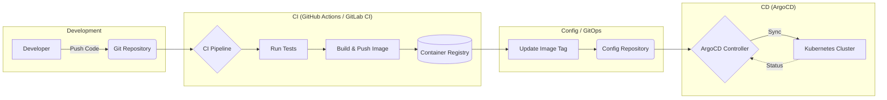

# CI/CD Integration

## Summary
CI/CD integration in Kubernetes is the process of automating the building, testing, and deployment of containerized applications to a cluster. It bridges the gap between development and operations by ensuring that every code change is validated and seamlessly transitioned into a running state. Modern Kubernetes CI/CD often leverages **GitOps** principles, where Git serves as the single source of truth for both infrastructure and application state. Tools like GitHub Actions and GitLab CI handle the integration phase (CI), while ArgoCD manages the continuous delivery (CD) by synchronizing the cluster state with Git repositories.

## Detailed Explanation

### The CI/CD Pipeline for Kubernetes
A standard Kubernetes-native pipeline is divided into two distinct phases: **Continuous Integration (CI)** and **Continuous Delivery (CD)**.

1.  **Continuous Integration (CI)**:
    *   **Source**: Triggered by a Git push or Pull Request.
    *   **Build**: Compiles the code and builds a container image (e.g., Docker).
    *   **Test**: Runs unit, integration, and security scans (linting, vulnerability checks).
    *   **Push**: Uploads the validated image to a Container Registry (GHCR, Docker Hub, GitLab Registry).

2.  **Continuous Delivery (CD)**:
    *   **Manifest Update**: The CI pipeline updates the Kubernetes manifests (YAML, Helm, or Kustomize) in a separate "config" repository with the new image tag.
    *   **Deployment**: The CD tool applies these changes to the cluster.

### Key Tools

#### 1. GitHub Actions
GitHub Actions uses YAML-defined workflows located in `.github/workflows/`. It is highly popular due to its deep integration with GitHub and a vast marketplace of pre-built "Actions".
*   **Best Practice**: Use **OIDC (OpenID Connect)** to authenticate with cloud providers (AWS, GCP, Azure) without storing long-lived secrets.

#### 2. GitLab CI/CD
GitLab offers a built-in CI/CD solution with `.gitlab-ci.yml`. It provides specialized features for Kubernetes, such as the **GitLab Agent for Kubernetes**, which allows for both push-based and pull-based deployments.
*   **Best Practice**: Use GitLab's "Environment" feature to track deployments and perform rollbacks directly from the UI.

#### 3. ArgoCD (GitOps)
ArgoCD is a declarative, GitOps continuous delivery tool for Kubernetes. It follows a **Pull-based model**:
*   It runs inside the cluster as a controller.
*   It monitors a Git repository for changes in Kubernetes manifests.
*   It compares the "Desired State" (Git) with the "Live State" (Cluster).
*   If a deviation is detected (Drift), it automatically or manually synchronizes the cluster to match Git.

### Pipeline Architecture Diagram



## Go Application

For Go developers, CI/CD integration focuses on creating small, secure binaries and automating the update of deployment manifests.

### 1. Multi-Stage Dockerfile for Go
Using multi-stage builds ensures that the final image only contains the compiled binary, reducing the attack surface and image size.

```dockerfile
# Stage 1: Build
FROM golang:1.23-alpine AS builder
WORKDIR /app
COPY go.mod go.sum ./
RUN go mod download
COPY . .
RUN CGO_ENABLED=0 GOOS=linux go build -o main ./cmd/server

# Stage 2: Final Image
FROM alpine:3.20
RUN apk --no-cache add ca-certificates
WORKDIR /root/
COPY --from=builder /app/main .
EXPOSE 8080
CMD ["./main"]
```

### 2. GitHub Actions Workflow Example
A typical workflow for a Go application that builds the image and updates an ArgoCD-tracked manifest repo.

```yaml
name: CI/CD Pipeline
on:
  push:
    branches: [ main ]

jobs:
  build-and-push:
    runs-on: ubuntu-latest
    steps:
      - uses: actions/checkout@v4

      - name: Set up Go
        uses: actions/setup-go@v5
        with:
          go-version: '1.23'

      - name: Run Tests
        run: go test -v ./...

      - name: Login to GHCR
        uses: docker/login-action@v3
        with:
          registry: ghcr.io
          username: ${{ github.actor }}
          password: ${{ secrets.GITHUB_TOKEN }}

      - name: Build and Push
        uses: docker/build-push-action@v5
        with:
          push: true
          tags: ghcr.io/${{ github.repository }}:latest,ghcr.io/${{ github.repository }}:${{ github.sha }}

      # Optional: Trigger GitOps update
      - name: Update Manifest
        run: |
          # Logic to update image tag in the GitOps repository
          echo "Updating image to ${{ github.sha }}"
```

### 3. Integrating with ArgoCD
Once the CI pipeline pushes the image and updates the manifest repository, ArgoCD detects the change. If configured with "Auto-Sync", it will immediately apply the new image to the cluster.

```yaml
# ArgoCD Application Resource
apiVersion: argoproj.io/v1alpha1
kind: Application
metadata:
  name: my-go-app
  namespace: argocd
spec:
  project: default
  source:
    repoURL: https://github.com/my-org/gitops-config.git
    targetRevision: HEAD
    path: apps/my-go-app
  destination:
    server: https://kubernetes.default.svc
    namespace: production
  syncPolicy:
    automated:
      prune: true
      selfHeal: true
```

## Interview Questions

1.  **What is the primary difference between a "Push" and a "Pull" model in CD?**
    *   **Answer**: In a **Push** model (e.g., Jenkins, standard GitHub Actions), the CI system has credentials to the K8s cluster and "pushes" changes using `kubectl apply`. In a **Pull** model (e.g., ArgoCD, Flux), an agent inside the cluster "pulls" changes from Git. The Pull model is more secure as it doesn't require exposing the cluster API to external CI systems.

2.  **Why is it recommended to separate the Application Code repo from the Manifest repo in GitOps?**
    *   **Answer**: It prevents recursive CI loops (where a manifest update triggers a new build), provides a cleaner audit trail for infrastructure changes, and allows different access controls for developers vs. operations.

3.  **How do you handle secrets in a Kubernetes CI/CD pipeline?**
    *   **Answer**: Secrets should never be stored in plain text in Git. Best practices include using **External Secrets Operator** (fetching from AWS Secrets Manager/HashiCorp Vault), **Sealed Secrets** (encrypted in Git), or **Sops**.

4.  **What is "Drift Detection" in ArgoCD?**
    *   **Answer**: It is the process where ArgoCD compares the live state of the cluster with the desired state in Git. If someone manually modifies a resource using `kubectl`, ArgoCD identifies this "drift" and can automatically revert it to match the Git configuration.

5.  **Explain the role of a Container Registry in the CI/CD flow.**
    *   **Answer**: It acts as the immutable artifact store. The CI pipeline produces a versioned image (artifact), and the CD process references this specific version to ensure that what was tested in CI is exactly what is deployed in production.
