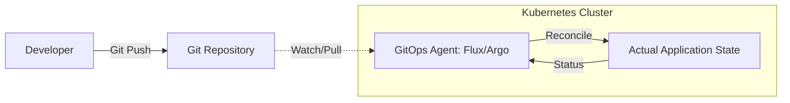

# GitOps (Flux, ArgoCD)

### **Summary**
GitOps is an operational framework that takes DevOps best practices—such as version control, collaboration, compliance, and CI/CD—and applies them to infrastructure automation. It uses Git as the **single source of truth** for the desired state of a system, ensuring that the actual state of the cluster matches the configuration stored in version control. By employing specialized tools like **Flux** or **ArgoCD**, GitOps enables automated synchronization, improved security through pull-based deployments, and faster disaster recovery through declarative configurations.

---

### **Detailed Explanation**

#### **What is GitOps?**
GitOps is a way of managing Kubernetes clusters and application delivery. It works by having a Git repository that contains the declarative description of the infrastructure currently required in the production environment and an automated process to make the production environment match the described state in the repository.

**The Four Principles of GitOps:**
1.  **Declarative**: The entire system must be described declaratively (e.g., YAML manifests).
2.  **Versioned and Immutable**: The desired state is stored in a way that enforces immutability and provides a versioned history (Git).
3.  **Pulled Automatically**: Software agents automatically pull the desired state declarations from the source.
4.  **Continuously Reconciled**: Software agents continuously observe the actual system state and attempt to apply the desired state to fix any "drift."

#### **Why use GitOps?**
-   **Enhanced Security**: No need to give your CI/CD tool (like GitHub Actions or Jenkins) direct `admin` access to your cluster. The GitOps agent runs *inside* the cluster and pulls changes.
-   **Reliability & Recovery**: If your cluster goes down, you can recreate it entirely from the Git repository.
-   **Audit Trail**: Every change is a Git commit, providing a clear history of who changed what and when.
-   **Developer Experience**: Developers use familiar tools (Git) to deploy applications without needing deep Kubernetes CLI knowledge.

#### **Flux vs. ArgoCD (2026 Context)**

| Feature | ArgoCD | Flux (Flux2) |
| :--- | :--- | :--- |
| **Interface** | Rich Web UI & CLI | CLI-first (GitOps UI available) |
| **Architecture** | Centralized (Hub & Spoke) | Modular (Source, Kustomize, Helm controllers) |
| **Multi-tenancy** | Native via Projects | Native via Service Accounts |
| **Best For** | Developer-centric teams, UI lovers | Automation-heavy, modular "Unix-style" fans |
| **OCI Support** | Full Support | OCI-first (highly optimized) |

#### **How it Works (Workflow)**



---

### **Go Application**

For Go developers, GitOps is often about interacting with **Custom Resource Definitions (CRDs)**. You might write a Go service that programmatically generates these manifests or a controller that reacts to their status.

#### **Interacting with ArgoCD in Go**
Using the ArgoCD API, you can define an `Application` resource. This is useful when building internal developer portals (IDP).

```go
package main

import (
	"context"
	argov1alpha1 "github.com/argoproj/argo-cd/v2/pkg/apis/application/v1alpha1"
	metav1 "k8s.io/apimachinery/pkg/apis/meta/v1"
	"sigs.k8s.io/controller-runtime/pkg/client"
)

// CreateArgoApplication demonstrates how a Go dev might define an ArgoCD app programmatically.
func CreateArgoApplication(ctx context.Context, c client.Client, name, repoURL, path string) error {
	app := &argov1alpha1.Application{
		ObjectMeta: metav1.ObjectMeta{
			Name:      name,
			Namespace: "argocd",
		},
		Spec: argov1alpha1.ApplicationSpec{
			Project: "default",
			Source: &argov1alpha1.ApplicationSource{
				RepoURL:        repoURL,
				Path:           path,
				TargetRevision: "HEAD",
			},
			Destination: argov1alpha1.ApplicationDestination{
				Server:    "https://kubernetes.default.svc",
				Namespace: "production",
			},
			SyncPolicy: &argov1alpha1.SyncPolicy{
				Automated: &argov1alpha1.SyncPolicyAutomated{
					Prune:    true,
					SelfHeal: true,
				},
			},
		},
	}
	return c.Create(ctx, app)
}
```

---

### **Interview Questions**

1.  **Explain the difference between the "Push" and "Pull" deployment models. Why is Pull preferred for GitOps?**
    -   *Answer*: In the **Push** model, an external CI tool pushes changes to the cluster, requiring it to store cluster credentials. In the **Pull** model, an agent inside the cluster watches Git and pulls changes. Pull is preferred because it is more secure (credentials stay inside the cluster) and natively handles drift detection by continuously comparing the states.

2.  **What is "Configuration Drift," and how do Flux/ArgoCD handle it?**
    -   *Answer*: Drift occurs when the actual state of the cluster is changed manually (e.g., via `kubectl edit`) and no longer matches the desired state in Git. GitOps tools handle this through a **reconciliation loop**: they detect the discrepancy and automatically re-apply the Git configuration to "self-heal" the cluster.

3.  **How do you handle secrets in a GitOps workflow if you cannot store them in plain text in Git?**
    -   *Answer*: Common strategies include:
        -   **Encrypted Secrets**: Using **Bitnami Sealed Secrets** to store encrypted manifests in Git that only the cluster can decrypt.
        -   **Secret References**: Using the **External Secrets Operator** or **AWS Secrets Manager** to fetch secrets at runtime.
        -   **SOPS**: Using Mozilla SOPS to encrypt values in Git, which Flux can natively decrypt using a KMS key.

4.  **In FluxCD, what is the role of a 'Kustomization' resource vs a 'GitRepository' resource?**
    -   *Answer*: The `GitRepository` is a **Source** resource that defines *where* to get the manifests (the "Source of Truth"). The `Kustomization` is a **Deployment** resource that defines *how* to apply those manifests (e.g., target namespace, path, interval, and dependencies).

5.  **Why would a team choose ArgoCD over Flux?**
    -   *Answer*: A team might choose ArgoCD if they require a **centralized dashboard** for visibility across many clusters, integrated SSO/RBAC for developers, or a "developer portal" experience. Flux is often chosen for its modularity, OCI support, and being more "invisible" in the background.
