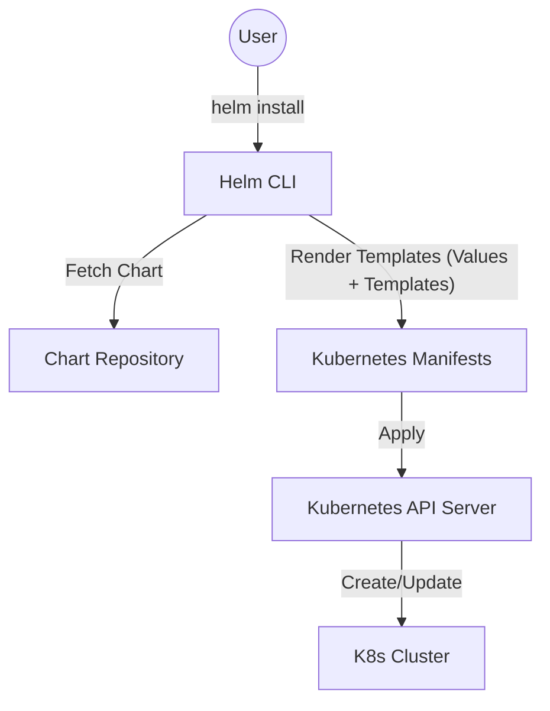

# Helm Charts

## Summary
Helm is the package manager for Kubernetes, designed to simplify the definition, installation, and upgrade of complex Kubernetes applications. It uses a packaging format called "Charts," which are collections of files that describe a related set of Kubernetes resources. By providing a template-based approach, Helm allows developers to manage Kubernetes manifests more efficiently, enabling versioning, reusability, and easy rollbacks.

## Detailed Explanation

### What is Helm?
Helm is an open-source tool that automates the deployment of applications on Kubernetes clusters. It functions similarly to `apt`, `yum`, or `npm`, but for Kubernetes resources. A single "Chart" can be used to deploy anything from a simple Redis pod to a complex full-stack web application with databases, caches, and HTTP servers.

### Why use Helm?
- **Manage Complexity**: Bundles multiple Kubernetes manifests into a single logical unit.
- **Easy Updates**: Upgrading applications is a single command away, and rollbacks are equally simple.
- **Shareable**: Charts can be packaged and shared via public or private repositories (Artifact Hub).
- **Customizable**: Uses `values.yaml` to parameterize templates, allowing the same chart to be used across different environments (Dev, Staging, Prod).

### How it Works: The Anatomy of a Chart
A standard Helm chart follows a specific directory structure:

```text
mychart/
  Chart.yaml          # Metadata about the chart (name, version, apiVersion)
  values.yaml         # Default configuration values for templates
  charts/             # Directory containing any dependent charts
  templates/          # The template files that will be rendered into K8s manifests
    deployment.yaml
    service.yaml
    _helpers.tpl      # Reusable template snippets (partials)
```

### Architecture Diagram


## Go Application

Helm is particularly relevant to Go developers because the Helm templating engine is built directly on **Go's `text/template`** and **`html/template`** libraries. This means Go developers will find the syntax (e.g., `{{ .Values.name }}`) very familiar.

### 1. Templating a Go Application
When deploying a Go microservice, you can use Helm to inject environment-specific configuration. Below is an example of how a Go app's deployment might be templated:

```yaml
# templates/deployment.yaml
apiVersion: apps/v1
kind: Deployment
metadata:
  name: {{ include "mychart.fullname" . }}
spec:
  replicas: {{ .Values.replicaCount }}
  template:
    spec:
      containers:
        - name: go-app
          image: "{{ .Values.image.repository }}:{{ .Values.image.tag | default .Chart.AppVersion }}"
          ports:
            - containerPort: {{ .Values.service.port }}
          env:
            - name: GIN_MODE
              value: {{ .Values.config.mode | quote }}
            - name: DB_URL
              value: {{ .Values.config.dbUrl | quote }}
```

### 2. Using the Helm Go SDK
If you are building an internal platform, a custom CLI, or a Kubernetes Operator in Go, you can use the **Helm SDK** to manage releases programmatically without calling the CLI.

```go
package main

import (
	"log"
	"os"

	"helm.sh/helm/v3/pkg/action"
	"helm.sh/helm/v3/pkg/kube"
)

func main() {
	// Initialize the action configuration
	actionConfig := new(action.Configuration)
	
	// Get kubeconfig from environment
	settings := kube.GetConfig(os.Getenv("KUBECONFIG"), "", "")
	
	// Initialize Helm with the "default" namespace
	if err := actionConfig.Init(settings, "default", "secrets", log.Printf); err != nil {
		log.Fatalf("Failed to init action config: %v", err)
	}

	// Create a client to list existing releases
	client := action.NewList(actionConfig)
	releases, err := client.Run()
	if err != nil {
		log.Fatalf("Failed to list releases: %v", err)
	}

	for _, rel := range releases {
		log.Printf("Found release: %s (Status: %s, Revision: %d)", 
            rel.Name, rel.Info.Status, rel.Version)
	}
}
```

## Interview Questions

**Q: What is the difference between `values.yaml` and `Chart.yaml`?**
**A:** `Chart.yaml` contains metadata about the chart itself (name, description, chart version, and application version). `values.yaml` contains the default configuration values that populate the templates during rendering.

**Q: Where does Helm store its release metadata?**
**A:** Since Helm 3, release information is stored as **Kubernetes Secrets** within the namespace where the release is installed. This removed the need for the "Tiller" server-side component used in Helm 2, making Helm more secure and easier to manage with RBAC.

**Q: What are Helm Hooks, and why would you use them?**
**A:** Hooks allow you to execute operations at specific points in a release lifecycle (e.g., `pre-install`, `post-upgrade`, `post-delete`). A common use case is running a Kubernetes Job to perform database migrations before the application pods are updated.

**Q: How do you handle secrets in Helm charts?**
**A:** While you can use `values.yaml` for configuration, plain-text secrets should never be stored there. Best practices include using **Helm Secrets** (with SOPS), **HashiCorp Vault**, or mapping external secrets into the cluster and referencing them in the chart templates.

**Q: Explain the `helm rollback` process.**
**A:** When you run `helm rollback <release> <revision>`, Helm identifies the metadata for the target revision (stored in Secrets), generates the manifests from that state, and applies them to the cluster. This effectively restores the application to its previous configuration and image version.
