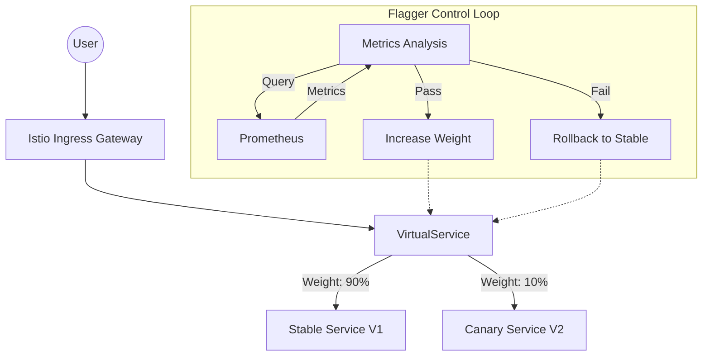

---
---

# **Canary Deployments (Flagger & Istio)**

### **Summary**
Canary deployments are a progressive delivery strategy that rolls out a new version of an application to a small subset of users before making it available to everyone. In a Kubernetes environment, tools like **Flagger** automate this process by leveraging a service mesh like **Istio** to perform fine-grained traffic shifting and automated health analysis. This approach minimizes the "blast radius" of potential failures by validating the new version (the "canary") against real production traffic using metrics like error rates and request latency.

---

### **Detailed Explanation**

#### **What, Why, and How**

*   **What**: A canary deployment involves running two versions of an application simultaneously: the "Primary" (stable) and the "Canary" (new). Initially, a tiny percentage of traffic is routed to the canary.
*   **Why**: To reduce risk. Unlike Blue-Green deployments which switch 100% of traffic, Canary allows for "testing in production" with minimal impact if something goes wrong.
*   **How**: 
    1.  **Traffic Shifting**: Istio's `VirtualService` and `DestinationRule` are used to split traffic by weight (e.g., 95% Stable, 5% Canary).
    2.  **Analysis**: Flagger monitors Prometheus metrics (e.g., HTTP 5xx errors < 1%, latency < 500ms).
    3.  **Promotion**: If the analysis passes, Flagger increases the weight (10%, 20%...). Once 100% is reached, the canary version becomes the new Primary.
    4.  **Rollback**: If metrics fail at any point, Flagger immediately routes all traffic back to the Primary version.

#### **Architecture Diagram**



#### **Canary Custom Resource Example**
```yaml
apiVersion: flagger.app/v1beta1
kind: Canary
metadata:
  name: my-app
spec:
  targetRef:
    apiVersion: apps/v1
    kind: Deployment
    name: my-app
  service:
    port: 80
    gateways: [public-gateway]
    hosts: [app.example.com]
  analysis:
    interval: 1m
    threshold: 5
    maxWeight: 50
    stepWeight: 10
    metrics:
    - name: request-success-rate
      thresholdRange:
        min: 99
      interval: 1m
```

---

### **Go Application Integration**

For Go developers, Canary deployments are most effective when combined with **Feature Flags** and **Robust Observability**.

#### **1. Feature Flags in Go**
While Istio handles traffic splitting, feature flags allow for logic-level control.

```go
package main

import (
	"fmt"
	"net/http"
)

func (s *Server) handler(w http.ResponseWriter, r *http.Request) {
	// Pattern: Headers can be used to force canary behavior for internal testing
	isCanaryUser := r.Header.Get("X-Canary-Group") == "internal"

	if isCanaryUser {
		s.serveNewFeature(w, r)
		return
	}
	s.serveStableFeature(w, r)
}

func (s *Server) serveNewFeature(w http.ResponseWriter, r *http.Request) {
	fmt.Fprint(w, "New v2 logic")
}

func (s *Server) serveStableFeature(w http.ResponseWriter, r *http.Request) {
	fmt.Fprint(w, "Stable v1 logic")
}
```

#### **2. Graceful Shutdown**
During a Canary rollout, pods are frequently created and destroyed. Go apps must handle `SIGTERM` to avoid dropped requests.

```go
func main() {
    // Context that listens for the interrupt signals from the OS.
    ctx, stop := signal.NotifyContext(context.Background(), os.Interrupt, syscall.SIGTERM)
    defer stop()

    srv := &http.Server{Addr: ":8080"}

    go func() {
        if err := srv.ListenAndServe(); err != nil && err != http.ErrServerClosed {
            log.Fatalf("listen: %s\n", err)
        }
    }()

    // Wait for interrupt signal
    <-ctx.Done()
    
    log.Println("Shutting down gracefully...")
    shutdownCtx, cancel := context.WithTimeout(context.Background(), 10*time.Second)
    defer cancel()
    
    if err := srv.Shutdown(shutdownCtx); err != nil {
        log.Fatal("Server forced to shutdown:", err)
    }
}
```

---

### **Interview Questions**

1.  **Q: What is the main difference between Blue-Green and Canary deployments?**
    *   **A:** Blue-Green deployment switches 100% of traffic from one environment (Blue) to another (Green) at once. Canary deployment gradually shifts a small percentage of traffic to the new version, allowing for incremental validation.

2.  **Q: How does Flagger determine if a Canary deployment is successful?**
    *   **A:** Flagger uses "Analysis" rules to query metrics providers (like Prometheus) for specific SLIs, such as HTTP success rate or request latency, over a specified interval.

3.  **Q: Why is a Service Mesh like Istio required for advanced Canary strategies?**
    *   **A:** Standard Kubernetes Services only support basic round-robin load balancing. Istio provides L7 traffic control, enabling weighted routing (e.g., 5% to V2) and header-based steering.

4.  **Q: What happens if a Flagger analysis fails?**
    *   **A:** Flagger halts the traffic shift, routes 100% of traffic back to the Primary (stable) version, and marks the rollout as failed, often triggering a notification.

5.  **Q: What is "Blast Radius" in the context of Canary deployments?**
    *   **A:** It refers to the number of users affected by a bug in the new version. Canary deployments minimize this by limiting the initial exposure to a very small percentage of traffic.
