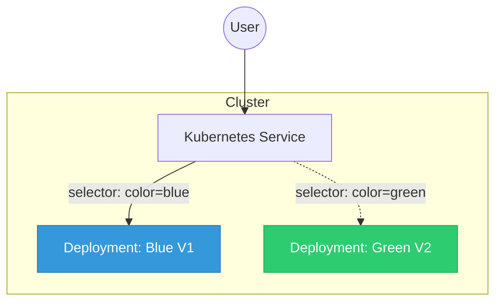

## Summary
Blue-Green deployment is a release strategy that minimizes downtime and risk by running two identical production environments: "Blue" (the current version) and "Green" (the new version). Traffic is routed to Blue until the Green version is fully tested and ready, at which point the router or load balancer (in Kubernetes, a Service or Ingress) switches traffic to Green. This approach allows for near-zero downtime and provides an instant rollback path if issues are detected after the switch.

## Detailed Explanation

### What is Blue-Green Deployment?
In a Blue-Green deployment, you maintain two identical, isolated environments. At any given time, only one of these environments is "live" and serving production traffic.
- **Blue Environment**: The "old" or currently stable production version.
- **Green Environment**: The "new" version being deployed and tested.

### Why Use It?
- **Zero Downtime**: Switching traffic at the network layer (Service/Ingress) is nearly instantaneous.
- **Risk Reduction**: You can perform final smoke tests on the Green environment in the actual production infrastructure before exposing it to users.
- **Instant Rollback**: If the Green version fails, you can immediately point the Service back to the Blue environment.
- **Environment Consistency**: It ensures that the deployment process is repeatable and that environments don't drift.

### How it works in Kubernetes
Kubernetes makes Blue-Green deployments relatively simple to implement using Labels and Selectors.

1.  **Preparation**: You have a `Deployment` named `app-blue` with label `color: blue`.
2.  **Service Setup**: A `Service` is configured with a selector `color: blue`.
3.  **Deploy Green**: You create a new `Deployment` named `app-green` with the new image version and label `color: green`.
4.  **Verification**: You test the `app-green` pods (using a temporary service or port-forwarding).
5.  **The Switch**: You update the production `Service` selector from `color: blue` to `color: green`.
6.  **Cleanup**: Once satisfied, you can either delete the Blue deployment or keep it for a few hours as a safety net.

### Architecture Diagram


## Go Application

For a Go application to thrive in a Blue-Green deployment, it must implement **Graceful Shutdown** and **Health Probes**. When traffic switches, old pods receive a `SIGTERM`. The Go app must finish active requests before exiting to avoid dropping connections.

### Implementation Example

```go
package main

import (
	"context"
	"fmt"
	"log"
	"net/http"
	"os"
	"os/signal"
	"syscall"
	"time"
)

func main() {
	mux := http.NewServeMux()

	// Business logic
	mux.HandleFunc("/", func(w http.ResponseWriter, r *http.Request) {
		fmt.Fprintf(w, "Hello from the Green version!")
	})

	// Kubernetes Health Probes
	mux.HandleFunc("/healthz", func(w http.ResponseWriter, r *http.Request) {
		w.WriteHeader(http.StatusOK)
	})

	server := &http.Server{
		Addr:    ":8080",
		Handler: mux,
	}

	// Channel to listen for OS signals
	stop := make(chan os.Signal, 1)
	signal.Notify(stop, os.Interrupt, syscall.SIGTERM)

	go func() {
		log.Printf("Server starting on %s", server.Addr)
		if err := server.ListenAndServe(); err != nil && err != http.ErrServerClosed {
			log.Fatalf("Listen error: %s", err)
		}
	}()

	// Wait for SIGTERM
	<-stop
	log.Println("Shutting down gracefully...")

	// Create a context with a timeout for the shutdown process
	ctx, cancel := context.WithTimeout(context.Background(), 30*time.Second)
	defer cancel()

	if err := server.Shutdown(ctx); err != nil {
		log.Fatalf("Server forced to shutdown: %s", err)
	}

	log.Println("Server exited cleanly")
}
```

## Interview Questions

**Q: How does Blue-Green deployment differ from Canary deployment?**
**A:** Blue-Green switches 100% of traffic from the old version to the new version at once after verification. Canary deployment gradually rolls out the new version to a small percentage of users (e.g., 5%, 10%, 25%) before a full rollout.

**Q: What are the main infrastructure challenges of Blue-Green deployments?**
**A:** The primary challenge is the doubling of resource requirements (CPU, Memory, Storage) during the transition period, as two full versions of the application must run simultaneously.

**Q: How do you handle database schema changes in a Blue-Green deployment?**
**A:** Database changes must be backward-compatible. This usually involves a multi-step process: 1. Apply schema changes that support both versions. 2. Deploy Green. 3. (Optional) Cleanup old schema after Blue is decommissioned.

**Q: Why is Graceful Shutdown important for Blue-Green deployments?**
**A:** When traffic is switched, the old pods will no longer receive new requests, but they might still be processing existing ones. Graceful shutdown ensures the Go application finishes those requests before the pod is terminated by Kubernetes, preventing 5xx errors for users.
