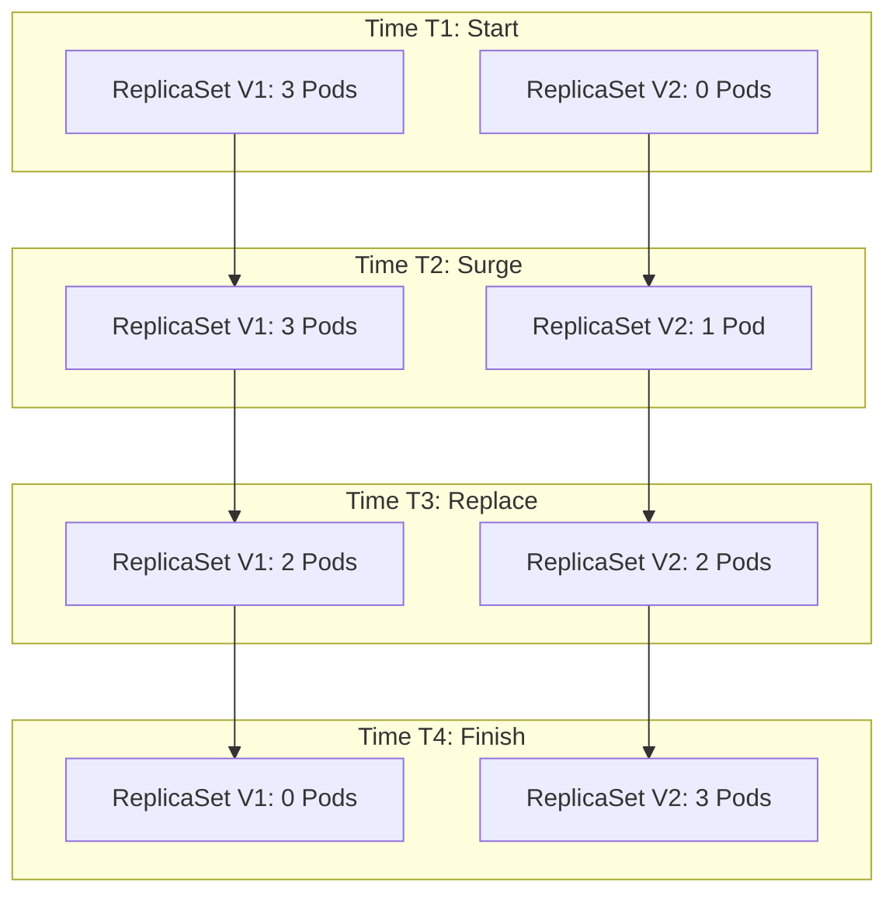

# Rolling Updates and Rollbacks

## Summary
A **Rolling Update** is the default deployment strategy in Kubernetes, designed to update applications with zero downtime. It works by incrementally replacing old Pods with new ones, ensuring that a minimum number of Pods are always available to serve traffic. If an issue is detected during the update, Kubernetes provides a native **Rollback** mechanism to revert the Deployment to a previous stable revision, utilizing the stored history of ReplicaSets.

## Detailed Explanation

### Rolling Update Strategy
When you update a Deployment (e.g., changing the image tag), the Deployment Controller creates a new ReplicaSet and begins scaling it up while scaling down the old ReplicaSet. The speed and safety of this process are controlled by two parameters:

1.  **`maxSurge`**: The maximum number of Pods that can be created *above* the desired replica count. (Can be an absolute number or percentage).
2.  **`maxUnavailable`**: The maximum number of Pods that can be unavailable during the update.

**Example**: With `replicas: 3`, `maxSurge: 1`, `maxUnavailable: 0`:
- Kubernetes creates 1 new Pod (Total: 4).
- Once the new Pod is Ready, it deletes 1 old Pod (Total: 3).
- Repeats until all Pods are new.

### Rollback Mechanism
Kubernetes maintains a revision history of Deployments. If a new version crashes or fails health checks, you can undo the rollout.
- **Command**: `kubectl rollout undo deployment/my-app`
- **Mechanism**: The Deployment Controller scales up the *previous* ReplicaSet and scales down the *current* (failed) one.

### Visualizing the Transition



## Go Application

For a rolling update to be truly "zero downtime," the Go application must handle the termination lifecycle correctly.

### Graceful Shutdown (The "Must Have")
When Kubernetes scales down an old ReplicaSet, it sends a `SIGTERM` signal to the Pod.
1.  **Kubernetes**: Removes Pod from Service Endpoints (stops new traffic).
2.  **Go App**: Receives `SIGTERM`. Should stop accepting new connections but finish processing active ones.
3.  **Kubernetes**: Waits for `terminationGracePeriodSeconds` (default 30s) before forcibly killing (SIGKILL).

```go
package main

import (
	"context"
	"log"
	"net/http"
	"os"
	"os/signal"
	"syscall"
	"time"
)

func main() {
	srv := &http.Server{Addr: ":8080"}

	// Start server in a goroutine
	go func() {
		if err := srv.ListenAndServe(); err != nil && err != http.ErrServerClosed {
			log.Fatalf("listen: %s\n", err)
		}
	}()

	// Wait for interrupt signal
	quit := make(chan os.Signal, 1)
	signal.Notify(quit, syscall.SIGINT, syscall.SIGTERM)
	<-quit
	log.Println("Shutting down server...")

	// The context is used to inform the server it has 5 seconds to finish
	// the request it is currently handling
	ctx, cancel := context.WithTimeout(context.Background(), 5*time.Second)
	defer cancel()

	if err := srv.Shutdown(ctx); err != nil {
		log.Fatal("Server forced to shutdown:", err)
	}

	log.Println("Server exiting")
}
```

## Interview Questions

**Q: What happens if I set `maxUnavailable` to 100%?**
**A:** The update effectively becomes a "Recreate" strategy (almost). Kubernetes will immediately terminate all old Pods (making the service unavailable) and then start creating new Pods. This causes downtime but ensures the update is as fast as possible.

**Q: How do you verify the status of a rolling update from the CLI?**
**A:** You use `kubectl rollout status deployment/<name>`. This command blocks until the rollout finishes successfully or fails. It's commonly used in CI/CD pipelines to ensure a deployment succeeded before proceeding.

**Q: Why might a rolling update get stuck?**
**A:** Common reasons include:
1.  **ImagePullBackOff**: The new image tag doesn't exist or authentication failed.
2.  **Readiness Probe Failure**: The new application is crashing or failing its health check, preventing Kubernetes from proceeding to the next pod.
3.  **Quota Exceeded**: The namespace ResourceQuota prevents creating the new surge pods.

**Q: How many revisions does Kubernetes keep by default?**
**A:** By default, Kubernetes keeps **10** revisions (`revisionHistoryLimit`). This means you can rollback to any of the last 10 deployments. Older revisions are garbage collected to save etcd space.

**Q: Can you pause a rolling update?**
**A:** Yes, using `kubectl rollout pause deployment/<name>`. This is useful for "Canary-like" manual verification. You can let a few new pods roll out, pause, check metrics/logs, and then `kubectl rollout resume` to finish the update.
