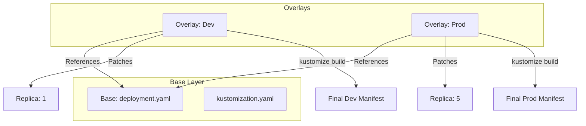

# Kustomize

## Summary
Kustomize is a template-free configuration management tool for Kubernetes that allows users to customize raw, template-free YAML files for multiple purposes, leaving the original YAML untouched and usable as is. It relies on a system of "bases" and "overlays" to manage variations across environments (development, staging, production) without forking the codebase. Built directly into `kubectl` (via `kubectl -k`), it offers a native, declarative approach to managing Kubernetes manifests.

## Detailed Explanation

### What is Kustomize?
Unlike Helm, which treats Kubernetes manifests as templates to be filled with values, Kustomize treats them as plain YAML files. It applies transformations (patches, namespace injection, label addition) on top of these base files.

### Why use Kustomize?
-   **Template-free**: No complex loops or logic in your YAML. The base manifest is valid on its own.
-   **Native Integration**: Available in `kubectl` since v1.14.
-   **Composition**: Encourages reusing common bases (e.g., a standard Deployment definition) and applying overlays for specific environments.
-   **Secret/ConfigMap Generation**: Automatically generates ConfigMaps and Secrets from files, appending a hash to the name to force rolling updates when content changes.

### Key Patterns: Base and Overlays
-   **Base**: The directory containing the common resources (deployment.yaml, service.yaml, kustomization.yaml).
-   **Overlay**: A directory (e.g., `overlays/production`) that references the Base and applies patches (e.g., higher replica count, different resource limits).

### Visualizing the Workflow



## Go Application

For Go developers, Kustomize is particularly relevant because it is written in Go, and its core API (`krusty`) can be imported to build custom tooling.

### 1. Using Kustomize Library in Go
If you are building an internal platform or operator, you can run Kustomize programmatically.

```go
package main

import (
	"fmt"
	"sigs.k8s.io/kustomize/api/krusty"
	"sigs.k8s.io/kustomize/kyaml/filesys"
)

func main() {
	// Create a Kustomizer with default options
	k := krusty.MakeKustomizer(krusty.MakeDefaultOptions())
    
	// Use on-disk file system
	fSys := filesys.MakeFsOnDisk()

	// Run Kustomize on a specific path
	m, err := k.Run(fSys, "overlays/production")
	if err != nil {
		panic(err)
	}

	// Output the resulting YAML
	yml, _ := m.AsYaml()
	fmt.Println(string(yml))
}
```

### 2. ConfigMap Generator with Go
Kustomize can generate ConfigMaps from `.env` files. This integrates perfectly with Go applications using `godotenv` or `viper`.

**kustomization.yaml:**
```yaml
configMapGenerator:
- name: app-config
  files:
  - config.env
```

**Go App:**
Your Go app simply reads environment variables, unaware that Kustomize generated the ConfigMap and rolled the Deployment.

---

## Interview Questions

### 1. How does Kustomize differ from Helm?
**Answer**: Helm uses a templating engine (Go templates) where values are injected into placeholders. Kustomize uses a patching engine where changes (overlays) are applied on top of valid base YAML files. Helm manages the packaging and lifecycle (releases), while Kustomize focuses purely on configuration transformation.

### 2. What is a "Strategic Merge Patch" in Kustomize?
**Answer**: It is a specialized patching method that understands the structure of Kubernetes objects. For example, when patching a list of containers in a Pod spec, a Strategic Merge Patch can modify a specific container by name (e.g., changing the image of the `sidecar` container) rather than replacing the entire list.

### 3. Why does Kustomize append hashes to ConfigMap and Secret names?
**Answer**: To trigger automatic rolling updates. Since Deployment resources reference ConfigMaps by name, changing the ConfigMap content *without* changing its name does not trigger a Pod restart. By appending a content-hash to the name (e.g., `my-config-h54a8d`), Kustomize updates the Deployment to point to the new name, forcing Kubernetes to create new Pods with the updated configuration.

### 4. Can Kustomize manage CRDs (Custom Resource Definitions)?
**Answer**: Yes. Kustomize treats CRDs just like any other Kubernetes object. It supports the `configurations` field to teach Kustomize how to handle custom structures in CRDs (e.g., which fields are object references) if the default merge strategy isn't sufficient.

### 5. What are "Generators" in Kustomize?
**Answer**: Generators are mechanisms to create resources dynamically. The built-in generators create ConfigMaps and Secrets from files or literals. Kustomize also supports plugins (exec or Go plugins) to generate any arbitrary Kubernetes resource based on custom logic.
