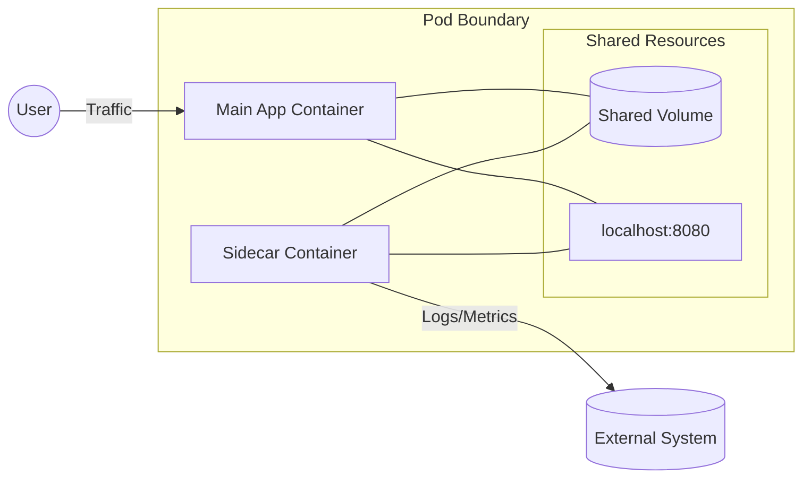

---
---

## Summary
The **Sidecar Pattern** is a modular container design where a secondary "helper" container runs alongside the primary application container within the same Pod. This pattern enables the separation of concerns by offloading peripheral tasks—such as logging, monitoring, configuration, or security—to a dedicated container without modifying the application code. Since Kubernetes v1.33 (stable), sidecars can be natively defined as restartable init containers, ensuring they start before and outlive the main application.

## Detailed Explanation

### What is the Sidecar Pattern?
In Kubernetes, a Pod is the smallest deployable unit and can contain multiple containers. These containers share the same:
- **Network Namespace**: They communicate via `localhost`.
- **Storage Volumes**: They can mount the same `emptyDir` or persistent volumes to share data.

The sidecar pattern leverages this co-location to extend the functionality of the main application container.

### Why Use It?
- **Single Responsibility**: Keep the main application container focused on business logic.
- **Language Independence**: A logging sidecar written in Go can support an application written in Python, Java, or Node.js.
- **Consistent Operations**: Standardize how logging, secrets, or proxies are handled across many different services.
- **Dynamic Updates**: Update the sidecar (e.g., a security agent) without needing to rebuild the application image.

### How it Works (Native Sidecars)
Before Kubernetes v1.29, sidecars were just regular containers in the `containers` array. This led to issues where the main app would start before the sidecar was ready, or the sidecar would prevent a Job from completing.

**Native Sidecars** (KEP-753) are implemented as **restartable init containers**. By setting `restartPolicy: Always` on an init container, Kubernetes ensures:
1. The sidecar starts before any regular containers.
2. The sidecar is kept running for the entire life of the Pod.
3. If the Pod is a Job, the sidecar is terminated automatically when the Job finishes.

### Visual Representation


## Go Application

### Example: Log Tailing Sidecar in Go
A common scenario for Go developers is building a high-performance sidecar that watches a log file and pushes it to a central server.

#### 1. The Main Application (Go)
This app simply writes logs to a shared volume.

```go
package main

import (
	"fmt"
	"log"
	"os"
	"time"
)

func main() {
	// Create/Open log file in the shared volume path
	f, _ := os.OpenFile("/var/log/app/output.log", os.O_APPEND|os.O_CREATE|os.O_WRONLY, 0644)
	defer f.Close()

	for {
		msg := fmt.Sprintf("Log message at %s\n", time.Now().Format(time.RFC3339))
		f.WriteString(msg)
		log.Print("Wrote log line")
		time.Sleep(2 * time.Second)
	}
}
```

#### 2. The Sidecar (Go)
The sidecar uses a shared volume to read the logs and process them.

```go
package main

import (
	"bufio"
	"fmt"
	"io"
	"os"
	"time"
)

func main() {
	logPath := "/var/log/app/output.log"
	
	// Wait for the main app to create the file
	for {
		if _, err := os.Stat(logPath); err == nil {
			break
		}
		time.Sleep(1 * time.Second)
	}

	file, _ := os.Open(logPath)
	reader := bufio.NewReader(file)

	for {
		line, err := reader.ReadString('\n')
		if err != nil {
			if err == io.EOF {
				time.Sleep(500 * time.Millisecond) // Wait for more logs
				continue
			}
			break
		}
		// In a real app, you would send this to Prometheus, ElasticSearch, etc.
		fmt.Printf("[Sidecar Exporter] Forwarding: %s", line)
	}
}
```

#### 3. Kubernetes Manifest (Native Sidecar)
Notice the use of `initContainers` with `restartPolicy: Always`.

```yaml
apiVersion: v1
kind: Pod
metadata:
  name: go-sidecar-example
spec:
  volumes:
  - name: shared-logs
    emptyDir: {}
    
  initContainers:
  - name: log-exporter
    image: my-go-sidecar:latest
    restartPolicy: Always # <--- This makes it a native sidecar
    volumeMounts:
    - name: shared-logs
      mountPath: /var/log/app
      
  containers:
  - name: main-app
    image: my-go-app:latest
    volumeMounts:
    - name: shared-logs
      mountPath: /var/log/app
```

## Interview Questions

**Q: What is the primary advantage of the Sidecar pattern over bundling everything in one container?**
**A:** It adheres to the Single Responsibility Principle. By decoupling helper tasks from the application, you can scale, update, and manage them independently. It also allows using the best tool/language for the specific helper task (e.g., C++/Go for proxies) regardless of the application's language.

**Q: How do containers in a Pod communicate with each other?**
**A:** They share the same network namespace, meaning they can communicate via `localhost` and share the same IP address. They also share the same UTS namespace (hostname) and can share storage via mounted volumes (typically an `emptyDir`).

**Q: What was the "Sidecar termination problem" and how did native sidecars solve it?**
**A:** In older Kubernetes versions, sidecars were indistinguishable from regular containers. If a Pod was running a Batch Job, the sidecar would keep running indefinitely, preventing the Pod from ever reaching the `Succeeded` state. Native sidecars (stable in v1.33) solve this by being defined as restartable init containers; Kubernetes now knows to terminate them automatically once all main containers in the Pod exit.

**Q: Compare the Sidecar pattern with the Ambassador and Adapter patterns.**
**A:** 
- **Sidecar**: Extends or enhances the main container (e.g., logging, data sync).
- **Ambassador**: Acts as a proxy for *outgoing* connections, abstracting the complexity of connecting to external services (e.g., database routing, circuit breaking).
- **Adapter**: Normalizes *incoming* or *outgoing* data to a standard format (e.g., converting heterogeneous application logs into a single Prometheus-compatible format).
