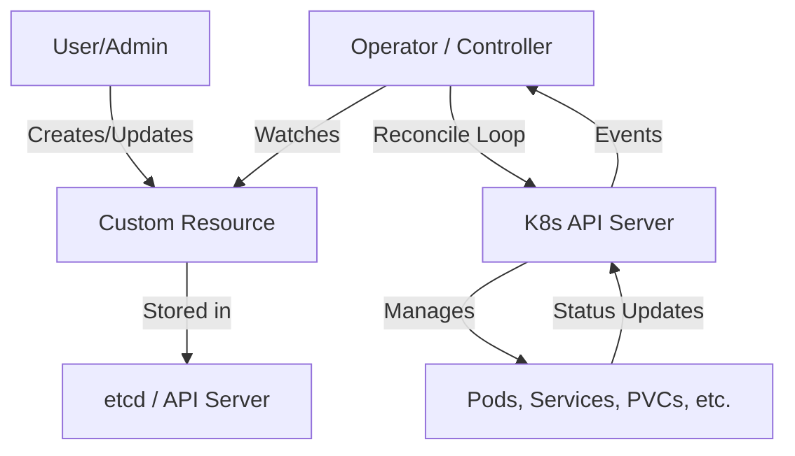

# Kubernetes Operators

## Summary
Kubernetes Operators are software extensions that use Custom Resources to manage applications and their components. They follow the control loop principle, acting as an automated "human operator" that has deep knowledge of how to deploy and manage a specific service. By capturing domain-specific knowledge into code, Operators can automate complex tasks like backups, upgrades, and failure recovery. They bridge the gap between low-level Kubernetes resources (Pods, Services) and high-level application lifecycle management.

## Detailed Explanation

### What are Operators?
An **Operator** is a method of packaging, deploying, and managing a Kubernetes application. It consists of two main components:
1.  **Custom Resource Definition (CRD)**: Defines the API for your application, allowing users to create "Custom Resources" (CRs) that describe the desired state of the application.
2.  **Custom Controller**: A process running in the cluster that watches for changes to these CRs and takes action to ensure the actual state matches the desired state.

### Why use Operators?
Standard Kubernetes controllers (like Deployment or StatefulSet) are generic. They understand how to keep a set of Pods running, but they don't know:
-   How to perform a database schema migration.
-   How to safely perform a cluster-aware rolling update for a distributed system like Cassandra or Kafka.
-   How to take a consistent backup of a stateful application.
Operators provide this **domain-specific intelligence** by encoding the operational knowledge of a human administrator into software.

### How they work: The Reconciliation Loop
The core of an Operator is the **Reconciliation Loop**. It is an infinite loop that performs the following steps:
1.  **Observe**: Watch the state of the Custom Resources and the actual state of the cluster.
2.  **Analyze**: Compare the desired state (CR) with the actual state (current resources).
3.  **Act**: Perform the necessary operations (create, update, delete) to reconcile the difference.



## Go Application

For Go developers, the two primary tools for building Operators are **Kubebuilder** and **Operator SDK**.

-   **Kubebuilder**: A framework for building Kubernetes APIs using CRDs. It provides the low-level scaffolding and the `controller-runtime` library which handles the heavy lifting of caching, watching, and queuing.
-   **Operator SDK**: Part of the Operator Framework, it builds on top of Kubebuilder to provide higher-level tools for testing, packaging (using OLM), and managing the lifecycle of your Operator.

### Example: A Simple Reconciler in Go
Below is a conceptual example of a Reconciler implementation using the `controller-runtime` library.

```go
package controllers

import (
    "context"
    "k8s.io/apimachinery/pkg/api/errors"
    "k8s.io/apimachinery/pkg/types"
    ctrl "sigs.k8s.io/controller-runtime"
    "sigs.k8s.io/controller-runtime/pkg/client"
    appsv1 "k8s.io/api/apps/v1"
    myv1 "github.com/example/my-operator/api/v1"
)

type MyAppReconciler struct {
    client.Client
    Log logr.Logger
}

func (r *MyAppReconciler) Reconcile(ctx context.Context, req ctrl.Request) (ctrl.Result, error) {
    // 1. Fetch the Custom Resource instance
    var myApp myv1.MyApp
    if err := r.Get(ctx, req.NamespacedName, &myApp); err != nil {
        return ctrl.Result{}, client.IgnoreNotFound(err)
    }

    // 2. Check if the underlying Deployment already exists
    var found appsv1.Deployment
    err := r.Get(ctx, types.NamespacedName{Name: myApp.Name, Namespace: myApp.Namespace}, &found)
    if err != nil && errors.IsNotFound(err) {
        // Define and create a new deployment based on CR specs
        dep := r.deploymentForMyApp(&myApp)
        if err := r.Create(ctx, dep); err != nil {
            return ctrl.Result{}, err
        }
        // Deployment created successfully - return and requeue
        return ctrl.Result{Requeue: true}, nil
    } else if err != nil {
        return ctrl.Result{}, err
    }

    // 3. Ensure the deployment matches the desired spec (e.g. replicas)
    size := myApp.Spec.Size
    if *found.Spec.Replicas != size {
        found.Spec.Replicas = &size
        if err := r.Update(ctx, &found); err != nil {
            return ctrl.Result{}, err
        }
    }

    return ctrl.Result{}, nil
}
```

## Interview Questions

1.  **Q: What is the difference between a Controller and an Operator?**
    *   **A**: A Controller is a generic control loop that regulates the state of the cluster (e.g., ReplicationController). An Operator is a specialized Controller that uses Custom Resources to manage a specific application, encoding domain-specific operational knowledge into code.
2.  **Q: What are the main benefits of using the Operator pattern?**
    *   **A**: Automation of "Day 2" operations (backups, upgrades, scaling), reduced human error in complex deployments, and providing a Kubernetes-native API for managing third-party software.
3.  **Q: Explain what a "Reconciliation Loop" is.**
    *   **A**: It is the core logic of a controller that continuously monitors the current state of a resource and takes action to bring it in line with the desired state specified by the user.
4.  **Q: When should you use a Helm chart vs. an Operator?**
    *   **A**: Use Helm for packaging and templating standard Kubernetes resources for simple, relatively static deployments. Use an Operator when the application has complex lifecycle requirements that need ongoing management and automation beyond what standard resources can provide.
5.  **Q: What is the role of `controller-runtime` in Go-based Operators?**
    *   **A**: It is a library that provides the fundamental building blocks for writing controllers, including managers, caches, clients, and webhooks, significantly reducing the boilerplate needed to interact with the Kubernetes API.
