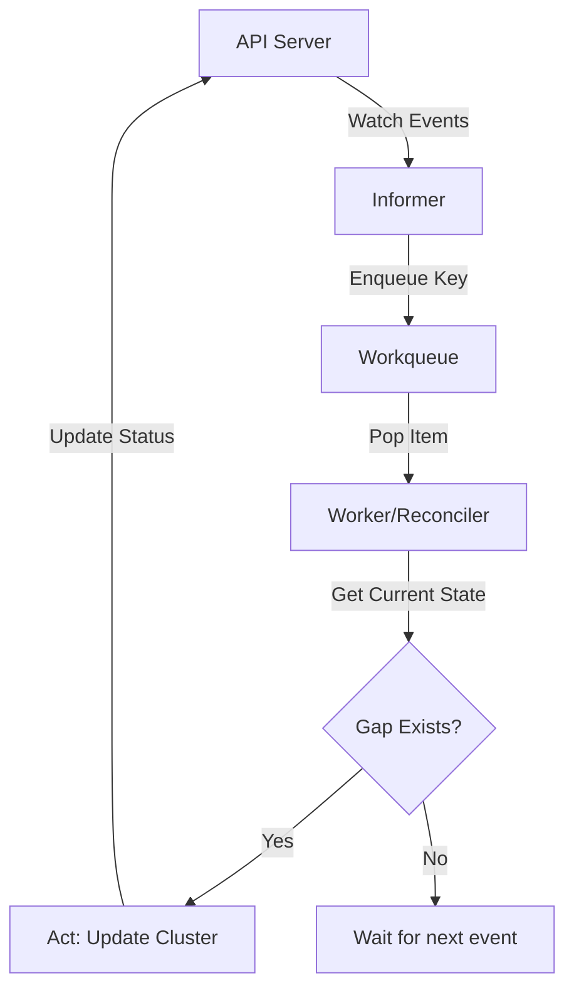

# Creating Custom Controllers

### Summary
Kubernetes Custom Controllers are the brain behind automation in a cluster, implementing a continuous control loop that regulates system state. They watch the cluster's state via the API server and take action to move the current state toward the desired state defined in resource specs. This pattern allows developers to extend Kubernetes with custom logic and resources (CRDs), treating them as first-class citizens within the ecosystem.

### Detailed Explanation

#### What
A **Controller** is a non-terminating loop that regulates the state of a system. In Kubernetes, controllers track at least one resource type. These objects have a `spec` field representing the desired state and a `status` field representing the current state. The controller's job is to ensure the `status` eventually matches the `spec`.

#### Why
- **Automation**: Replaces manual operational tasks (e.g., "If a Pod fails, restart it").
- **Extensibility**: Allows the creation of Custom Resource Definitions (CRDs) to manage non-native resources (e.g., a `Database` or `GithubRunner`).
- **Declarative API**: Users declare the end state, and controllers handle the complexity of reaching it.

#### How: The Reconciliation Loop
The core logic of every controller is the **Reconciliation Loop**. It follows three steps:
1.  **Observe**: Watch for events (Create, Update, Delete) from the API Server.
2.  **Analyze**: Compare the actual state (fetched from the cluster) with the desired state (the resource spec).
3.  **Act**: Perform necessary operations (e.g., creating a Deployment, updating a Service) to resolve any discrepancies.



---

### Go Application (client-go)

For Go developers, building a controller usually involves the `k8s.io/client-go` library. The standard architecture uses several specialized components to ensure efficiency and reliability.

#### Core Components
- **Informers (SharedInformer)**: Instead of polling the API, Informers maintain a local cache of objects. They provide `EventHandlers` (`AddFunc`, `UpdateFunc`, `DeleteFunc`) to react to changes.
- **Listers**: Tools to query the Informer's local cache. This prevents unnecessary high-load requests to the API server.
- **Workqueues**: Decouples the event detection from the processing logic. It handles:
    - **Retries**: Exponential backoff for failed reconciliations.
    - **Deduplication**: Ensuring the same resource isn't processed by multiple workers at once.

#### Implementation Pattern
```go
// Simplified Controller Structure
type Controller struct {
    kubeclientset kubernetes.Interface
    informer      cache.SharedIndexInformer
    lister        listers.PodLister
    workqueue     workqueue.RateLimitingInterface
}

func (c *Controller) Run(workers int, stopCh <-chan struct{}) {
    // 1. Sync cache
    if !cache.WaitForCacheSync(stopCh, c.informer.HasSynced) {
        return
    }

    // 2. Start workers
    for i := 0; i < workers; i++ {
        go wait.Until(c.runWorker, time.Second, stopCh)
    }
    <-stopCh
}

func (c *Controller) syncHandler(key string) error {
    // 1. Convert key to namespace/name
    namespace, name, _ := cache.SplitMetaNamespaceKey(key)

    // 2. Get the current object from lister
    pod, err := c.lister.Pods(namespace).Get(name)
    if errors.IsNotFound(err) {
        return nil // Object deleted, ignore
    }

    // 3. RECONCILE: Compare spec vs status and act
    // ... logic goes here ...

    return nil
}
```

---

### Interview Questions

1.  **What is the difference between a Controller and an Operator?**
    - A **Controller** is the generic pattern of a control loop. An **Operator** is a specific type of controller that manages a complex application (like PostgreSQL or Kafka) using CRDs and encapsulates operational "know-how" in code.

2.  **Why are Kubernetes controllers said to be "Level-triggered"?**
    - Unlike edge-triggered systems that only react to a specific event signal, level-triggered systems reconcile based on the **state**. If a controller is offline during an event, it will still reconcile correctly upon restart because it compares the *final state* rather than replaying missed events.

3.  **What is the purpose of the Workqueue in a controller?**
    - It provides **reliability** (retries with backoff) and **concurrency control** (ensuring one resource is handled by one worker at a time). It also helps "de-bounce" rapid updates to the same object.

4.  **What does `cache.WaitForCacheSync` do?**
    - It blocks the controller from starting its workers until the Informer's local cache has been fully populated with the initial state of the cluster. This prevents workers from making decisions based on incomplete or empty data.
