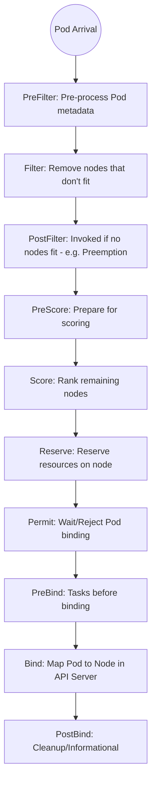

# Custom Schedulers and Extenders

## Summary
Kubernetes allows developers to extend or replace the default scheduling logic to meet complex workload requirements. This is achieved through three primary mechanisms: **Multiple Schedulers** (running independent scheduler binaries), **Scheduler Extenders** (external HTTP services called by the default scheduler), and the **Scheduling Framework** (a pluggable architecture of Go-based plugins). While Extenders are easier to implement as sidecars, the Scheduling Framework is the modern standard, offering superior performance by integrating directly into the scheduler's lifecycle.

## Detailed Explanation

### 1. Multiple Schedulers
In Kubernetes, you are not limited to the default `kube-scheduler`. You can run multiple schedulers simultaneously in a cluster. Each Pod can specify which scheduler should handle it using the `spec.schedulerName` field. If omitted, it defaults to `default-scheduler`.

### 2. Scheduler Extenders
A Scheduler Extender is an external service that implements HTTP APIs to assist the scheduler. When the default scheduler reaches certain stages (like filtering or scoring), it sends a JSON request to the Extender and waits for a response.

*   **Pros**: Easy to write in any language; no need to recompile the scheduler.
*   **Cons**: Significant latency due to HTTP overhead; limited to specific extension points.

### 3. Scheduling Framework (The Modern Way)
The Scheduling Framework (introduced in v1.15, stable in v1.19) is a pluggable architecture that allows Go-based plugins to be compiled directly into the `kube-scheduler`. It defines a set of **Extension Points** where plugins can hook into.

#### Extension Points Diagram


### Key Differences
| Feature | Extender | Scheduling Framework (Plugins) |
| :--- | :--- | :--- |
| **Communication** | HTTP/JSON (External) | Direct Go function calls (Internal) |
| **Performance** | Higher latency (Network) | Minimal latency (Shared memory) |
| **Extensibility** | Limited points | Full lifecycle hooks |
| **Language** | Any | Go (must be compiled with scheduler) |

## Go Application

Go developers can extend the scheduler by implementing the interfaces defined in `k8s.io/kubernetes/pkg/scheduler/framework`. 

### Example: A Simple "Cosmos" Plugin
This plugin filters nodes based on a custom label.

```go
package cosmos

import (
	"context"
	"fmt"

	v1 "k8s.io/api/core/v1"
	"k8s.io/apimachinery/pkg/runtime"
	"k8s.io/kubernetes/pkg/scheduler/framework"
)

// Name is the name of the plugin used in the Configuration.
const Name = "Cosmos"

// Cosmos is a plugin that checks if a node has the 'cosmos' label.
type Cosmos struct {
	handle framework.Handle
}

var _ framework.FilterPlugin = &Cosmos{}

// Name returns name of the plugin.
func (pl *Cosmos) Name() string {
	return Name
}

// Filter checks if the node has the required label.
func (pl *Cosmos) Filter(ctx context.Context, state *framework.CycleState, pod *v1.Pod, nodeInfo *framework.NodeInfo) *framework.Status {
	node := nodeInfo.Node()
	if node == nil {
		return framework.NewStatus(framework.Error, "node not found")
	}

	if _, ok := node.Labels["cosmos-enabled"]; !ok {
		return framework.NewStatus(framework.Unschedulable, "Node is not cosmos-enabled")
	}

	return nil
}

// New initializes a new plugin and returns it.
func New(obj runtime.Object, h framework.Handle) (framework.Plugin, error) {
	return &Cosmos{handle: h}, nil
}
```

### Registering the Plugin
To use this plugin, you must build a custom `kube-scheduler` binary that includes it:

```go
package main

import (
	"os"

	"k8s.io/component-base/cli"
	"k8s.io/kubernetes/cmd/kube-scheduler/app"
	"sigs.k8s.io/scheduler-plugins/pkg/cosmos" // Hypothetical path
)

func main() {
	// Register the custom plugin in the scheduler command
	command := app.NewSchedulerCommand(
		app.WithPlugin(cosmos.Name, cosmos.New),
	)

	code := cli.Run(command)
	os.Exit(code)
}
```

## Interview Questions

**Q: What is the main advantage of the Scheduling Framework over Scheduler Extenders?**
**A:** Performance and depth of integration. The Scheduling Framework uses direct Go function calls within the scheduler process, avoiding the network latency and serialization overhead of HTTP-based Extenders. It also provides many more extension points (like `Permit` and `Reserve`) that are not available to Extenders.

**Q: How do you tell Kubernetes to use a custom scheduler for a specific Pod?**
**A:** You set the `spec.schedulerName` field in the Pod's manifest to the name of your custom scheduler (e.g., `my-custom-scheduler`). The default scheduler will ignore this Pod, and only the scheduler with the matching name will attempt to schedule it.

**Q: Explain the 'Filter' and 'Score' extension points.**
**A:** `Filter` is used to exclude nodes that cannot host the Pod (similar to Predicates). If a node fails a Filter, it is removed from consideration. `Score` is used to rank the remaining nodes (similar to Priorities). The scheduler assigns a weight to each node based on the plugin's logic, and the node with the highest total score is selected.

**Q: What is a 'Permit' plugin used for?**
**A:** A `Permit` plugin can "wait" a Pod's scheduling for a specified timeout. This is useful for features like **Gang Scheduling**, where you want to wait until all members of a group are ready to be scheduled together before actually binding them to nodes.

**Q: Can you run multiple instances of the default scheduler with different configurations?**
**A:** Yes. Since Kubernetes v1.18, you can use **Scheduling Profiles** within a single `kube-scheduler` binary. Each profile can have its own set of enabled/disabled plugins and configuration, essentially acting as multiple "virtual" schedulers within one process.
