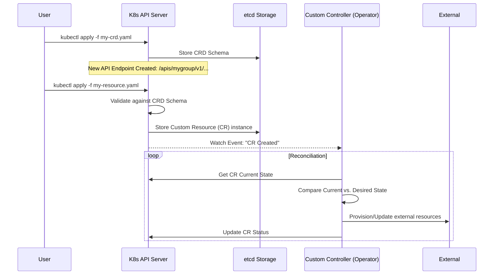

# Custom Resource Definitions (CRDs)

## Summary
Custom Resource Definitions (CRDs) are a powerful Kubernetes extension mechanism that allows users to define their own custom objects (Resources) within the Kubernetes API. By creating a CRD, you provide a schema that the Kubernetes API server uses to handle the storage and management of your custom data. This transforms Kubernetes from a container orchestrator into a general-purpose platform capable of managing any infrastructure or application component via the declarative "Reconciliation" pattern.

## Detailed Explanation

### **What are CRDs?**
In Kubernetes, a **Resource** is an endpoint in the API that stores a collection of API objects (e.g., Pods, Services). A **Custom Resource (CR)** is an instance of a Resource that isn't available in a default Kubernetes installation. A **Custom Resource Definition (CRD)** is the meta-resource used to define these new types.

### **Why use CRDs?**
1. **Declarative Infrastructure**: Manage non-K8s resources (like Cloud SQL databases or GitHub Teams) using `kubectl`.
2. **Encapsulation of Logic**: Combine multiple primitive resources (Deployment + Service + ConfigMap) into a single, high-level abstraction (e.g., a `Database` object).
3. **Operator Pattern**: CRDs serve as the "Source of Truth" for Operators (Custom Controllers) that watch for changes and automate complex operational tasks.
4. **API Integration**: Leverage built-in K8s features like RBAC, `kubectl` compatibility, and Audit Logging for your custom types.

### **How it Works (The Workflow)**
The interaction between a user, the API Server, and a Custom Controller follows the standard Kubernetes control loop:



---

## Go Application

For Go developers, CRDs are typically managed using the **Controller Runtime** library and tools like **Kubebuilder** or **Operator SDK**. These tools use "Markers" (special comments) to generate the CRD manifests and Go code.

### **Defining the Type**
In Go, you define your CRD structure and use markers to instruct `controller-gen` how to build the OpenAPI v3 validation schema.

```go
package v1

import (
	metav1 "k8s.io/apimachinery/pkg/apis/meta/v1"
)

// +kubebuilder:object:root=true
// +kubebuilder:subresource:status
// +kubebuilder:resource:shortName=db
// +kubebuilder:printcolumn:name="Engine",type=string,JSONPath=".spec.engine"

// PostgresDatabase is the Schema for the postgresdatabases API
type PostgresDatabase struct {
	metav1.TypeMeta   `json:",inline"`
	metav1.ObjectMeta `json: "metadata,omitempty"`

	Spec   PostgresDatabaseSpec   `json:"spec,omitempty"`
	Status PostgresDatabaseStatus `json:"status,omitempty"`
}

type PostgresDatabaseSpec struct {
	// +kubebuilder:validation:Required
	// +kubebuilder:validation:Enum=Postgres;MySQL
	Engine string `json:"engine"`

	// +kubebuilder:validation:Minimum=1
	// +kubebuilder:validation:Maximum=100
	StorageGB int32 `json:"storageGb"`
}

type PostgresDatabaseStatus struct {
	// ObservedGeneration represents the last reconciled generation
	ObservedGeneration int64 `json:"observedGeneration,omitempty"`
	
	// Phase defines the current state of the database (Pending, Ready, Failed)
	Phase string `json:"phase,omitempty"`
}
```

### **Code Generation**
Developers run `make manifests` or `controller-gen crd ...` to produce the YAML file that users apply to the cluster. The `+kubebuilder` markers ensure that:
- Validation is enforced at the API level (e.g., `StorageGB` cannot be less than 1).
- `kubectl get db` shows the "Engine" column.
- The `/status` subresource is enabled for efficient updates.

---

## Interview Questions

### **1. What is the difference between a CRD and an API Aggregation?**
- **CRD**: Easier to use, no extra server to manage, data is stored in the main `etcd`. Best for most use cases.
- **API Aggregation**: Requires running a separate extension API server. Used for high-performance needs, custom storage backends, or when you need total control over the API behavior (like `metrics-server`).

### **2. How do you handle CRD versioning (e.g., moving from v1alpha1 to v1)?**
Kubernetes supports multiple versions in a single CRD. You must define which version is the **storage version**. If the schema changes significantly, you use **Conversion Webhooks**—a small service that the API server calls to convert objects from one version to another on-the-fly.

### **3. What is the purpose of the `Status` subresource in a CRD?**
Enabling the `status` subresource allows controllers to update the status of a resource without incrementing its `metadata.generation`. This prevents unnecessary reconciliation loops and allows for better RBAC control (e.g., allowing a service account to only update status but not the spec).

### **4. How can you enforce validation on CRD fields?**
Validation is primarily done via **OpenAPI v3 schemas** defined inside the CRD. For complex logic that schema validation can't handle (e.g., cross-field validation), you should implement a **Validating Admission Webhook**.

### **5. What is "Finalizers" in the context of CRDs?**
Finalizers are strings in the metadata that prevent a resource from being deleted until a controller performs cleanup (e.g., deleting an external AWS database). The controller removes the finalizer after cleanup, allowing Kubernetes to finally delete the object.
