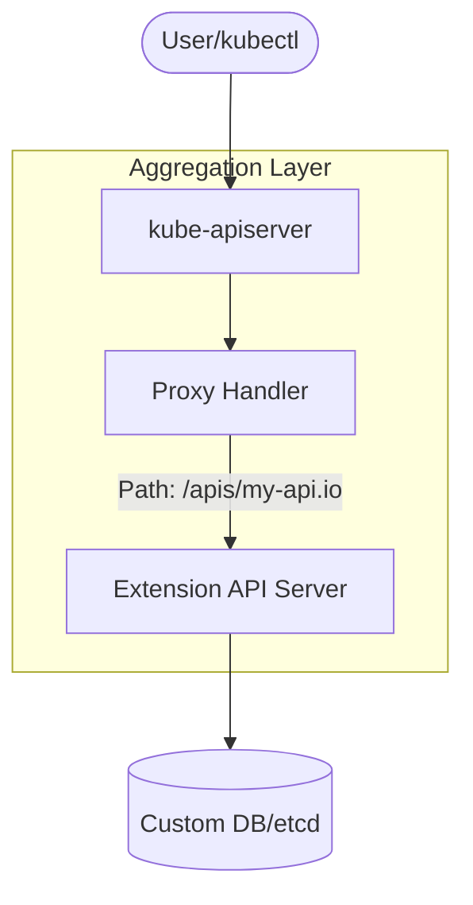
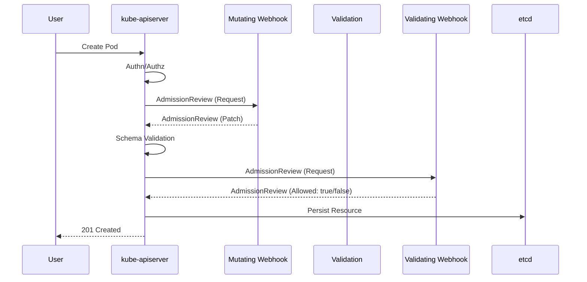

# Kubernetes Extensions and APIs

## Summary
Kubernetes extensions allow developers to augment the core API with custom functionality through two primary mechanisms: the **Aggregation Layer** and **Admission Webhooks**. The Aggregation Layer enables the registration of custom API servers that run alongside the core `kube-apiserver`, providing a seamless experience for specialized resources like the metrics-server. Admission Webhooks, categorized into **Mutating** and **Validating**, intercept API requests after authentication but before persistence, allowing for real-time modification or policy-based rejection of resources. Together, these tools transform Kubernetes from a static container orchestrator into a fully programmable cloud platform.

## Detailed Explanation

### 1. API Aggregation Layer
The API Aggregation Layer allows you to provide additional Kubernetes-style APIs in your cluster. Unlike Custom Resource Definitions (CRDs), which are managed by the core API server, Aggregated APIs are served by a separate **Extension API Server**.

- **How it works**: You register an `APIService` object that tells the main `kube-apiserver` to proxy requests for a specific API group and version to your service.
- **Why use it**: Use it when you need specialized behavior that CRDs cannot provide, such as custom storage backends (not just etcd) or complex data transformations.



### 2. Admission Controllers (Webhooks)
Admission controllers are specialized plugins that act as "gatekeepers" for the cluster. While many are compiled-in, **Dynamic Admission Control** allows you to use external webhooks.

#### Mutating Admission Webhooks
These are called first. They can modify the incoming object (e.g., injecting a sidecar container, adding labels, or setting default resources).
- **Format**: They return a JSON Patch (RFC 6902) to the API server.

#### Validating Admission Webhooks
These are called after mutation. They cannot change the object; they only decide whether to **Accept** or **Reject** the request based on custom logic (e.g., ensuring images come from a trusted registry).



## Go Application

For Go developers, implementing admission webhooks typically involves using the `k8s.io/api/admission/v1` package. Below is a simplified example of a Mutating Webhook handler that injects a default label.

### Mutating Webhook Handler in Go
```go
package main

import (
    "encoding/json"
    "fmt"
    "net/http"

    admissionv1 "k8s.io/api/admission/v1"
    corev1 "k8s.io/api/core/v1"
    metav1 "k8s.io/apimachinery/pkg/apis/meta/v1"
)

func handleMutate(w http.ResponseWriter, r *http.Request) {
    var review admissionv1.AdmissionReview
    if err := json.NewDecoder(r.Body).Decode(&review); err != nil {
        http.Error(w, err.Error(), http.StatusBadRequest)
        return
    }

    // Extract the Pod from the request
    raw := review.Request.Object.Raw
    pod := corev1.Pod{}
    if err := json.Unmarshal(raw, &pod); err != nil {
        http.Error(w, err.Error(), http.StatusInternalServerError)
        return
    }

    // Create a JSON Patch to add a label
    patch := `[{"op": "add", "path": "/metadata/labels/managed-by", "value": "my-webhook"}]`
    
    // Prepare the response
    response := &admissionv1.AdmissionResponse{
        UID:     review.Request.UID,
        Allowed: true,
        Patch:   []byte(patch),
        PatchType: func() *admissionv1.PatchType {
            pt := admissionv1.PatchTypeJSONPatch
            return &pt
        }(),
    }

    review.Response = response
    json.NewEncoder(w).Encode(review)
}
```

### Key Go Libraries
- `controller-runtime`: Simplifies webhook creation with high-level managers.
- `client-go`: For interacting with the API server within your extension.

## Interview Questions

**Q: What is the difference between Aggregated APIs and Custom Resource Definitions (CRDs)?**
**A:** CRDs are easy to use and managed by the core API server, storing data in the cluster's etcd. Aggregated APIs require building and maintaining a separate API server, but offer more control over data storage, API versioning, and complex business logic that doesn't fit the standard CRUD pattern.

**Q: In what order are Mutating and Validating webhooks executed?**
**A:** Mutating webhooks are executed first, followed by object validation. Finally, Validating webhooks are executed. This ensures that the Validating webhooks see the final, "mutated" state of the object before it is persisted.

**Q: What happens if an Admission Webhook is unreachable or returns an error?**
**A:** This depends on the `failurePolicy` defined in the webhook configuration (`MutatingWebhookConfiguration` or `ValidatingWebhookConfiguration`). If set to `Fail`, the API request is rejected. If set to `Ignore`, the error is logged and the request proceeds.

**Q: How do you secure the communication between the kube-apiserver and your webhook?**
**A:** Communication must be over HTTPS. You must provide a `caBundle` in the webhook configuration so the API server can verify the webhook's TLS certificate. Conversely, the webhook should verify that requests are coming from the API server (often via client certs or shared tokens).
