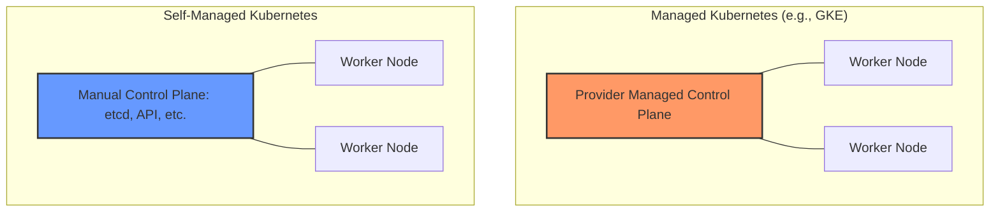

# Should You Manage Your Own Cluster?

## Summary
Deciding whether to manage your own Kubernetes cluster (self-managed) or use a cloud provider's managed service (e.g., EKS, GKE, AKS) is a pivotal strategic choice. Managed services offload the complex "Day 2" operations of the control plane, such as upgrades, patching, and high availability, to the provider. Conversely, self-managed clusters offer maximum control over configuration and data sovereignty but require significant engineering effort and deep expertise in Kubernetes internals. For most organizations, the overhead of self-management only pays off when strict compliance, extreme customization, or specific on-premises requirements are mandatory.

## Detailed Explanation

The debate between managed and self-managed Kubernetes boils down to **Control vs. Convenience**. To make an informed decision, you must understand the components you are taking responsibility for.

### The Managed Kubernetes Model
In a managed service (like AWS EKS or Google GKE), the cloud provider manages the **Control Plane**. This includes the API Server, `etcd`, Scheduler, and Controller Manager.

- **What you do**: Manage worker nodes (often via node groups), deploy applications, and configure networking/IAM.
- **What they do**: Ensure the control plane is highly available, back up `etcd`, and provide one-click version upgrades.

### The Self-Managed (Unmanaged) Model
When you "roll your own" cluster using tools like `kubeadm`, `kops`, or `Rancher` on bare metal or VMs, you own the entire stack.

- **What you do**: Everything. You must architect the control plane for HA, manage certificates, handle `etcd` snapshots, and perform manual rolling upgrades of every component.
- **Why do it?**: You need to enable specific Alpha features, use custom API server flags, or operate in a disconnected (air-gapped) environment.

### Comparison Matrix

| Feature | Managed (EKS/GKE/AKS) | Self-Managed (kubeadm/kops) |
| :--- | :--- | :--- |
| **Control Plane** | Abstracted & Managed | Manually Configured |
| **Operational Effort** | Low to Medium | Very High |
| **Customization** | Limited to Provider Support | Full Control |
| **Upgrades** | Automated/Streamlined | Manual & Risky |
| **Cost** | Management fee + Resources | Resource cost + High Salary Ops |
| **SLA** | Guaranteed by Provider | Defined by your Ops Team |

### Architecture Overview



## Go Application

For Go developers, the decision impacts how you build and interact with the cluster. In a self-managed environment, you might be responsible for building the very tools that keep the cluster alive. Go is the primary language for these "Day 2" tools because of its static binaries and native Kubernetes client support.

### Monitoring Cluster Health in Go
If you manage your own cluster, you'll often write custom sidecars or controllers in Go to monitor the health of the control plane components.

```go
package main

import (
	"context"
	"fmt"
	"time"

	metav1 "k8s.io/apimachinery/pkg/apis/meta/v1"
	"k8s.io/client-go/kubernetes"
	"k8s.io/client-go/rest"
)

func main() {
	// Create in-cluster configuration
	config, err := rest.InClusterConfig()
	if err != nil {
		panic(err.Error())
	}

	// Create the clientset
	clientset, err := kubernetes.NewForConfig(config)
	if err != nil {
		panic(err.Error())
	}

	for {
		// Example: Check health of all nodes
		nodes, err := clientset.CoreV1().Nodes().List(context.TODO(), metav1.ListOptions{})
		if err != nil {
			fmt.Printf("Error getting nodes: %v\n", err)
		} else {
			fmt.Printf("Cluster Status: %d nodes are currently registered.\n", len(nodes.Items))
			for _, node := range nodes.Items {
				for _, condition := range node.Status.Conditions {
					if condition.Type == "Ready" {
						fmt.Printf(" - Node %s is Ready: %s\n", node.Name, condition.Status)
					}
				}
			}
		}
		time.Sleep(30 * time.Second)
	}
}
```

### Why Go for Cluster Ops?
1. **Direct API Access**: The `client-go` library is the gold standard for Kubernetes interaction.
2. **Binary Portability**: A single Go binary can be dropped onto a bare-metal node without worrying about Python/Node runtimes.
3. **Concurrency**: Go's goroutines are perfect for watching thousands of resources simultaneously without blocking.

## Interview Questions

**Q: What is the biggest operational risk of managing your own Kubernetes control plane?**
**A:** The management of `etcd`. As the single source of truth for the cluster, any corruption or latency in the `etcd` quorum can lead to total cluster failure. In a self-managed setup, you are responsible for its backup, encryption, and high-availability architecture.

**Q: When is "vendor lock-in" a valid reason to choose self-managed Kubernetes?**
**A:** When your application relies on specific cloud-provider integrations (like AWS IAM Roles for Service Accounts or GCP Workload Identity) that make migrating to another provider difficult. By using a self-managed layer (like Rancher or kops) across clouds, you maintain a consistent operational surface.

**Q: How does the "Shared Responsibility Model" differ between EKS and a self-hosted kubeadm cluster?**
**A:** In EKS, the provider is responsible for the availability and security of the API server and `etcd`. In a self-hosted cluster, the user is responsible for the entire stack, including patching the OS of the master nodes and securing the control plane communication.

**Q: What are the cost implications of self-management versus managed services?**
**A:** While managed services often charge a small hourly fee (e.g., $0.10/hr for EKS), self-management hides costs in "human capital." The engineering hours required to perform upgrades and troubleshoot low-level networking often far exceed the nominal fee of a managed provider.
