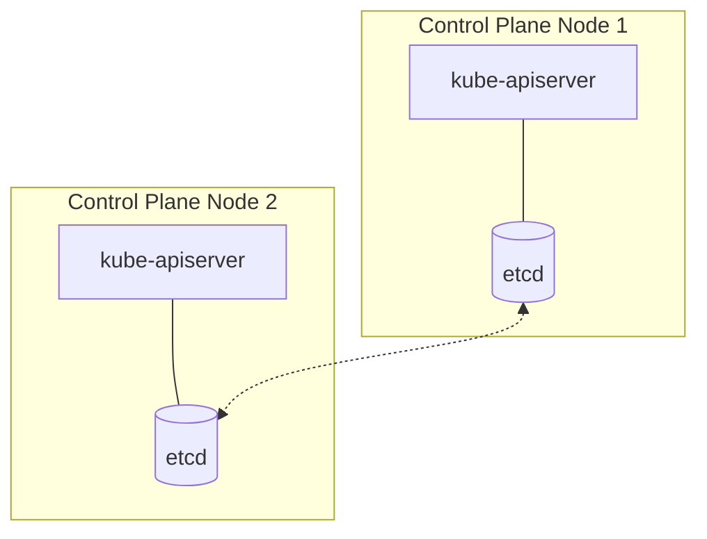
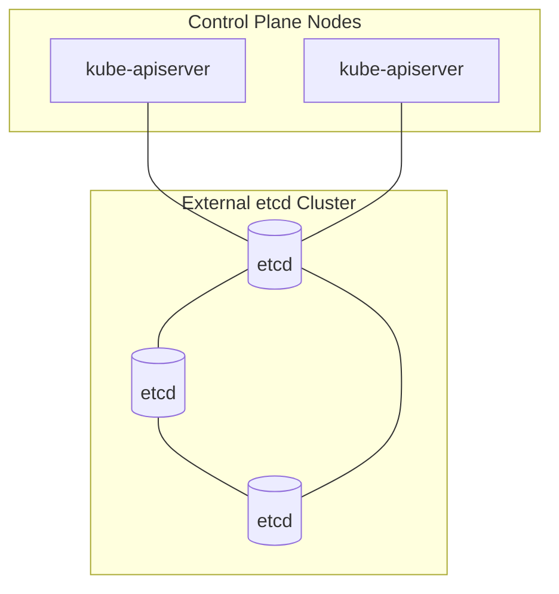

# Installing the Control Plane

## Summary
Installing the Kubernetes Control Plane is the process of bootstrapping the "brain" of a cluster, responsible for maintaining the desired state and managing resources. Using `kubeadm`, the industry-standard tool, administrators can initialize the core components: the API Server, Scheduler, Controller Manager, and the etcd data store. A critical decision during installation is the etcd topology—choosing between co-locating etcd with control plane components (stacked) or running it on dedicated nodes (external) for better isolation and performance.

## Detailed Explanation

The control plane is the orchestration layer of Kubernetes. It makes global decisions about the cluster (e.g., scheduling) and detects/responds to cluster events (e.g., starting a new pod when a deployment's replica count is unsatisfied).

### Core Components
1.  **kube-apiserver**: The front end for the Kubernetes control plane. It exposes the Kubernetes API.
2.  **etcd**: Consistent and highly-available key-value store used as Kubernetes' backing store for all cluster data.
3.  **kube-scheduler**: Watches for newly created Pods with no assigned node, and selects a node for them to run on.
4.  **kube-controller-manager**: Runs controller processes (Node, Job, Endpoint, Service Account controllers).

### Installation with Kubeadm
`kubeadm` simplifies the installation process by automating certificate generation, component configuration, and bootstrap token management.

#### 1. Pre-requisites
Before running `kubeadm`, nodes must have:
*   A compatible Linux OS (e.g., Ubuntu, RHEL).
*   A Container Runtime (CRI) like `containerd`.
*   `kubelet` and `kubectl` installed.
*   Swap disabled (mandatory for kubelet stability).

#### 2. Initializing the Cluster
The command `kubeadm init` performs several phases:
*   **preflight**: Checks system state.
*   **certs**: Generates a self-signed CA to provision certificates for components.
*   **kubeconfig**: Generates files for the admin and kubelet to connect to the API.
*   **control-plane**: Generates static Pod manifests for the API server, controller manager, and scheduler.
*   **etcd**: Generates the static Pod manifest for a local etcd instance (if not using external etcd).

### etcd Management Topologies

#### Stacked etcd Topology
Each control plane node runs an instance of `etcd`, co-located with the other components. This is easier to manage and requires fewer nodes.



#### External etcd Topology
`etcd` runs on a separate cluster. This provides better isolation; a failure in the control plane components won't affect the data store directly, and vice versa.



### High Availability (HA)
In production, you should have at least 3 control plane nodes. A load balancer (e.g., HAProxy or Nginx) is placed in front of the API servers to provide a single stable endpoint for `kubectl` and worker nodes.

## Go Application

For Go developers, the Kubernetes control plane is particularly interesting because it is almost entirely written in Go. Understanding how it is installed helps in building cloud-native applications that interact with the cluster.

### interacting with the Control Plane
Go applications typically use the `client-go` library to communicate with the API server we just installed.

```go
package main

import (
	"context"
	"fmt"
	"os"

	metav1 "k8s.io/apimachinery/pkg/apis/meta/v1"
	"k8s.io/client-go/kubernetes"
	"k8s.io/client-go/tools/clientcmd"
)

func main() {
	// Path to the kubeconfig file generated by 'kubeadm init'
	kubeconfig := os.Getenv("KUBECONFIG")
	if kubeconfig == "" {
		kubeconfig = os.Getenv("HOME") + "/.kube/config"
	}

	// Use the current context in kubeconfig
	config, err := clientcmd.BuildConfigFromFlags("", kubeconfig)
	if err != nil {
		panic(err.Error())
	}

	// Create the clientset
	clientset, err := kubernetes.NewForConfig(config)
	if err != nil {
		panic(err.Error())
	}

	// Access the Control Plane to list pods in the default namespace
	pods, err := clientset.CoreV1().Pods("default").List(context.TODO(), metav1.ListOptions{})
	if err != nil {
		panic(err.Error())
	}

	fmt.Printf("There are %d pods in the default namespace\n", len(pods.Items))
	for _, pod := range pods.Items {
		fmt.Printf("- %s\n", pod.Name)
	}
}
```

### Why Go?
*   **Concurrency**: Go's goroutines are perfect for the controller-manager, which needs to run dozens of independent control loops simultaneously.
*   **Static Binaries**: Components are deployed as static binaries, making them easy to package into the minimal "distroless" containers used by `kubeadm`.

## Interview Questions

*   **Q: What is the purpose of the `kubeadm join` command?**
    *   **A:** It is used to bootstrap a new node (either a worker or an additional control plane node) and join it to an existing cluster. It uses a bootstrap token and a discovery hash to securely establish trust with the API server.

*   **Q: Why does etcd require an odd number of members?**
    *   **A:** etcd uses the Raft consensus algorithm, which requires a majority (quorum) to make decisions. An odd number of nodes (3, 5, etc.) maximizes fault tolerance. For example, a 3-node cluster can survive 1 failure, and a 4-node cluster can also only survive 1 failure, so the 4th node adds complexity without increasing availability.

*   **Q: What are Static Pods, and how does `kubeadm` use them?**
    *   **A:** Static Pods are managed directly by the `kubelet` on a specific node, without the API server's involvement. `kubeadm` places the manifests for the API server, scheduler, and controller manager in `/etc/kubernetes/manifests`, and the local `kubelet` automatically starts them as pods.

*   **Q: How do you back up the "source of truth" in a Kubernetes cluster?**
    *   **A:** Since all state is stored in `etcd`, a backup involves taking a snapshot of the etcd data. This is typically done using the `etcdctl snapshot save` command. Restoration involves stopping the etcd service and running `etcdctl snapshot restore`.

*   **Q: What is the role of the Load Balancer in a High Availability (HA) control plane setup?**
    *   **A:** The load balancer provides a single, virtual IP or DNS name for the multiple API servers. This ensures that if one control plane node fails, worker nodes and users can still reach the cluster through the other healthy API servers without changing their configuration.
