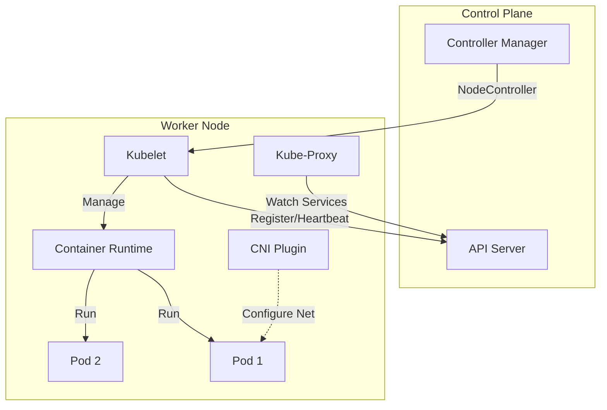

# Adding and Managing Worker Nodes

## Summary
Worker nodes are the workhorses of a Kubernetes cluster, responsible for running containerized applications (Pods). Adding and managing them involves configuring the container runtime (e.g., containerd), the `kubelet` agent, and the `kube-proxy` for networking. Efficient node management requires understanding the bootstrapping process (typically via `kubeadm join`), managing node labels/taints for scheduling, and ensuring the underlying OS and network plugins (CNI) are correctly configured for stability and performance.

## Detailed Explanation

### The Anatomy of a Worker Node
A functional worker node consists of three critical components:
1.  **Container Runtime**: The software that actually runs the containers (e.g., containerd, CRI-O, Docker Engine).
2.  **Kubelet**: The primary "node agent" that registers the node with the API server and ensures Pods are running and healthy.
3.  **Kube-Proxy**: Maintains network rules on the node to allow network communication to your Pods (Service abstraction).

### Adding a Node (Bootstrapping)
The standard process (using `kubeadm`) involves:
1.  **Prepare OS**: Disable swap, enable IP forwarding, install runtime.
2.  **Join**: Run `kubeadm join <control-plane-endpoint> --token <token> --discovery-token-ca-cert-hash <hash>`.
3.  **CSR Approval**: The Kubelet generates a certificate signing request (CSR), which the control plane auto-approves (if configured) to issue the node's identity certificate.

### Node Lifecycle Management
-   **Cordoning**: Marking a node as unschedulable (`kubectl cordon node-1`). Useful before maintenance.
-   **Draining**: Safely evicting all pods from a node (`kubectl drain node-1`). Critical for upgrades without downtime.
-   **Taints/Labels**: Used to steer workloads (e.g., `gpu=true`, `env=prod`).

### Architecture Diagram



## Go Application

For Go developers, interacting with nodes programmatically is key for building operators, custom schedulers, or monitoring tools.

### 1. Listing Nodes and Conditions via Client-Go
This snippet demonstrates how to list nodes and check their "Ready" status.

```go
package main

import (
	"context"
	"fmt"
	corev1 "k8s.io/api/core/v1"
	metav1 "k8s.io/apimachinery/pkg/apis/meta/v1"
	"k8s.io/client-go/kubernetes"
	"k8s.io/client-go/tools/clientcmd"
)

func main() {
	config, _ := clientcmd.BuildConfigFromFlags("", "/path/to/kubeconfig")
	clientset, _ := kubernetes.NewForConfig(config)

	nodes, _ := clientset.CoreV1().Nodes().List(context.TODO(), metav1.ListOptions{})

	for _, node := range nodes.Items {
		fmt.Printf("Node: %s\n", node.Name)
		for _, condition := range node.Status.Conditions {
			if condition.Type == corev1.NodeReady {
				fmt.Printf("  Ready: %s (Reason: %s)\n", condition.Status, condition.Reason)
			}
		}
	}
}
```

### 2. Graceful Shutdown Handling
When a node is drained, your Go app receives a `SIGTERM`.

```go
// Standard pattern for handling termination
c := make(chan os.Signal, 1)
signal.Notify(c, syscall.SIGINT, syscall.SIGTERM)
<-c
// Perform cleanup (close DB connections, flush buffers)
server.Shutdown(ctx)
```

## Interview Questions

**Q: What happens if the `kubelet` process crashes on a worker node?**
**A:** The containers managed by that kubelet will continue to run (since they are managed by the container runtime), but the node will stop reporting its status to the API server. After a timeout (`pod-eviction-timeout`, default 5m), the Node Controller will mark the node as `NotReady` and eventually schedule the Pods for deletion/rescheduling.

**Q: What is the purpose of CNI in the context of a worker node?**
**A:** The Container Network Interface (CNI) plugin is responsible for configuring the network interface for each Pod. When a Pod starts, the kubelet calls the CNI plugin to allocate an IP address and set up the necessary routing/bridging so the Pod can communicate with the rest of the cluster.

**Q: Explain the difference between `kubectl cordon` and `kubectl drain`.**
**A:** `cordon` marks a node as unschedulable, preventing *new* pods from landing there. `drain` does two things: it first `cordons` the node, and then safely evicts (deletes) all existing pods on that node (respecting PodDisruptionBudgets), forcing them to reschedule elsewhere.

**Q: How does a node join the cluster securely?**
**A:** Using a bootstrap token. The joining node authenticates to the API server using a shared token. It effectively says "I am a new node, please sign my certificate." The control plane verifies the token and, if valid, signs the node's Kubelet client certificate, establishing mutual TLS.

**Q: Why might you need to disable Swap memory on a Kubernetes node?**
**A:** Historically, the kubelet was not designed to handle swap memory; enabling it could lead to unpredictable performance and stability issues because the scheduler assumes memory guarantees are physical RAM. While recent versions (v1.22+) have beta support for swap, it is still standard practice to disable it for production stability.
