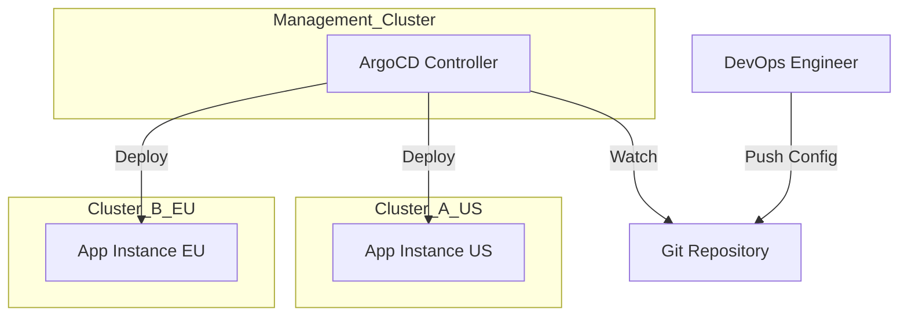

# Multi-Cluster Management

## Summary
Multi-cluster management involves orchestrating applications and policies across multiple Kubernetes clusters, often spread across different regions or clouds. This strategy improves high availability, reduces latency by placing workloads closer to users, and ensures compliance through isolation. Key approaches include **Cluster Federation** (centralized API), **GitOps** (managing configs via Git repositories), and the **Cluster API** (declarative cluster lifecycle management).

## Detailed Explanation

### Why Multi-Cluster?
*   **High Availability (HA)**: If one region fails (e.g., AWS us-east-1), traffic can be routed to another cluster in us-west-2.
*   **Latency**: Run clusters in Europe, Asia, and US to serve users from the nearest location.
*   **Isolation**: Separate Prod, Staging, and Dev clusters, or isolate sensitive tenants (compliance).
*   **Scale**: Bypass the scalability limits of a single Kubernetes cluster (approx. 5k nodes).

### Approaches to Management

#### 1. GitOps (ArgoCD / Flux)
The most popular "modern" way. A central management cluster runs ArgoCD, which watches a Git repo.
*   **Pattern**: "Hub-and-Spoke". The Hub cluster pushes manifests to Spoke clusters (or Spokes pull from Git).
*   **Pros**: Declarative, version controlled, easy to understand.

#### 2. Cluster API (CAPI)
Standardizes the creation and lifecycle of clusters themselves. You define a `Cluster` resource in YAML, and a controller spins up the VMs/LBs.
*   **Concept**: "Kubernetes managing Kubernetes."

#### 3. KubeFed (Federation v2)
Allows you to define a resource once and propagate it to multiple clusters.
*   **Status**: Often considered complex; GitOps is usually preferred for app delivery.

### Architecture Diagram (GitOps Model)



## Go Application

For Go developers, multi-cluster apps often involve **Global Load Balancing** and **Service Discovery**.

### Multi-Cluster Service Discovery (MCS)
You might write a Go app that needs to call a service in another cluster.

```go
package main

import (
	"fmt"
	"net/http"
	"io/ioutil"
)

func main() {
	// MCS DNS standard: <service>.<ns>.svc.clusterset.local
	// This requires a multi-cluster service mesh (like Istio/Linkerd) or MCS controller.
	url := "http://my-service.default.svc.clusterset.local:8080"

	resp, err := http.Get(url)
	if err != nil {
		fmt.Printf("Failed to call remote cluster: %v\n", err)
		return
	}
	defer resp.Body.Close()
    
    body, _ := ioutil.ReadAll(resp.Body)
    fmt.Println("Response from remote cluster:", string(body))
}
```

### Building Multi-Cluster Operators
Using `kubebuilder`, you can create operators that watch resources in multiple clusters by instantiating multiple `Managers` or using a `MultiClusterManager`.

## Interview Questions

**Q: What is the "Hub and Spoke" pattern in multi-cluster management?**
**A:** It's a topology where one central "Hub" cluster creates and manages other "Spoke" clusters. The Hub typically hosts the management tools (ArgoCD, Rancher, Red Hat ACM), while the Spokes run the actual application workloads.

**Q: How do you handle secrets across multiple clusters?**
**A:** You shouldn't manually sync secrets. Best practice is to use an **External Secrets Operator** in each cluster that pulls from a central vault (AWS Secrets Manager, HashiCorp Vault). Alternatively, use **Sealed Secrets** committed to a shared Git repo that all clusters can decrypt.

**Q: What is the Cluster API (CAPI)?**
**A:** CAPI is a Kubernetes project that allows you to manage the lifecycle of Kubernetes clusters using Kubernetes-style APIs. You define a `Cluster`, `Machine`, and `MachineDeployment` in YAML, and controllers provision the actual infrastructure (VMs, VPCs) on the cloud provider.

**Q: How does a Service Mesh like Istio help in multi-cluster setups?**
**A:** Istio provides a unified network layer. It enables transparent service-to-service communication across clusters (mTLS), global traffic routing (failover to another region), and unified observability, treating the separate clusters as a single "logical" mesh.

**Q: What is the main challenge of KubeFed (Federation)?**
**A:** Complexity. It introduces a new API surface area (`FederatedDeployment`, `FederatedService`) that "wraps" standard resources. This often conflicts with the simplicity of GitOps, where you just put standard YAMLs in folders per cluster. Most teams prefer GitOps over Federation for app delivery.
