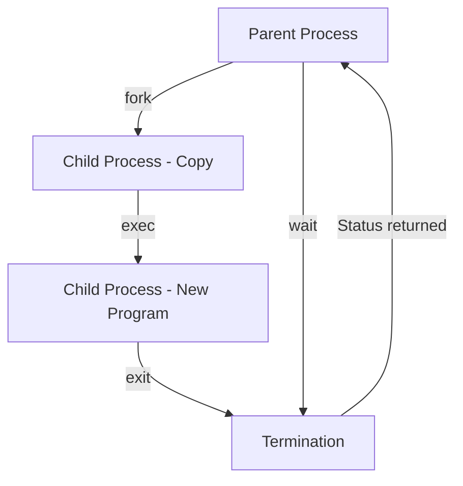

# Process Forking (fork, exec, parent/child)

## Summary
In Linux, process creation follows a unique "fork and exec" model. Instead of starting a new process from scratch, the system creates a copy of an existing process (the parent) using the `fork()` system call. This copy (the child) can then replace its own memory image with a new program using the `exec()` family of functions. This mechanism allows for efficient resource sharing through Copy-on-Write (COW) and provides a clear hierarchy for process management, including handling termination through `wait()` to prevent resource leaks like zombie processes.

## Detailed Explanation

### 1. The `fork()` System Call
`fork()` is the primary way to create a new process in Unix-like systems.
*   **Duplication**: It creates a child process that is an exact duplicate of the parent process (memory, file descriptors, etc.).
*   **Return Values**:
    *   In the **Parent**: Returns the Process ID (PID) of the child.
    *   In the **Child**: Returns `0`.
    *   **Failure**: Returns `-1` if the process cannot be created.

### 2. The `exec()` Family
Once a child is forked, it usually wants to run a different program. The `exec()` functions (e.g., `execl`, `execv`, `execvp`) replace the current process image with a new one.
*   The PID remains the same.
*   The code, data, stack, and heap are replaced by the new program.

### 3. Process Lifecycle Flow
The standard lifecycle follows this pattern:
1.  **Fork**: Parent creates a child.
2.  **Exec**: Child replaces its image with a new program.
3.  **Wait**: Parent calls `wait()` or `waitpid()` to block until the child finishes.
4.  **Exit**: Child finishes and returns an exit status.



### 4. Special Process States
*   **Zombie Process**: A process that has finished execution (called `exit`) but still has an entry in the process table. It stays there until the parent "reaps" it by calling `wait()`.
*   **Orphan Process**: A child process whose parent has died. These are automatically adopted by the `init` process (PID 1), which reaps them when they exit.
*   **Copy-on-Write (COW)**: To optimize `fork()`, Linux doesn't immediately copy all memory. Both processes share the same physical pages until one of them tries to write to a page, at which point a copy is made.

### 5. Process Creation in Go
In Go, direct `fork()` is discouraged due to the complexity of the multi-threaded runtime (goroutines). Instead, the `os/exec` package provides a high-level API to handle the fork/exec sequence safely.

```go
package main

import (
	"fmt"
	"os/exec"
)

func main() {
	// Create a new command (equivalent to preparing for fork/exec)
	cmd := exec.Command("ls", "-l", "/var/tmp")

	// Run() starts the command and waits for it to complete (Fork + Exec + Wait)
	err := cmd.Run()
	if err != nil {
		fmt.Printf("Command finished with error: %v\n", err)
		return
	}

	fmt.Println("Command executed successfully")
}
```

In Go, if you need more control (like setting environment variables or working with pipes), you use the `Cmd` struct:

```go
cmd := exec.Command("grep", "hello")
cmd.Stdin = strings.NewReader("hello world\ngoodbye")
var out bytes.Buffer
cmd.Stdout = &out
err := cmd.Run()
```

## Interview Questions

### 1. What is the difference between `fork()` and `exec()`?
**Answer:** `fork()` creates a new process by duplicating the calling process (parent), resulting in two identical processes. `exec()` replaces the current process's memory and code with a new program, keeping the same PID. Usually, they are used together: `fork()` to create a new process, and `exec()` inside the child to run a specific task.

### 2. What happens if a parent process dies before its child?
**Answer:** The child becomes an **orphan process**. In Linux, orphan processes are adopted by the `init` process (PID 1) or a "subreaper." The `init` process will automatically call `wait()` on these children when they terminate to ensure they are properly reaped.

### 3. What is a "Zombie Process" and how do you fix it?
**Answer:** A zombie process is a terminated process that hasn't been reaped by its parent yet. It doesn't consume memory but occupies a slot in the process table. To "fix" or prevent zombies, the parent must call `wait()` or `waitpid()`. If the parent is broken and won't reap its children, killing the parent will make the zombies orphans, and `init` will reap them.

### 4. Why does `fork()` return different values to the parent and child?
**Answer:** It allows the same code to branch and perform different actions. The child sees `0` so it knows it should (typically) call `exec()`, while the parent receives the child's PID so it can track, manage, or wait for that specific child.

### 5. How does Go's `os/exec` differ from a raw `syscall.ForkExec`?
**Answer:** `os/exec` is a high-level wrapper that handles the complexity of the Go runtime (which is multi-threaded and doesn't play well with raw `fork`). It manages the creation of pipes for `stdin/stdout`, sets up the environment, and automatically calls `wait()` when using `cmd.Run()`. `syscall.ForkExec` is lower-level and requires manual management of these resources.
