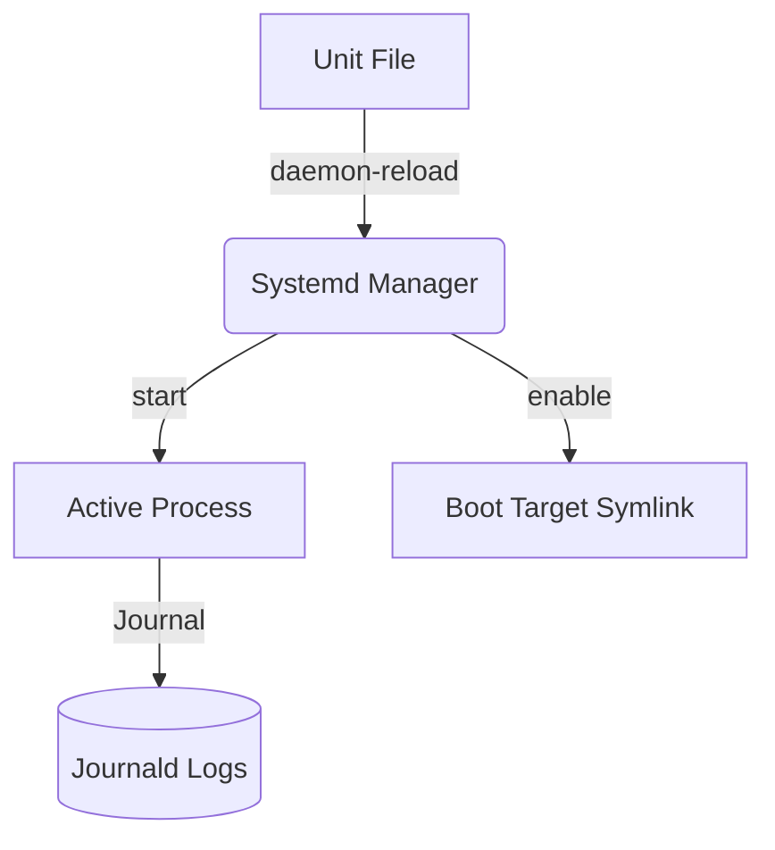

# Creating Systemd Services

## Summary
Systemd services are defined using `.service` unit files, which are configuration files that describe how to manage a process as a background service. These files are typically divided into three main sections: `[Unit]` (metadata and dependencies), `[Service]` (execution logic and process management), and `[Install]` (how the service should be enabled at boot). Understanding these files is essential for automating background tasks and managing application lifecycles in modern Linux distributions.

## Detailed Explanation

### Anatomy of a `.service` File
Unit files are usually located in:
- `/etc/systemd/system/`: User-created or administrator-provided services (highest priority).
- `/usr/lib/systemd/system/`: Services installed by package managers (lower priority).

A typical service file consists of three sections:

#### 1. The `[Unit]` Section
Provides general metadata and defines the relationship with other units.
- `Description=`: A meaningful name for the service.
- `After=`: Ensures the service starts only after the specified units are up (e.g., `network.target`).
- `Requires=`: A strong dependency; if the required unit fails, this service will not start.
- `Wants=`: A weak dependency; systemd will attempt to start the wanted unit but won't fail if it doesn't.

#### 2. The `[Service]` Section
The core configuration for how the service behaves.
- `Type=`: Defines the process startup behavior.
    - `simple` (default): Assumes the service starts immediately. The process must not fork.
    - `forking`: Used for classic daemons that fork into the background.
    - `oneshot`: For scripts that run once and exit.
- `ExecStart=`: The absolute path to the command or script to execute.
- `Restart=`: When to restart the service (e.g., `always`, `on-failure`).
- `User=` / `Group=`: Runs the service as a specific user/group.
- `WorkingDirectory=`: Sets the working directory for the process.

#### 3. The `[Install]` Section
Defines how the unit is "enabled" (i.e., linked to start at boot).
- `WantedBy=`: Specifies which target should pull in this service. `multi-user.target` is the most common for server environments.

### Service Lifecycle Diagram



---

### Step-by-Step Example: Creating a Bash Service

#### 1. Create the Script
First, let's create a simple bash script that simulates a background worker.

```bash
# Example script at /usr/local/bin/my-worker.sh
#!/bin/bash
while true; do
    echo "Worker is pulsing at $(date)"
    sleep 10
done
```
*Note: Ensure the script is executable: `chmod +x /usr/local/bin/my-worker.sh`*

#### 2. Create the Service File
Now, create the unit file at `/etc/systemd/system/my-worker.service`:

```ini
[Unit]
Description=My Custom Bash Worker Service
After=network.target

[Service]
Type=simple
ExecStart=/usr/local/bin/my-worker.sh
Restart=always
User=nobody
StandardOutput=journal
StandardError=journal

[Install]
WantedBy=multi-user.target
```

#### 3. Manage the Service
After creating or modifying a file, you must reload the systemd manager:

```bash
# Reload systemd to recognize the new file
sudo systemctl daemon-reload

# Start the service immediately
sudo systemctl start my-worker.service

# Enable it to start on boot
sudo systemctl enable my-worker.service

# Check its status
sudo systemctl status my-worker.service
```

## Interview Questions

**Q: What is the difference between `Type=simple` and `Type=oneshot`?**
**A:** `simple` is for long-running processes that stay in the foreground (from systemd's perspective). `oneshot` is for scripts that perform a task and then exit; systemd waits for a `oneshot` process to exit before starting subsequent units.

**Q: Why do you need to run `systemctl daemon-reload` after editing a .service file?**
**A:** Systemd caches unit files in memory for performance. `daemon-reload` forces systemd to re-scan the unit directories and update its internal representation of the service files.

**Q: What is the purpose of the `WantedBy=multi-user.target` line?**
**A:** It tells systemd that when you `enable` the service, it should create a symbolic link in the `.wants` directory of the `multi-user.target`. This ensures the service starts when the system reaches the standard multi-user state (runlevel 3 equivalent).

**Q: How can you see the logs of a specific service?**
**A:** You use the `journalctl` command with the `-u` (unit) flag: `journalctl -u my-worker.service`. Adding `-f` will allow you to follow the logs in real-time.

**Q: What does the `After=network.target` directive do?**
**A:** It ensures that systemd does not attempt to start your service until the network management stack has reached the "started" state. It defines the order of startup but does not create a hard dependency (for that, you would use `Requires`).
