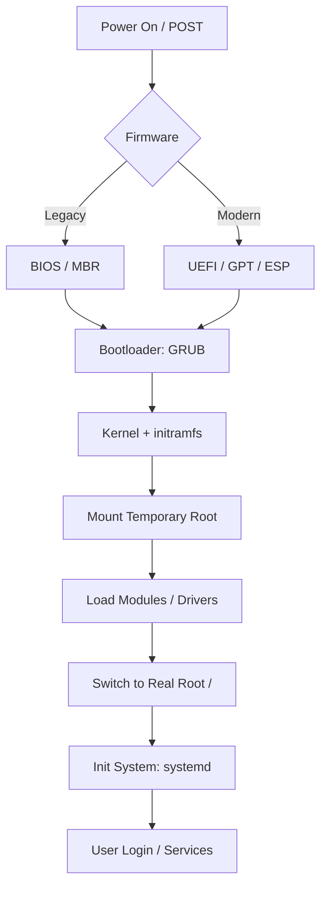

# Boot Loaders (GRUB, UEFI vs BIOS, initramfs)

## Summary
The Linux boot process is a highly structured sequence that transitions control from hardware firmware to the operating system kernel and eventually to user-space services. Key components include the firmware (**BIOS** or **UEFI**), which initializes hardware and locates the **Bootloader** (most commonly **GRUB**). The bootloader then loads the kernel and an initial RAM filesystem (**initramfs**) into memory. The `initramfs` serves as a temporary root filesystem to load essential drivers before switching to the actual root partition on the disk.

## Detailed Explanation

The boot process can be broken down into five distinct stages:

### 1. BIOS vs. UEFI (Firmware Stage)
When the computer is powered on, the firmware (BIOS or UEFI) executes a **POST (Power-On Self-Test)** to ensure hardware components are functional.

*   **Legacy BIOS**: Uses the **Master Boot Record (MBR)**, which is the first 512 bytes of the bootable drive. BIOS is limited to 2.2TB partitions and a maximum of four primary partitions.
*   **UEFI (Unified Extensible Firmware Interface)**: The modern replacement for BIOS. It uses the **GUID Partition Table (GPT)** and looks for an **EFI System Partition (ESP)** (a FAT32 partition) to find bootloader files (ending in `.efi`).

**Bash Example: Verifying Boot Mode**
```bash
# Check if the EFI firmware directory exists
if [ -d /sys/firmware/efi ]; then
    echo "System is booted in UEFI mode"
else
    echo "System is booted in Legacy BIOS mode"
fi

# View UEFI boot entries (requires efibootmgr)
sudo efibootmgr
```

### 2. The Bootloader (GRUB)
The bootloader is the first piece of software that runs after the firmware. Its primary job is to load the kernel and `initramfs` into memory.

*   **GRUB2 (Grand Unified Bootloader)**: The industry standard. It supports advanced features like file system awareness, menu interfaces, and scriptable configuration.
*   **Configuration**: The main config is `/boot/grub/grub.cfg`, but it is automatically generated. Users should edit `/etc/default/grub` or scripts in `/etc/grub.d/`.

**Bash Example: Updating GRUB Configuration**
```bash
# 1. Edit the default configuration
sudo nano /etc/default/grub

# 2. Apply changes by generating a new grub.cfg
# On Ubuntu/Debian:
sudo update-grub

# On RHEL/Fedora/CentOS:
sudo grub2-mkconfig -o /boot/grub2/grub.cfg
```

### 3. Kernel & initramfs
The bootloader hands over control to the **Kernel** (`vmlinuz`). Because the kernel may need drivers (e.g., for RAID, LVM, or encrypted LUKS volumes) that aren't built-in, it uses an **initramfs** (Initial RAM Filesystem).

*   **initramfs**: A compressed `cpio` archive that is extracted into a RAM-based filesystem (`tmpfs`).
*   The kernel executes the `/init` script inside the `initramfs` to load necessary modules and mount the real root partition.

**Bash Example: Inspecting initramfs Contents**
```bash
# List files inside the current initramfs
lsinitramfs /boot/initrd.img-$(uname -r) | head -n 20

# Identify which kernel command line arguments were used
cat /proc/cmdline
```

### 4. Boot Process Flowchart


## Interview Questions

*   **Q: What is the purpose of the initramfs in the Linux boot process?**
*   **A:** It provides a minimal root filesystem in RAM containing the necessary drivers and tools (like LVM or LUKS) to mount the real root filesystem. Without it, the kernel would fail to mount the root partition if it requires non-compiled-in drivers.

*   **Q: How does UEFI differ from BIOS regarding bootloader location?**
*   **A:** BIOS looks for the bootloader in the MBR (first sector of the disk). UEFI looks for a specific **EFI System Partition (ESP)** formatted as FAT32, where bootloader `.efi` files are stored as regular files.

*   **Q: Which command is used to regenerate the GRUB2 configuration file?**
*   **A:** `grub-mkconfig -o /boot/grub/grub.cfg` (or the `update-grub` wrapper on Debian-based systems).

*   **Q: What happens if the kernel cannot find the root filesystem?**
*   **A:** The system will typically drop into an "initramfs shell" (or "initrd shell"), allowing the administrator to troubleshoot mounting issues, check disk partitions, or load missing modules manually.

*   **Q: What is 'Secure Boot' in the context of UEFI?**
*   **A:** Secure Boot is a UEFI feature that ensures only digitally signed bootloaders and kernels are allowed to run, protecting the system against boot-level malware (rootkits).
