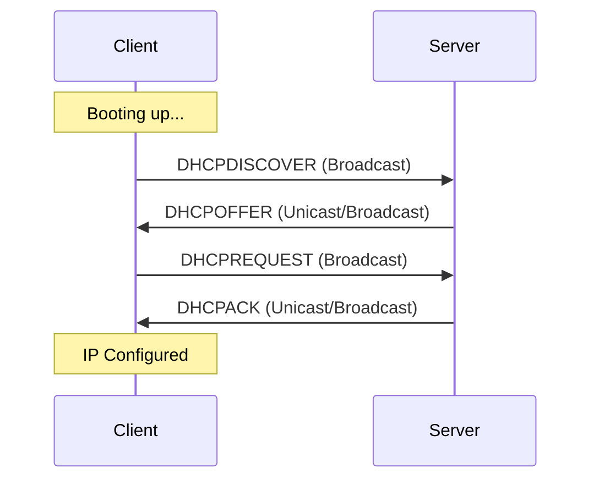

## Summary
The **Dynamic Host Configuration Protocol (DHCP)** is a network management protocol used on Internet Protocol (IP) networks for automatically assigning IP addresses and other communication parameters to devices connected to the network using a client–server architecture. It eliminates the need for manual configuration, reducing errors and simplifying network administration.

## Detailed Explanation
DHCP operates on a client-server model. When a new device (client) connects to a network, it sends a request for configuration information. The DHCP server maintains a pool of IP addresses and assigns one to the client for a specific period (lease).

### The DORA Process
The fundamental mechanism of DHCP is known as the **DORA** process, consisting of four steps:

1.  **Discover (DHCPDISCOVER)**: The client broadcasts a message on the physical subnet to find available DHCP servers. Since the client has no IP, it uses `0.0.0.0` as the source and `255.255.255.255` as the destination.
2.  **Offer (DHCPOFFER)**: A DHCP server receives the discovery message and responds with an offer containing an available IP address, subnet mask, default gateway, and lease duration.
3.  **Request (DHCPREQUEST)**: The client selects an offer (usually the first one received) and broadcasts a request to use that specific IP. This also informs other servers that their offers were not chosen.
4.  **Acknowledge (DHCPACK)**: The server sends an acknowledgment, confirming the IP address assignment and providing any additional configuration (DNS servers, etc.).



### DHCP Lease and Renewal
*   **Lease Time**: The duration for which an IP is assigned.
*   **Renewal (T1)**: At 50% of the lease time, the client attempts to renew the lease with the original server via Unicast.
*   **Rebinding (T2)**: At 87.5% of the lease time, if the original server hasn't responded, the client broadcasts a request to any available DHCP server.

### Linux Implementation: dhclient
On Linux, the most common DHCP client is `dhclient`.

#### Basic Usage
```bash
# Obtain a fresh IP address for a specific interface (e.g., eth0)
sudo dhclient eth0

# Release the current IP address and end the lease
sudo dhclient -r eth0

# Verbose mode to see the DORA process in action
sudo dhclient -v eth0

# Renew the lease for all interfaces
sudo dhclient
```

### DHCP Ports
DHCP uses **UDP** as its transport protocol:
*   **UDP Port 67**: Used by the Server (listening for client requests).
*   **UDP Port 68**: Used by the Client (listening for server responses).

## Interview Questions
*   **Q: What is the DORA process in DHCP?**
    *   **A:** It stands for Discover, Offer, Request, and Acknowledge. It is the 4-step sequence used by a client to obtain an IP address from a DHCP server.
*   **Q: Which transport protocol and ports does DHCP use?**
    *   **A:** DHCP uses UDP. The server listens on port 67, and the client listens on port 68.
*   **Q: What is a DHCP Relay Agent?**
    *   **A:** A DHCP Relay Agent is any host that forwards DHCP packets between clients and servers when they are not on the same physical subnet. It allows a single DHCP server to serve multiple subnets.
*   **Q: What happens if a client cannot find a DHCP server?**
    *   **A:** On most modern operating systems, the client will assign itself an Automatic Private IP Address (APIPA) in the range `169.254.0.1` to `169.254.255.254`.
*   **Q: How do you force a DHCP renewal on a Linux system?**
    *   **A:** You can use `sudo dhclient -r` to release the current lease and then `sudo dhclient` to request a new one. Alternatively, `dhclient -v` often triggers a renewal if a lease exists.
