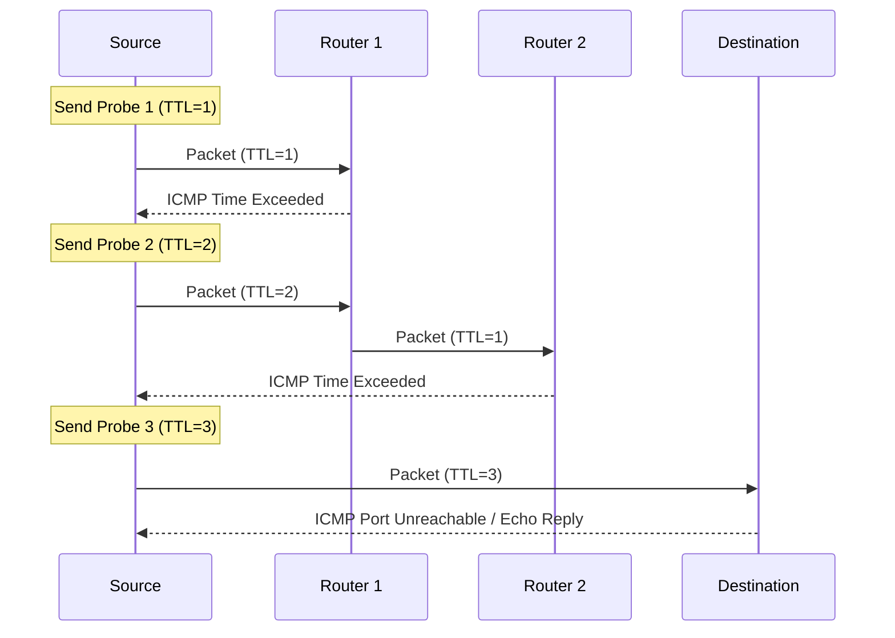

# Traceroute (TTL, Path Analysis, MTR)

## Summary
`traceroute` and `mtr` are fundamental network diagnostic tools used to identify the path packets take through an IP network and to pinpoint where delays or packet loss occur. They rely on the **Time To Live (TTL)** field in IP headers to trigger ICMP responses from intermediate routers, effectively "mapping" the route to a destination.

## Detailed Explanation

### How Traceroute Works (TTL Mechanism)
Traceroute doesn't actually "trace" a single packet. Instead, it sends a series of probe packets (usually UDP on Linux, ICMP on Windows) with increasing TTL values:

1.  **TTL=1**: The first router (hop) receives the packet, decrements the TTL to 0, and discards it. It then sends an **ICMP Time Exceeded** message back to the source. The source records the router's IP and the round-trip time (RTT).
2.  **TTL=2**: The packet passes through the first router (TTL becomes 1) and reaches the second router, which decrements it to 0 and sends the ICMP message.
3.  **Incrementing**: This process repeats until the destination is reached or the maximum hop limit (default 30) is hit.

#### Mermaid Diagram: TTL Propagation


### Interpreting Output and `* * *`
A typical `traceroute` output shows the hop number, hostname (if resolved), IP address, and three RTT values (as it sends 3 probes by default).

When you see `* * *`, it indicates that the probe timed out. This can happen for several reasons:
- **Firewalls**: A router or the destination might be configured to drop probe packets (UDP/ICMP) or filter outgoing ICMP "Time Exceeded" messages.
- **Rate Limiting**: Some routers deprioritize ICMP generation to protect their CPU.
- **Packet Loss**: Real network congestion or link failure.

### Bash Examples

#### Basic Traceroute
```bash
# Standard UDP traceroute
traceroute google.com

# Use ICMP Echo requests (similar to Windows tracert)
# Requires root/sudo
sudo traceroute -I google.com

# Use TCP SYN probes (useful for bypassing firewalls)
sudo traceroute -T -p 443 google.com
```

### MTR (My Traceroute)
`mtr` combines `traceroute` and `ping`. It is dynamic and provides a live view of the network health.

```bash
# Start mtr (interactive mode)
mtr google.com

# Generate a static report after 10 cycles
mtr -rw google.com
```

**Key MTR Columns:**
- **Loss%**: Percentage of packets lost at this hop.
- **Last/Avg/Best/Wrst**: Latency statistics in milliseconds.
- **StDev**: Standard deviation of latency (high StDev indicates "jitter").

## Interview Questions

**Q: How does traceroute identify the routers along a path?**
**A:** It sends packets with an incrementally increasing TTL (Time To Live). When a router receives a packet with TTL=1, it decrements it to 0, drops the packet, and sends an ICMP "Time Exceeded" message back to the sender. The sender uses the source IP of these ICMP messages to identify the routers.

**Q: Why might you see high latency at hop 5, but low latency at hop 6 and beyond?**
**A:** This is often due to **ICMP rate limiting** or **Control Plane Policing (CoPP)** on the router at hop 5. The router handles transit traffic (packets passing through) in hardware (ASICs), but generating ICMP messages is a CPU-intensive task handled by the "slow path" (Control Plane). If the router is busy, it may delay or drop ICMP generation while still forwarding normal traffic at full speed.

**Q: What is the main advantage of using MTR over standard traceroute?**
**A:** MTR provides continuous, real-time statistics. While traceroute gives a single snapshot of the path, MTR can reveal intermittent packet loss or jitter by sending multiple probes over time, making it much more effective for troubleshooting performance issues that aren't permanent.

**Q: Why do some hops show `* * *` while the destination is still reachable?**
**A:** Many network administrators block ICMP or specific UDP ports at the firewall level for security reasons. Some routers are also configured never to send "Time Exceeded" messages. If subsequent hops respond, the network is passing traffic correctly; the intermediate router is simply "stealthy."
