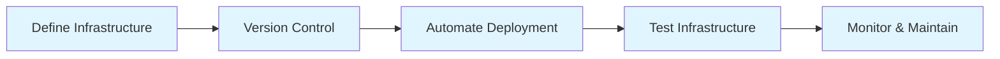

# What is Infrastructure as Code (IaC)

## Summary

**Infrastructure as Code (IaC)** is the practice of managing and provisioning infrastructure through machine-readable definition files instead of manual processes. IaC treats infrastructure like software - version controlled, tested, and deployed programmatically. This approach enables reproducibility, consistency, and automation of infrastructure across development, staging, and production environments.

## Detailed Explanation

### IaC Paradigms

| Paradigm | Description | Tools |
|-----------|-------------|--------|
| **Declarative** | Define desired state; tool figures out how to achieve it | Terraform, AWS CloudFormation, Azure ARM |
| **Imperative** | Define step-by-step procedures to achieve state | Ansible, Chef, Puppet, Shell scripts |

### Key Principles of IaC



**1. Version Control**
```bash
# Store infrastructure in Git
git clone https://github.com/company/infrastructure
git checkout main
git checkout production
```

**2. Idempotency**
```hcl
# Declarative: Describe desired state
# Terraform ensures state matches, regardless of current state
resource "aws_instance" "web" {
    ami           = "ami-0c55b159cbfafe1f0"
    instance_type = "t2.micro"
}
# Running this 10x always results in 1 instance (idempotent)
```

**3. Consistency**
- Same infrastructure across environments
- No "snowflake" servers
- Reproducible deployments

**4. Documentation as Code**
```hcl
# Infrastructure definitions serve as documentation
resource "aws_s3_bucket" "data" {
    bucket = "my-app-data"
    acl    = "private"

    tags = {
        Environment = "production"
        ManagedBy   = "Terraform"
    }
}
```

### IaC Benefits

| Benefit | Impact |
|---------|---------|
| **Speed** | Provision infrastructure in minutes, not days |
| **Consistency** | Identical environments every time |
| **Reproducibility** | Recreate infrastructure from code |
| **Version Control** | Track changes, rollbacks, audit trail |
| **Collaboration** | Infrastructure changes through PRs |
| **Cost Management** | Easy to identify and remove unused resources |
| **Disaster Recovery** | Quickly rebuild infrastructure from code |

### Traditional vs IaC

| Aspect | Traditional (Manual) | IaC |
|---------|-------------------|-------|
| **Provisioning** | Click in console | Code-based |
| **Reproducibility** | Low (manual steps) | High (version control) |
| **Documentation** | Separate from config | Config IS documentation |
| **Testing** | Manual verification | Automated tests |
| **Rollbacks** | Manual, error-prone | Code rollback |
| **Consistency** | Variable | Guaranteed |

### Declarative IaC with Terraform

```hcl
# Terraform is declarative - you describe WHAT you want
terraform {
    required_providers {
        aws = {
            source  = "hashicorp/aws"
            version = "~> 5.0"
        }
    }
}

provider "aws" {
    region = "us-west-2"
}

# Describe desired state
resource "aws_vpc" "main" {
    cidr_block = "10.0.0.0/16"

    tags = {
        Name = "main-vpc"
    }
}

resource "aws_subnet" "public" {
    vpc_id     = aws_vpc.main.id
    cidr_block = "10.0.1.0/24"

    tags = {
        Name = "public-subnet"
    }
}
```

**How Declarative Works:**

1. **Plan**: Compare code vs actual state
2. **Diff**: Calculate changes needed
3. **Apply**: Make minimal changes to reach desired state

```bash
# Example workflow
terraform plan    # See what will change
terraform apply   # Apply changes
# Result: Terraform creates/updates only what's necessary
```

### IaC Maturity Levels

| Level | Description | Example |
|--------|-------------|----------|
| **Level 1** | Static templates | CloudFormation templates |
| **Level 2** | Parameterized templates | Templates with variables |
| **Level 3** | Modular, reusable | Terraform modules |
| **Level 4** | Automated testing & CI/CD | PR tests, auto-deploy |
| **Level 5** | Self-service platforms | Internal developer platform |

### Common IaC Patterns

```hcl
# Pattern 1: Multi-environment
variable "environment" {
    type = string
}

resource "aws_instance" "web" {
    ami           = var.environment == "prod" ? var.prod_ami : var.dev_ami
    instance_type = var.environment == "prod" ? "t3.large" : "t3.micro"
}

# Pattern 2: Modular
module "vpc" {
    source = "./modules/vpc"
    cidr   = "10.0.0.0/16"
}

module "ec2" {
    source     = "./modules/ec2"
    subnet_ids = module.vpc.public_subnet_ids
}

# Pattern 3: Drift detection
terraform plan -refresh-only  # Detect changes outside Terraform
```

### IaC Anti-Patterns

```hcl
# ❌ Anti-pattern: Hard-coded secrets
resource "aws_instance" "web" {
    ami           = "ami-0c55b159cbfafe1f0"
    user_data     = "password=secret123"  # Don't do this!
}

# ✅ Pattern: Use secrets management
resource "aws_instance" "web" {
    ami           = "ami-0c55b159cbfafe1f0"
    user_data     = templatefile("${path.module}/init.sh", {
        password = aws_secretsmanager_secret.password.arn
    })
}

# ❌ Anti-pattern: Giant monolithic files
# main.tf with 5000 lines

# ✅ Pattern: Modular structure
main.tf -> modules/vpc/main.tf
          -> modules/ec2/main.tf
          -> modules/database/main.tf
```

### IaC in CI/CD Pipeline

```yaml
# .github/workflows/terraform.yml
name: Terraform

on:
  push:
    paths:
      - 'terraform/**'

jobs:
  plan:
    runs-on: ubuntu-latest
    steps:
      - uses: actions/checkout@v2
      - uses: hashicorp/setup-terraform@v1
      - run: terraform init
      - run: terraform plan -out=tfplan

  apply:
    needs: plan
    if: github.ref == 'refs/heads/main'
    runs-on: ubuntu-latest
    steps:
      - uses: actions/checkout@v2
      - uses: hashicorp/setup-terraform@v1
      - run: terraform init
      - run: terraform apply tfplan
```

### State Management

```hcl
# IaC requires state to track resources
# State: Mapping of resources -> real infrastructure

terraform {
    backend "s3" {
        bucket         = "terraform-state"
        key           = "prod/terraform.tfstate"
        region        = "us-west-2"
        encrypt       = true
        dynamodb_table = "terraform-locks"
    }
}
```

## Interview Questions

**Q: What is the difference between declarative and imperative IaC?**
**A:** Declarative defines the **desired state** (what you want), and the tool figures out how to achieve it (e.g., Terraform). Imperative defines **procedures** to follow (how to do it), step by step (e.g., Ansible scripts). Declarative is generally preferred for infrastructure.

**Q: Why is idempotency important in IaC?**
**A:** Idempotency ensures running the same operation multiple times produces the same result. This is critical for IaC because you can apply configurations repeatedly without creating duplicate resources or causing conflicts. Terraform is idempotent - it only makes changes needed to reach desired state.

**Q: What are the main benefits of using IaC?**
**A:** Speed (provision in minutes), consistency (identical environments), reproducibility (recreate from code), version control (track changes), collaboration (PR-based workflows), cost management (identify unused resources), and disaster recovery (rebuild from code).

**Q: How does IaC enable better disaster recovery?**
**A:** Infrastructure code in version control serves as documentation. If infrastructure is destroyed, you can redeploy by running the code. This eliminates manual, error-prone recreation steps and ensures recovered infrastructure matches the original design.
