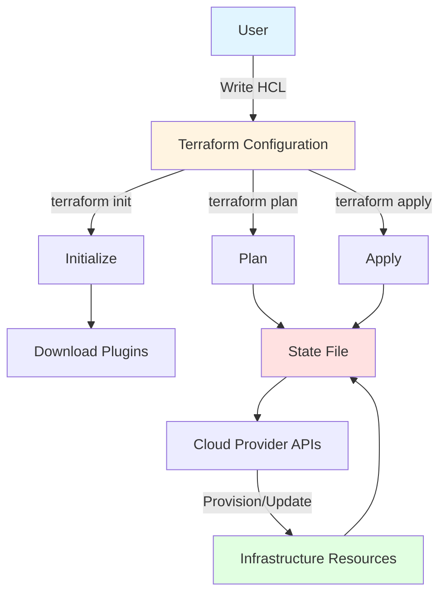
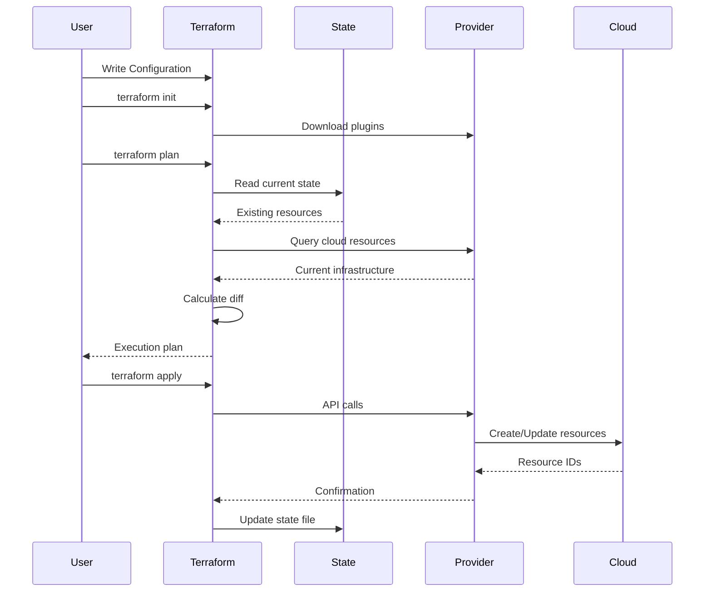

# What is Terraform

## Summary

**Terraform** is an open-source Infrastructure as Code (IaC) tool created by HashiCorp. It enables users to define and provision infrastructure resources across multiple cloud providers (AWS, Azure, GCP, etc.) using a declarative configuration language called HCL (HashiCorp Configuration Language). Terraform manages infrastructure through a state file that tracks the relationship between configuration and actual resources, enabling safe, predictable infrastructure changes.

## Detailed Explanation

### Terraform Architecture



### Core Concepts

| Concept | Description | Example |
|---------|-------------|---------|
| **Configuration** | HCL files defining desired infrastructure | `main.tf`, `variables.tf` |
| **Provider** | Plugin managing API interactions with cloud services | `aws`, `azurerm`, `google` |
| **Resource** | Infrastructure component to be created/managed | `aws_instance`, `azurerm_storage_account` |
| **State** | JSON file mapping resources to real infrastructure | `terraform.tfstate` |
| **Module** | Reusable collection of resources | `terraform-aws-modules/vpc/aws` |
| **Backend** | Where state is stored (local or remote) | S3, Azure Blob, Consul |

### Terraform Workflow



### Basic Terraform Configuration

```hcl
# main.tf - Main configuration file

terraform {
  # Required Terraform version
  required_version = ">= 1.0"

  # Provider requirements
  required_providers {
    aws = {
      source  = "hashicorp/aws"
      version = "~> 5.0"
    }
  }

  # Remote state backend
  backend "s3" {
    bucket         = "my-terraform-state"
    key           = "prod/terraform.tfstate"
    region        = "us-west-2"
    encrypt       = true
    dynamodb_table = "terraform-locks"
  }
}

# Provider configuration
provider "aws" {
  region = "us-west-2"
}

# Resource: Create a VPC
resource "aws_vpc" "main" {
  cidr_block = "10.0.0.0/16"

  tags = {
    Name        = "main-vpc"
    Environment = "production"
  }
}

# Resource: Create a subnet
resource "aws_subnet" "public" {
  vpc_id     = aws_vpc.main.id
  cidr_block = "10.0.1.0/24"

  tags = {
    Name = "public-subnet-1"
  }
}

# Resource: Create an EC2 instance
resource "aws_instance" "web" {
  ami           = "ami-0c55b159cbfafe1f0"
  instance_type = "t3.micro"

  subnet_id = aws_subnet.public.id

  tags = {
    Name = "web-server-1"
  }
}
```

### Terraform Commands

| Command | Description | Usage |
|---------|-------------|-------|
| **terraform init** | Initialize working directory, download plugins | First command in new directory |
| **terraform plan** | Show execution plan (preview changes) | Review before applying |
| **terraform apply** | Apply configuration changes | Deploy infrastructure |
| **terraform destroy** | Destroy managed infrastructure | Clean up resources |
| **terraform validate** | Validate configuration syntax | Check for errors |
| **terraform fmt** | Format configuration files | Consistent formatting |
| **terraform output** | Show output values | Retrieve outputs |

```bash
# Typical Terraform workflow
terraform init              # Initialize the project
terraform plan -out=tfplan  # Create execution plan
terraform apply tfplan      # Apply the plan
terraform output web_ip     # Get output value

# Destroy infrastructure
terraform destroy           # Destroy all resources
```

### Multi-Cloud Support

```hcl
# Terraform supports multiple providers simultaneously

terraform {
  required_providers {
    aws = {
      source  = "hashicorp/aws"
      version = "~> 5.0"
    }
    azurerm = {
      source  = "hashicorp/azurerm"
      version = "~> 3.0"
    }
    google = {
      source  = "hashicorp/google"
      version = "~> 4.0"
    }
  }
}

# AWS resources
provider "aws" {
  region = "us-east-1"
}

resource "aws_instance" "server" {
  ami           = "ami-12345678"
  instance_type = "t3.micro"
}

# Azure resources
provider "azurerm" {
  features {}
}

resource "azurerm_resource_group" "example" {
  name     = "example-resources"
  location = "West Europe"
}

# Google Cloud resources
provider "google" {
  project = "my-project-id"
  region  = "us-central1"
}

resource "google_compute_instance" "vm" {
  name         = "test-instance"
  machine_type = "e2-medium"
}
```

### State Management

```hcl
# Local state (default - NOT recommended for teams)
terraform {
  backend "local" {
    path = "terraform.tfstate"
  }
}

# Remote state - S3 (recommended)
terraform {
  backend "s3" {
    bucket         = "terraform-state-prod"
    key           = "network/terraform.tfstate"
    region        = "us-west-2"
    encrypt       = true
    dynamodb_table = "terraform-locks"
  }
}

# Remote state - Azure Blob
terraform {
  backend "azurerm" {
    resource_group_name  = "storage-resource-group"
    storage_account_name = "tfstatestorage"
    container_name       = "tfstate"
    key                  = "prod.terraform.tfstate"
  }
}

# Remote state - GCS
terraform {
  backend "gcs" {
    bucket  = "terraform-state-prod"
    prefix  = "prod"
  }
}
```

### Terraform Registry

```hcl
# Using official modules from Terraform Registry
module "vpc" {
  source  = "terraform-aws-modules/vpc/aws"
  version = "5.1.2"

  name = "my-vpc"
  cidr = "10.0.0.0/16"

  azs             = ["us-west-2a", "us-west-2b", "us-west-2c"]
  private_subnets = ["10.0.1.0/24", "10.0.2.0/24", "10.0.3.0/24"]
  public_subnets  = ["10.0.101.0/24", "10.0.102.0/24", "10.0.103.0/24"]

  enable_nat_gateway = true
  single_nat_gateway = true
}

module "ec2" {
  source  = "terraform-aws-modules/ec2-instance/aws"
  version = "5.2.0"

  name           = "my-ec2"
  instance_type  = "t3.micro"
  ami            = "ami-0c55b159cbfafe1f0"
  subnet_id      = module.vpc.private_subnets[0]

  tags = {
    Environment = "production"
  }
}
```

### Terraform Cloud vs Terraform Open Source

| Feature | Terraform OSS | Terraform Cloud |
|---------|---------------|-----------------|
| **Cost** | Free | Free tier + paid plans |
| **State Storage** | Self-managed (S3, GCS, etc.) | Managed by HashiCorp |
| **Remote Execution** | Manual | Included |
| **VCS Integration** | Manual | Native (GitHub, GitLab, Bitbucket) |
| **Policy as Code** | Third-party | Sentinel (enterprise) |
| **Drift Detection** | Manual | Automatic |
| **Private Module Registry** | Self-hosted | Included |

### Terraform vs Other IaC Tools

| Tool | Language | State Management | Cloud Support |
|------|----------|------------------|---------------|
| **Terraform** | HCL | Required (state file) | Multi-cloud |
| **CloudFormation** | JSON/YAML | AWS-managed | AWS only |
| **ARM Templates** | JSON | Azure-managed | Azure only |
| **Ansible** | YAML | Optional (agentless) | Multi-cloud |
| **Pulumi** | Python/TS/Go/etc. | Optional | Multi-cloud |
| **Chef** | Ruby | Chef Server | Multi-cloud |

### Terraform Best Practices

```hcl
# Best Practice 1: Separate concerns
# main.tf - Resources
# variables.tf - Input variables
# outputs.tf - Output values
# provider.tf - Provider configuration
# backend.tf - Backend configuration

# Best Practice 2: Use meaningful names
resource "aws_instance" "web_server_prod" {
  # Good: descriptive
  tags = {
    Name = "web-server-prod"
  }
}

resource "aws_instance" "i" {
  # Bad: cryptic name
}

# Best Practice 3: Use variables for reusability
variable "instance_type" {
  description = "EC2 instance type"
  type        = string
  default     = "t3.micro"
}

resource "aws_instance" "web" {
  instance_type = var.instance_type
}

# Best Practice 4: Tag all resources
resource "aws_vpc" "main" {
  tags = {
    Name        = "main-vpc"
    Environment = var.environment
    ManagedBy   = "Terraform"
    Owner       = "devops-team"
  }
}

# Best Practice 5: Use remote state with locking
terraform {
  backend "s3" {
    bucket         = "terraform-state"
    key           = "prod/terraform.tfstate"
    region        = "us-west-2"
    encrypt       = true
    dynamodb_table = "terraform-locks"  # Locking
  }
}
```

## Interview Questions

**Q: What is Terraform and what problem does it solve?**
**A:** Terraform is an Infrastructure as Code tool that allows you to define and provision infrastructure using a declarative language (HCL). It solves the problem of manual, error-prone infrastructure provisioning by enabling version-controlled, reproducible, and automated infrastructure management across multiple cloud providers.

**Q: What is the difference between terraform plan and terraform apply?**
**A:** `terraform plan` creates an execution plan showing what Terraform will do without making any changes (dry run). `terraform apply` actually creates, updates, or destroys infrastructure resources to match the desired state. Best practice is to run plan first, review changes, then apply.

**Q: What is the Terraform state file and why is it important?**
**A:** The state file (`terraform.tfstate`) is a JSON file that maps Terraform resources to real-world infrastructure. It's critical because Terraform uses it to track resource IDs, dependencies, and metadata. Without state, Terraform wouldn't know what resources exist or need to be created/updated.

**Q: Explain Terraform's core workflow.**
**A:** 1) Write HCL configuration, 2) Run `terraform init` to initialize and download providers, 3) Run `terraform plan` to see what will change, 4) Run `terraform apply` to make changes, 5) Terraform updates state file to reflect actual infrastructure. State is maintained after each apply.

**Q: How does Terraform differ from CloudFormation or ARM Templates?**
**A:** Terraform is cloud-agnostic (works with AWS, Azure, GCP, etc.) while CloudFormation is AWS-only and ARM is Azure-only. Terraform uses HCL (readable language), CloudFormation uses JSON/YAML, and ARM uses JSON. Terraform also has a more active community and larger module ecosystem.

**Q: What are Terraform providers and why do you need them?**
**A:** Providers are plugins that enable Terraform to interact with cloud providers, SaaS providers, and other APIs. Each provider knows how to create, read, update, and delete resources for its specific service. You need providers because Terraform doesn't include built-in knowledge of any cloud services - it's a framework that relies on provider plugins.

**Q: What happens if you lose the Terraform state file?**
**A:** Losing the state file is serious because Terraform won't know what resources it's managing. Solutions: 1) Restore from backup (if using remote state), 2) Import existing resources using `terraform import`, or 3) Delete resources manually and recreate. This is why remote state with backups is critical.

**Q: How does Terraform handle dependencies between resources?**
**A:** Terraform automatically infers dependencies from resource references (e.g., `aws_subnet.public.id` in `aws_instance`). It builds a dependency graph and creates resources in the correct order. You can also explicitly define dependencies using the `depends_on` meta-argument.
