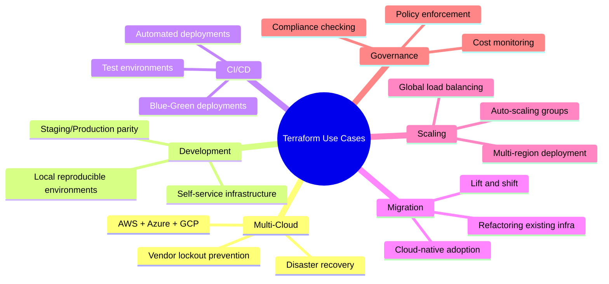

# Terraform Use Cases and Benefits

## Summary

Terraform is used for automating infrastructure provisioning across on-premises, cloud, and hybrid environments. Key use cases include multi-cloud deployments, reproducible development environments, CI/CD pipeline integration, and infrastructure scaling. Benefits include speed (provisioning in minutes), consistency (identical environments), cost savings (resource optimization), reduced human error, and improved collaboration through Git-based workflows.

## Detailed Explanation

### Primary Use Cases



### Use Case 1: Multi-Cloud Architecture

```hcl
# Use Terraform to distribute services across multiple clouds

terraform {
  required_providers {
    aws   = { source = "hashicorp/aws", version = "~> 5.0" }
    azure = { source = "hashicorp/azurerm", version = "~> 3.0" }
    google = { source = "hashicorp/google", version = "~> 4.0" }
  }
}

# Primary services on AWS
provider "aws" {
  region = "us-east-1"
}

resource "aws_eks_cluster" "primary" {
  name     = "prod-cluster"
  role_arn = aws_iam_role.eks.arn
}

# Backup services on Azure
provider "azurerm" {
  features {}
}

resource "azurerm_kubernetes_cluster" "backup" {
  name                = "prod-cluster-backup"
  location            = "eastus"
  resource_group_name = "backup-rg"
}

# Disaster recovery on GCP
provider "google" {
  project = "dr-project"
  region  = "us-central1"
}

resource "google_compute_instance" "dr_instance" {
  name         = "dr-server"
  machine_type = "e2-medium"
}
```

**Benefits:**
- **Vendor lockout prevention**: Avoid dependency on single cloud provider
- **Cost optimization**: Run workloads where cheapest
- **Disaster recovery**: Distribute across regions/providers
- **Compliance**: Meet data residency requirements

### Use Case 2: Development Environments

```hcl
# variables.tf
variable "environment" {
  type        = string
  description = "Environment name (dev, staging, prod)"
}

variable "instance_count" {
  type        = map(number)
  default     = {
    dev     = 1
    staging = 2
    prod    = 3
  }
}

variable "instance_type" {
  type        = map(string)
  default     = {
    dev     = "t3.micro"
    staging = "t3.small"
    prod    = "t3.medium"
  }
}

# main.tf
resource "aws_instance" "app_server" {
  count         = var.instance_count[var.environment]
  ami           = "ami-0c55b159cbfafe1f0"
  instance_type = var.instance_type[var.environment]

  tags = {
    Name        = "app-server-${var.environment}-${count.index}"
    Environment = var.environment
  }
}

# Workspaces for easy environment switching
# terraform workspace new dev
# terraform apply -var="environment=dev"

# terraform workspace new staging
# terraform apply -var="environment=staging"

# terraform workspace new prod
# terraform apply -var="environment=prod"
```

**Benefits:**
- **Reproducibility**: Create identical environments repeatedly
- **Developer self-service**: Devs provision their own resources
- **Consistency**: No "works on my machine" issues
- **Quick spin-up**: New environments in minutes, not days

### Use Case 3: CI/CD Integration

```yaml
# .github/workflows/terraform.yml
name: Terraform CI/CD

on:
  pull_request:
    paths:
      - 'terraform/**'
  push:
    branches:
      - main
    paths:
      - 'terraform/**'

env:
  TF_VERSION: "1.6.0"

jobs:
  validate:
    name: Validate Terraform
    runs-on: ubuntu-latest
    steps:
      - uses: actions/checkout@v3

      - name: Setup Terraform
        uses: hashicorp/setup-terraform@v2
        with:
          terraform_version: ${{ env.TF_VERSION }}

      - name: Terraform Format Check
        run: terraform fmt -check -recursive

      - name: Terraform Init
        run: terraform init

      - name: Terraform Validate
        run: terraform validate

  plan:
    name: Terraform Plan
    runs-on: ubuntu-latest
    needs: validate
    steps:
      - uses: actions/checkout@v3

      - name: Configure AWS credentials
        uses: aws-actions/configure-aws-credentials@v2
        with:
          aws-access-key-id: ${{ secrets.AWS_ACCESS_KEY_ID }}
          aws-secret-access-key: ${{ secrets.AWS_SECRET_ACCESS_KEY }}
          aws-region: us-east-1

      - name: Setup Terraform
        uses: hashicorp/setup-terraform@v2

      - name: Terraform Init
        run: terraform init

      - name: Terraform Plan
        run: terraform plan -out=tfplan

      - name: Save Plan
        uses: actions/upload-artifact@v3
        with:
          name: tfplan
          path: tfplan

  apply:
    name: Terraform Apply
    runs-on: ubuntu-latest
    needs: plan
    if: github.ref == 'refs/heads/main'
    steps:
      - uses: actions/checkout@v3

      - name: Configure AWS credentials
        uses: aws-actions/configure-aws-credentials@v2
        with:
          aws-access-key-id: ${{ secrets.AWS_ACCESS_KEY_ID }}
          aws-secret-access-key: ${{ secrets.AWS_SECRET_ACCESS_KEY }}
          aws-region: us-east-1

      - name: Setup Terraform
        uses: hashicorp/setup-terraform@v2

      - name: Load Plan
        uses: actions/download-artifact@v3
        with:
          name: tfplan

      - name: Terraform Apply
        run: terraform apply tfplan
```

**Benefits:**
- **Automated deployments**: No manual provisioning
- **Change tracking**: All changes via pull requests
- **Peer review**: Infrastructure changes reviewed like code
- **Audit trail**: Git history shows who changed what

### Use Case 4: Infrastructure Scaling

```hcl
# Auto-scaling with Terraform

resource "aws_launch_template" "web" {
  name_prefix   = "web-"
  image_id      = "ami-0c55b159cbfafe1f0"
  instance_type = "t3.micro"

  tag_specifications {
    resource_type = "instance"

    tags = {
      Name = "web-server"
    }
  }
}

resource "aws_autoscaling_group" "web" {
  desired_capacity    = 2
  max_size           = 10
  min_size           = 2
  vpc_zone_identifier = aws_subnet.public[*].id

  launch_template {
    id      = aws_launch_template.web.id
    version = "$Latest"
  }

  tag {
    key                 = "Environment"
    value               = "production"
    propagate_at_launch = true
  }
}

# Scale based on CPU
resource "aws_cloudwatch_metric_alarm" "high_cpu" {
  alarm_name          = "high-cpu-utilization"
  comparison_operator = "GreaterThanThreshold"
  evaluation_periods  = "2"
  metric_name         = "CPUUtilization"
  namespace           = "AWS/EC2"
  period              = "120"
  statistic           = "Average"
  threshold           = "80"

  alarm_description = "This metric monitors EC2 CPU utilization"
  alarm_actions    = [aws_autoscaling_policy.scale_up.arn]
}

resource "aws_autoscaling_policy" "scale_up" {
  name                   = "scale-up"
  scaling_adjustment      = 1
  adjustment_type        = "ChangeInCapacity"
  cooldown               = 300
  autoscaling_group_name = aws_autoscaling_group.web.name
}
```

**Benefits:**
- **Auto-scaling**: Automatically respond to load
- **Cost optimization**: Scale down when idle
- **High availability**: Maintain service during spikes
- **Predictable costs**: Set scaling limits

### Use Case 5: Infrastructure Drift Detection

```bash
# Detect manual changes outside Terraform
terraform plan -refresh-only

# Output:
# Note: Objects have changed outside of Terraform
#
# Terraform detected the following changes made outside of Terraform
# since the last "terraform apply":
#
#   # aws_instance.example has changed
#   ~ resource "aws_instance" "example" {
#         id                   = "i-1234567890abcdef0"
#       ~ tags                 = {
#           ~ "Owner" = "old-team" -> "new-team"
#         }
#     }
```

```hcl
# Use lifecycle to prevent manual changes
resource "aws_s3_bucket" "data" {
  bucket = "my-app-data"

  lifecycle {
    ignore_changes = [  # Allow specific changes
      versioning,
    ]
  }
}

resource "aws_instance" "database" {
  ami           = "ami-0c55b159cbfafe1f0"
  instance_type = "t3.micro"

  lifecycle {
    prevent_destroy = true  # Prevent accidental deletion
  }
}
```

**Benefits:**
- **Drift detection**: Identify unauthorized changes
- **Compliance**: Enforce infrastructure standards
- **Documentation**: Keep infrastructure definition accurate

### Key Benefits Summary

| Benefit | Description | Impact |
|---------|-------------|--------|
| **Speed** | Provision infrastructure in minutes vs days | Faster time-to-market |
| **Consistency** | Identical environments every time | Reduced bugs in production |
| **Reproducibility** | Recreate infrastructure from code | Easy disaster recovery |
| **Version Control** | Track all infrastructure changes | Audit trail, easy rollbacks |
| **Collaboration** | PR-based infrastructure changes | Better team coordination |
| **Cost Management** | Easy to identify and remove unused resources | Reduced cloud spend |
| **Automation** | Integrate with CI/CD pipelines | No manual steps |
| **Scalability** | Easy to replicate environments | Handle growth |
| **Multi-Cloud** | Manage resources across providers | No vendor lock-in |
| **Documentation** | Infrastructure code is documentation | Always up-to-date |

### Benefits with Examples

```hcl
# Benefit 1: Speed - Provision entire stack in minutes
# Before: 2 weeks of manual configuration
# After: 10 minutes running terraform apply

module "vpc" {
  source = "./modules/vpc"
}

module "eks" {
  source     = "./modules/eks"
  vpc_id     = module.vpc.vpc_id
  subnet_ids = module.vpc.subnet_ids
}

module "rds" {
  source     = "./modules/rds"
  vpc_id     = module.vpc.vpc_id
  subnet_ids = module.vpc.private_subnet_ids
}

# Benefit 2: Consistency - Same config for all environments
variable "environment" {
  type = string
}

resource "aws_instance" "app" {
  instance_type = var.environment == "prod" ? "t3.medium" : "t3.micro"
  # All environments use same pattern
}

# Benefit 3: Cost Management - Easy cleanup
terraform destroy  # Remove all resources when done
terraform state list  # List all managed resources
terraform state rm aws_instance.unwanted  # Remove from state

# Benefit 4: Version Control - Git history
# git log shows all infrastructure changes
# git revert to roll back infrastructure changes

# Benefit 5: Documentation - Code is documentation
# resource "aws_vpc" "main" {
#   cidr_block = "10.0.0.0/16"  # Self-documenting
# }
```

### Terraform vs Manual Infrastructure

| Aspect | Manual | Terraform |
|--------|--------|-----------|
| **Time to provision** | Days/weeks | Minutes |
| **Consistency** | Variable (human error) | Guaranteed |
| **Reusability** | Copy-paste scripts | Modules, templates |
| **Documentation** | Separate wiki/docs | Code IS documentation |
| **Version control** | None | Git-based |
| **Collaboration** | Email, tickets | Pull requests |
| **Rollback** | Manual, error-prone | `terraform apply` old commit |
| **Audit trail** | Incomplete | Complete Git history |
| **Cost tracking** | Manual | Integrated |
| **Compliance** | Manual checks | Automated policies |

### Cost Benefit Analysis

```hcl
# Resource tagging for cost tracking
resource "aws_instance" "web" {
  tags = {
    Name        = "web-server"
    Environment = "production"
    Owner       = "team-platform"
    CostCenter  = "engineering"
    Project     = "web-app"
  }
}

# Use terraform-cost to estimate costs
# After configuration:
# $ terraform-cost
# + Monthly cost estimate: $1,250.00
# + New resources: $800.00
# + Existing resources: $450.00
```

### Real-World Success Stories

**Netflix**: Uses Terraform for multi-region infrastructure
- Deploy to multiple AWS regions simultaneously
- Handle millions of requests per second
- Consistent infrastructure across regions

**Heroku (Salesforce)**: Automated platform provisioning
- Thousands of environments
- Self-service for developers
- Reduced provisioning time from days to minutes

**GitLab**: Complete infrastructure in Terraform
- Manage 2,000+ VMs
- Multi-cloud (AWS, GCP, Azure)
- Deployed across 10+ data centers

## Interview Questions

**Q: What are the main use cases for Terraform?**
**A:** Primary use cases include multi-cloud deployments (AWS + Azure + GCP), reproducible development environments (dev/staging/prod), CI/CD pipeline integration (automated deployments), infrastructure scaling (auto-scaling groups), infrastructure migration (lift and shift), and governance (policy enforcement, compliance checking).

**Q: What are the key benefits of using Terraform over manual infrastructure?**
**A:** Key benefits: Speed (provision in minutes vs weeks), Consistency (identical environments guaranteed), Reproducibility (recreate from code), Version Control (track changes via Git), Collaboration (PR-based workflows), Cost Management (easy to identify unused resources), Automation (CI/CD integration), Scalability (easy replication), Multi-Cloud (manage across providers), and Documentation (code IS documentation).

**Q: How does Terraform improve disaster recovery?**
**A:** Terraform stores infrastructure as code in Git. If infrastructure is destroyed, you can redeploy by running `terraform apply`. This eliminates manual, error-prone recreation steps and ensures recovered infrastructure matches the original design. With remote state backups, you can even recover state files.

**Q: How can Terraform help with cost management?**
**A:** Terraform helps in several ways: 1) Consistent resource tagging for cost allocation, 2) Easy identification and removal of unused resources (`terraform destroy`, state management), 3) Use tools like `terraform-cost` or `infracost` to estimate costs before applying, 4) Automated cleanup of test environments, 5) Resource limits and budget constraints in CI/CD pipelines.

**Q: Explain how Terraform enables collaboration in infrastructure changes.**
**A:** Terraform treats infrastructure as code stored in Git. Team members make changes via pull requests, allowing peer review, automated testing, and discussion before deployment. Changes are tracked in Git history, providing an audit trail. CI/CD pipelines can validate, plan, and apply changes automatically after PR approval.

**Q: What is infrastructure drift and how does Terraform handle it?**
**A:** Infrastructure drift occurs when resources are modified outside Terraform (manual console changes). Terraform can detect drift using `terraform plan -refresh-only`, which compares actual infrastructure to state. You can prevent drift using `ignore_changes` lifecycle block for allowed changes, or enforce strict control preventing any manual modifications.

**Q: How does Terraform support multi-cloud strategies?**
**A:** Terraform supports multiple providers simultaneously in the same configuration. You can define AWS resources alongside Azure and GCP resources, enabling hybrid deployments, disaster recovery across clouds, and cost optimization by running workloads where cheapest. This prevents vendor lock-in and improves resilience.

**Q: Why is reproducibility important in infrastructure?**
**A:** Reproducibility ensures you can recreate identical infrastructure reliably. This is critical for disaster recovery (rebuild from code), testing (create identical test environments), scaling (replicate stacks), and compliance (audit trail). Manual infrastructure cannot guarantee reproducibility due to human error and undocumented steps.

**Q: How does Terraform reduce human error in infrastructure management?**
**A:** Terraform reduces human error by: 1) Declarative language (describe desired state, not steps), 2) Validation and planning stages (preview changes before applying), 3) Automated execution (no manual steps), 4) Idempotency (running multiple times doesn't create duplicates), 5) Peer review (code changes reviewed before deployment), 6) Automated testing in CI/CD.
