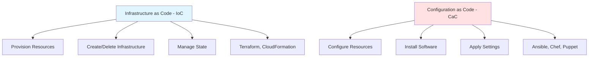
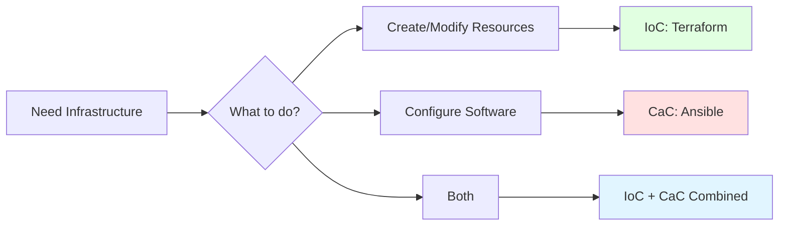

# CAC vs IoC: Configuration as Code vs Infrastructure as Code

## Summary

**Configuration as Code (CaC)** focuses on configuring infrastructure **after** it's provisioned (e.g., Ansible, Chef, Puppet). **Infrastructure as Code (IoC)** focuses on **provisioning** the infrastructure itself (e.g., Terraform, CloudFormation). They complement each other: IoC creates the resources (servers, networks, databases), while CaC configures them (installs software, applies settings). Terraform is primarily IoC but can use provisioners for basic configuration tasks.

## Detailed Explanation

### Key Differences



| Aspect | Infrastructure as Code (IoC) | Configuration as Code (CaC) |
|---------|----------------------------|----------------------------|
| **Focus** | Provisioning resources | Configuring resources |
| **When it runs** | Once (to create/modify) | Repeatedly (maintain state) |
| **State tracking** | Required | Optional |
| **Examples** | Create VPC, EC2, RDS | Install Nginx, configure users |
| **Tools** | Terraform, CloudFormation, ARM | Ansible, Chef, Puppet |
| **Change approach** | Declarative (desired state) | Often imperative (procedures) |
| **Recovery** | Re-create from code | Re-apply configurations |

### IoC (Infrastructure as Code)

```hcl
# Terraform - Create infrastructure
resource "aws_instance" "web" {
  ami           = "ami-0c55b159cbfafe1f0"
  instance_type = "t3.micro"

  tags = {
    Name = "web-server"
  }
}

# What this does:
# 1. Creates an EC2 instance
# 2. Tracks it in state
# 3. Can update/destroy later
# 4. Does NOT install software inside
```

### CaC (Configuration as Code)

```yaml
# Ansible - Configure infrastructure
---
- name: Configure web server
  hosts: web_servers
  become: yes

  tasks:
    - name: Update apt cache
      apt:
        update_cache: yes

    - name: Install Nginx
      apt:
        name: nginx
        state: present

    - name: Start Nginx service
      service:
        name: nginx
        state: started
        enabled: yes

    - name: Deploy website
      copy:
        src: /app/index.html
        dest: /var/www/html/index.html

# What this does:
# 1. Connects to existing servers
# 2. Installs/configures software
# 3. Maintains configuration state
# 4. Can be run repeatedly (idempotent)
```

### When to Use Each



#### Use IoC (Terraform) for:
- **Creating infrastructure**: VPCs, subnets, EC2 instances, S3 buckets
- **Managing cloud resources**: IAM roles, security groups, load balancers
- **Multi-cloud deployments**: AWS, Azure, GCP simultaneously
- **State tracking**: Knowing what exists and its relationships

#### Use CaC (Ansible) for:
- **Installing software**: Nginx, Docker, Kubernetes, monitoring agents
- **System configuration**: Users, SSH keys, firewall rules
- **Application deployment**: Copying files, running initialization scripts
- **Compliance enforcement**: Ensuring configurations match standards

### Combined Approach: IoC + CaC

```yaml
# Combined CI/CD Pipeline
stages:
  - provision
  - configure
  - deploy

# Stage 1: Provision Infrastructure with Terraform
provision:
  stage: provision
  script:
    - terraform init
    - terraform apply -auto-approve
  artifacts:
    paths:
      - inventory.ini  # Output IPs for Ansible

# Stage 2: Configure with Ansible
configure:
  stage: configure
  script:
    - ansible-playbook -i inventory.ini configure.yml
  needs:
    - provision

# Stage 3: Deploy application
deploy:
  stage: deploy
  script:
    - ansible-playbook -i inventory.ini deploy.yml
  needs:
    - configure
```

```hcl
# Terraform: Create infrastructure and output for Ansible
resource "aws_instance" "web" {
  ami           = "ami-0c55b159cbfafe1f0"
  instance_type = "t3.micro"

  tags = {
    Name = "web-server"
  }
}

# Generate Ansible inventory
resource "local_file" "ansible_inventory" {
  content = templatefile("${path.module}/inventory.tpl", {
    ips = [aws_instance.web.public_ip]
  })
  filename = "inventory.ini"
}
```

```ini
# inventory.tpl (Ansible inventory template)
[web_servers]
%{ for ip in ips ~}
${ip}
%{ endfor ~}

[web_servers:vars]
ansible_user=ubuntu
ansible_python_interpreter=/usr/bin/python3
```

### Terraform Provisioners (Bridge to CaC)

Terraform can perform basic configuration using provisioners, but this is **not recommended** for complex tasks.

```hcl
resource "aws_instance" "web" {
  ami           = "ami-0c55b159cbfafe1f0"
  instance_type = "t3.micro"

  # File provisioner: Copy files to instance
  provisioner "file" {
    source      = "app/index.html"
    destination = "/tmp/index.html"

    connection {
      type        = "ssh"
      user        = "ubuntu"
      private_key = file("~/.ssh/id_rsa")
      host        = self.public_ip
    }
  }

  # Remote-exec: Run commands on instance
  provisioner "remote-exec" {
    inline = [
      "sudo apt-get update",
      "sudo apt-get install -y nginx",
      "sudo mv /tmp/index.html /var/www/html/",
      "sudo systemctl restart nginx"
    ]

    connection {
      type        = "ssh"
      user        = "ubuntu"
      private_key = file("~/.ssh/id_rsa")
      host        = self.public_ip
    }
  }
}

# Better approach: Use Ansible
resource "aws_instance" "web" {
  ami           = "ami-0c55b159cbfafe1f0"
  instance_type = "t3.micro"

  # Output for Ansible
  provisioner "local-exec" {
    command = "ansible-playbook -i '${self.public_ip},' playbook.yml"
  }
}
```

### Comparison: Provisioners vs CaC Tools

| Aspect | Terraform Provisioners | CaC Tools (Ansible, etc.) |
|--------|----------------------|--------------------------|
| **Complexity** | Limited | Advanced |
| **Error handling** | Basic | Robust (retry, rollback) |
| **Idempotency** | Manual | Built-in |
| **Templates** | Basic | Rich |
| **Dependencies** | Poor | Strong |
| **Testing** | Difficult | Easy |
| **Use case** | Simple bootstrapping | Full configuration |
| **Best practice** | Avoid for complex tasks | Use for configuration |

### Real-World Examples

#### Example 1: Web Application Stack

```hcl
# main.tf - Terraform (IoC)
resource "aws_vpc" "main" {
  cidr_block = "10.0.0.0/16"
}

resource "aws_subnet" "public" {
  vpc_id     = aws_vpc.main.id
  cidr_block = "10.0.1.0/24"
}

resource "aws_instance" "web" {
  ami           = "ami-0c55b159cbfafe1f0"
  instance_type = "t3.micro"
  subnet_id     = aws_subnet.public.id
}

resource "aws_lb" "web" {
  # Load balancer configuration
}

output "web_ips" {
  value = aws_instance.web[*].public_ip
}
```

```yaml
# configure.yml - Ansible (CaC)
---
- name: Configure web servers
  hosts: all
  become: yes

  tasks:
    - name: Install Docker
      apt:
        name: docker.io
        state: present

    - name: Start Docker
      service:
        name: docker
        state: started

    - name: Deploy application
      docker_container:
        name: web-app
        image: "myapp:latest"
        ports:
          - "80:80"
```

#### Example 2: Kubernetes Cluster

```hcl
# Terraform: Create EKS cluster
resource "aws_eks_cluster" "main" {
  name     = "production"
  role_arn = aws_iam_role.eks.arn

  vpc_config {
    subnet_ids = aws_subnet.public[*].id
  }
}

output "cluster_endpoint" {
  value = aws_eks_cluster.main.endpoint
}
```

```yaml
# Ansible: Configure cluster
---
- name: Configure Kubernetes
  hosts: localhost
  tasks:
    - name: Install Helm charts
      kubernetes.helm:
        name: nginx-ingress
        chart:
          name: ingress-nginx
          repo: https://kubernetes.github.io/ingress-nginx
```

### Best Practices

```hcl
# ✅ Do: Use Terraform for infrastructure
resource "aws_instance" "web" {
  ami           = "ami-0c55b159cbfafe1f0"
  instance_type = "t3.micro"

  tags = {
    Name = "web-server"
  }
}

# ✅ Do: Output infrastructure details for CaC tools
output "web_public_ips" {
  value = aws_instance.web[*].public_ip
}

output "web_private_ips" {
  value = aws_instance.web[*].private_ip
}

# ❌ Don't: Use provisioners for complex configuration
resource "aws_instance" "web" {
  # ... config ...

  provisioner "remote-exec" {
    inline = [
      "sudo apt-get update && sudo apt-get install -y nginx php-fpm mysql-server",
      "sudo sed -i 's/;memory_limit = 128M/memory_limit = 512M/' /etc/php/7.4/fpm/php.ini",
      "sudo systemctl restart php7.4-fpm"
    ]
  }
}

# ✅ Do: Use Ansible instead
# ansible-playbook -i inventory web-server.yml
```

### Decision Matrix

| Scenario | Recommended Tool | Why |
|-----------|------------------|-----|
| **Create AWS EC2 instance** | Terraform (IoC) | Provisions cloud resource |
| **Install Nginx on EC2** | Ansible (CaC) | Configures OS/application |
| **Create VPC and subnets** | Terraform (IoC) | Cloud infrastructure |
| **Configure network ACLs** | Terraform (IoC) | Cloud-level configuration |
| **Create Kubernetes cluster** | Terraform (IoC) | Cloud resource provisioning |
| **Deploy Helm charts** | Helm/Helmfile (CaC) | Kubernetes configuration |
| **Create S3 bucket** | Terraform (IoC) | Cloud resource |
| **Set up bucket policies** | Terraform (IoC) | Cloud resource configuration |
| **Configure SSH users** | Ansible (CaC) | OS-level configuration |

## Interview Questions

**Q: What is the difference between Infrastructure as Code (IoC) and Configuration as Code (CaC)?**
**A:** IoC focuses on provisioning infrastructure resources (servers, networks, databases) using tools like Terraform, CloudFormation. CaC focuses on configuring already-provisioned resources (installing software, applying settings) using tools like Ansible, Chef, Puppet. They complement each other: IoC creates infrastructure, CaC configures it.

**Q: When should you use Terraform vs Ansible?**
**A:** Use Terraform (IoC) to create/manage cloud infrastructure: VPCs, EC2, RDS, IAM, S3, etc. Use Ansible (CaC) to configure servers: install software (Nginx, Docker), configure users, deploy applications, apply OS settings. Best practice: use both together - Terraform provisions infrastructure, Ansible configures it.

**Q: What are Terraform provisioners and why should you avoid them?**
**A:** Provisioners execute scripts on resources (file upload, remote-exec, local-exec). Avoid them because: 1) Limited error handling, 2) Not idempotent by default, 3) Difficult to test, 4) Breaks Terraform's declarative model. Use proper CaC tools (Ansible, Chef) instead.

**Q: How can you integrate Terraform and Ansible?**
**A:** Terraform outputs infrastructure details (IPs, DNS names) which Ansible consumes as inventory. Workflow: 1) Terraform creates resources, 2) Terraform outputs IPs to inventory file, 3) Ansible configures resources using that inventory. Can be orchestrated via CI/CD pipeline with stages.

**Q: What is the main benefit of using both IoC and CaC together?**
**A:** IoC provides infrastructure with state tracking and easy provisioning/destroy. CaC ensures consistent configuration across infrastructure. Together they enable reproducible, consistent deployments where infrastructure is created reliably and configured identically every time. This is critical for scaling and disaster recovery.

**Q: Can Terraform handle configuration tasks that Ansible does?**
**A:** Terraform can handle basic configuration using provisioners (file upload, remote commands), but it's not designed for it. Ansible is purpose-built for configuration management with better error handling, idempotency, testing, and complex orchestration. Use Terraform for infrastructure, Ansible for configuration.

**Q: What happens if you only use IoC (Terraform) without CaC?**
**A:** You'll have infrastructure ready but unconfigured. Servers will run base OS with no applications. While you can use user data scripts for basic setup, complex configurations (software installation, dependency management, configuration files) are better handled by CaC tools. Production environments typically need both.

**Q: How does state management differ between IoC and CaC?**
**A:** IoC tools (Terraform) require state to track infrastructure - mapping between code and actual resources. State is critical for operations. CaC tools (Ansible) typically don't require state - they apply configurations idempotently, checking current state and making changes as needed. State is optional or implicit.

**Q: Explain how you would deploy a web application using both IoC and CaC.**
**A:** 1) Use Terraform to create VPC, subnets, EC2 instances, load balancer. 2) Terraform outputs instance IPs. 3) Use Ansible with those IPs to install Nginx, configure SSL, deploy application code. 4) Use CI/CD pipeline to orchestrate: terraform apply → ansible-playbook deploy.yml.

**Q: What are the limitations of using only CaC without IoC?**
**A:** Without IoC, you must manually create infrastructure (click in console) or use scripts. This lacks: 1) State tracking (don't know what exists), 2) Version control for infrastructure, 3) Easy cleanup (destroy all resources), 4) Dependency management, 5) Multi-cloud abstraction. CaC alone doesn't solve infrastructure provisioning.
