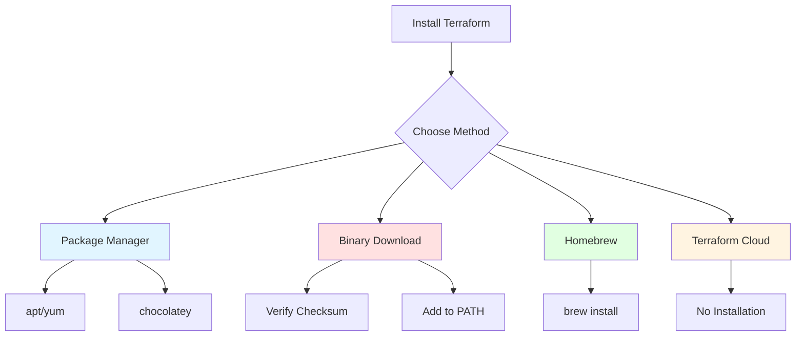

# Installing Terraform

## Summary

Terraform can be installed on Linux, macOS, and Windows using package managers, binary downloads, or Homebrew. Installation typically involves downloading the Terraform binary, verifying with checksums, and ensuring it's in your PATH. Terraform Cloud provides a browser-based alternative without local installation. Always use official HashiCorp releases and verify checksums for security.

## Detailed Explanation

### Installation Methods



### Method 1: Package Managers (Recommended)

#### Linux (apt - Ubuntu/Debian)

```bash
# Add HashiCorp GPG key
wget -O- https://apt.releases.hashicorp.com/gpg | sudo gpg --dearmor -o /usr/share/keyrings/hashicorp-archive-keyring.gpg

# Verify GPG key fingerprint
gpg --no-default-keyring --keyring /usr/share/keyrings/hashicorp-archive-keyring.gpg --fingerprint

# Add HashiCorp repository
echo "deb [signed-by=/usr/share/keyrings/hashicorp-archive-keyring.gpg] https://apt.releases.hashicorp.com $(lsb_release -cs) main" | sudo tee /etc/apt/sources.list.d/hashicorp.list

# Update package list
sudo apt update

# Install Terraform
sudo apt install -y terraform

# Verify installation
terraform --version
```

#### Linux (yum - RHEL/CentOS/Amazon Linux)

```bash
# Install yum-config-manager
sudo yum install -y yum-utils

# Add HashiCorp repository
sudo yum-config-manager --add-repo https://rpm.releases.hashicorp.com/RHEL/hashicorp.repo

# Install Terraform
sudo yum install -y terraform

# Verify installation
terraform --version
```

#### Windows (Chocolatey)

```powershell
# Install Chocolatey if not already installed
Set-ExecutionPolicy Bypass -Scope Process -Force
[System.Net.ServicePointManager]::SecurityProtocol = [System.Net.ServicePointManager]::SecurityProtocol -bor 3072
iex ((New-Object System.Net.WebClient).DownloadString('https://community.chocolatey.org/install.ps1'))

# Install Terraform
choco install terraform

# Verify installation
terraform version
```

### Method 2: Homebrew (macOS/Linux)

```bash
# Install Homebrew if not already installed
/bin/bash -c "$(curl -fsSL https://raw.githubusercontent.com/Homebrew/install/HEAD/install.sh)"

# Add HashiCorp tap
brew tap hashicorp/tap

# Install Terraform
brew install hashicorp/tap/terraform

# Verify installation
terraform --version

# Update to latest version
brew upgrade hashicorp/tap/terraform
```

### Method 3: Binary Download (Universal)

#### Step 1: Download

```bash
# Visit releases page and download for your OS
# https://releases.hashicorp.com/terraform/

# Example: Download for Linux AMD64
wget https://releases.hashicorp.com/terraform/1.6.0/terraform_1.6.0_linux_amd64.zip

# Example: Download for macOS AMD64
curl -O https://releases.hashicorp.com/terraform/1.6.0/terraform_1.6.0_darwin_amd64.zip

# Example: Download for Windows
curl -O https://releases.hashicorp.com/terraform/1.6.0/terraform_1.6.0_windows_amd64.zip
```

#### Step 2: Verify Checksum (Security)

```bash
# Download checksum file
wget https://releases.hashicorp.com/terraform/1.6.0/terraform_1.6.0_SHA256SUMS

# Verify checksum
sha256sum -c terraform_1.6.0_SHA256SUMS 2>&1 | grep OK

# Or verify specific file
echo "abc123... <checksum file>" | sha256sum -c -
```

#### Step 3: Extract

```bash
# Unzip
unzip terraform_1.6.0_linux_amd64.zip

# Verify binary works
./terraform --version
```

#### Step 4: Install to PATH

```bash
# Linux/macOS: Move to /usr/local/bin
sudo mv terraform /usr/local/bin/

# Or add to user PATH
mkdir -p ~/bin
mv terraform ~/bin/
echo 'export PATH="$HOME/bin:$PATH"' >> ~/.bashrc
source ~/.bashrc

# Verify
terraform --version
```

```powershell
# Windows: Add to PATH
# 1) Move to C:\Program Files\Terraform
# 2) Add to system PATH via Environment Variables
# Or using PowerShell:
[Environment]::SetEnvironmentVariable(
  "Path",
  [Environment]::GetEnvironmentVariable("Path", "Machine") + ";C:\Program Files\Terraform",
  "Machine"
)

# Restart terminal and verify
terraform version
```

### Method 4: Using tfenv (Version Manager)

```bash
# Install tfenv
git clone --depth=1 https://github.com/tfutils/tfenv.git ~/.tfenv
echo 'export PATH="$HOME/.tfenv/bin:$PATH"' >> ~/.bashrc
source ~/.bashrc

# Install specific version
tfenv install 1.6.0

# Set as active version
tfenv use 1.6.0

# List installed versions
tfenv list

# Verify
terraform --version

# Switch between versions easily
tfenv use 1.5.0
tfenv use 1.6.0
```

### Verifying Installation

```bash
# Check version
terraform --version
# Output: Terraform v1.6.0

# Check provider installation
terraform providers

# Show help
terraform -help
```

### Installing Terraform Cloud (No Installation)

Terraform Cloud is a web-based alternative:

```yaml
# Benefits of Terraform Cloud:
# - No installation required
# - Remote execution
# - State management included
# - VCS integration (GitHub, GitLab, Bitbucket)
# - Collaboration features
# - Free tier available

# Visit: https://app.terraform.io
```

### IDE/Editor Integration

#### VS Code (Terraform Extension)

```json
{
  "recommendations": [
    "hashicorp.terraform"
  ]
}

# Features:
# - Syntax highlighting
# - IntelliSense/auto-completion
# - Error highlighting
# - Format on save
# - Navigate to references
```

#### Vim (vim-terraform)

```vim
" Install using vim-plug
Plug 'hashivim/vim-terraform'

" Features:
" - Syntax highlighting
" - Auto-formatting
" - Command completion
" - Fold support
```

#### JetBrains (Terraform Plugin)

```kotlin
// Install via: Settings → Plugins → Terraform

// Features:
// - Syntax highlighting
// - Code completion
// - Formatter integration
// - Navigation
// - Structure view
```

### Auto-completion

```bash
# Enable shell auto-completion
terraform -install-autocomplete

# For bash
complete -C /usr/local/bin/terraform terraform

# For zsh
autoload -U +X bashcompinit && bashcompinit
```

### Post-Installation Setup

```bash
# Create workspace directory
mkdir ~/terraform-projects
cd ~/terraform-projects

# Create first project
mkdir my-first-project
cd my-first-project

# Create main.tf
cat > main.tf << 'EOF'
terraform {
  required_providers {
    aws = {
      source  = "hashicorp/aws"
      version = "~> 5.0"
    }
  }
}

provider "aws" {
  region = "us-east-1"
}

resource "aws_s3_bucket" "example" {
  bucket = "my-terraform-test-bucket-$(date +%s)"
}
EOF

# Configure AWS credentials
export AWS_ACCESS_KEY_ID="your-access-key"
export AWS_SECRET_ACCESS_KEY="your-secret-key"
# Or use: aws configure

# Initialize (download providers)
terraform init

# Plan changes
terraform plan

# Apply changes
terraform apply -auto-approve
```

### Version Constraints

```hcl
# Lock Terraform version in project
terraform {
  # Exact version
  required_version = "1.6.0"

  # Minimum version
  # required_version = ">= 1.5.0"

  # Range
  # required_version = "~> 1.6.0"

  # Multiple constraints
  # required_version = ">= 1.5.0, < 2.0.0"

  required_providers {
    aws = {
      source  = "hashicorp/aws"
      version = "~> 5.0"
    }
  }
}
```

### Uninstalling

```bash
# Remove binary
sudo rm /usr/local/bin/terraform

# Or if using Homebrew
brew uninstall hashicorp/tap/terraform

# Clean up config directory
rm -rf ~/.terraform.d

# Remove workspace data
rm -rf ~/terraform-projects
```

### Troubleshooting

```bash
# Permission denied
chmod +x terraform

# Command not found
echo $PATH  # Check PATH
which terraform  # Find location

# Version mismatch
terraform --version
terraform version -json  # Detailed version info

# Provider download fails
# Check internet connection
# Verify HCP Terraform token if using
terraform login

# Clean up and retry
rm -rf .terraform
terraform init -upgrade
```

### System Requirements

| Platform | Minimum Requirements |
|----------|-------------------|
| **Linux** | glibc 2.17+, 64-bit |
| **macOS** | 10.13+, 64-bit |
| **Windows** | Windows 10+, 64-bit |
| **Memory** | 256 MB RAM minimum |
| **Disk** | 100 MB free space |

### Installation Verification Checklist

```bash
#!/bin/bash
# terraform-check.sh - Verify Terraform installation

echo "Checking Terraform installation..."

# Check if terraform is in PATH
if ! command -v terraform &> /dev/null; then
  echo "❌ Terraform not found in PATH"
  exit 1
fi
echo "✅ Terraform found: $(which terraform)"

# Check version
terraform --version

# Check providers
echo "✅ Checking providers..."
terraform providers schema -json > /dev/null 2>&1
if [ $? -eq 0 ]; then
  echo "✅ Provider schema working"
else
  echo "❌ Provider schema failed"
fi

# Check init
mkdir -p /tmp/tf-test && cd /tmp/tf-test
cat > main.tf << 'EOF'
terraform {
  required_providers {
    null = {
      source  = "hashicorp/null"
      version = "~> 3.0"
    }
  }
}

provider "null" {}
EOF

terraform init > /dev/null 2>&1
if [ $? -eq 0 ]; then
  echo "✅ Terraform init working"
else
  echo "❌ Terraform init failed"
fi

cd - && rm -rf /tmp/tf-test

echo "Installation check complete!"
```

## Interview Questions

**Q: What are the different ways to install Terraform?**
**A:** Terraform can be installed using: 1) Package managers (apt, yum, chocolatey, Homebrew), 2) Binary download from HashiCorp releases, 3) Version managers (tfenv), 4) Terraform Cloud (browser-based, no installation). Package managers are recommended for ease of updates.

**Q: Why should you verify checksums when downloading Terraform binaries?**
**A:** Verifying checksums ensures the downloaded file hasn't been tampered with or corrupted. HashiCorp provides SHA256 checksums for each release. Running `sha256sum -c` verifies the binary matches the official checksum, protecting against supply chain attacks.

**Q: What is tfenv and why would you use it?**
**A:** tfenv is a Terraform version manager similar to nvm for Node.js. It allows you to install multiple Terraform versions and switch between them easily. Useful for working on multiple projects with different Terraform version requirements without uninstalling/reinstalling.

**Q: How do you add Terraform to your PATH on Linux/macOS?**
**A:** Move the terraform binary to `/usr/local/bin/` (requires sudo), or add to user's PATH: `mv terraform ~/bin/`, then `export PATH="$HOME/bin:$PATH"` in `~/.bashrc` or `~/.zshrc`. Verify with `which terraform`.

**Q: What happens after running `terraform init`?**
**A:** `terraform init` downloads provider plugins to `.terraform/providers/`, initializes the backend, sets up child modules, and configures the workspace. This is required before running any other Terraform commands (plan, apply, etc.). It's safe to run multiple times.

**Q: How do you specify Terraform version requirements in a project?**
**A:** Use the `required_version` argument in the `terraform` block: `required_version = ">= 1.5.0"` or `required_version = "~> 1.6.0"`. This ensures the project uses a compatible Terraform version and prevents accidental updates that might break configurations.

**Q: What is difference between Terraform OSS and Terraform Cloud?**
**A:** Terraform OSS is the open-source CLI tool requiring local installation. Terraform Cloud is a hosted service that runs Terraform remotely, manages state, integrates with VCS (GitHub, GitLab), and provides collaboration features. Terraform Cloud has a free tier with paid plans for advanced features.

**Q: How do you set up AWS credentials for Terraform?**
**A:** Several methods: 1) Environment variables `AWS_ACCESS_KEY_ID` and `AWS_SECRET_ACCESS_KEY`, 2) AWS CLI `aws configure`, 3) Shared credentials file `~/.aws/credentials`, 4) IAM roles when running on EC2. Terraform respects standard AWS credential chain.

**Q: Why might you use provisioners during Terraform apply?**
**A:** Provisioners execute scripts on resources after creation. Use them for basic bootstrapping: copying SSH keys, running initialization scripts, or triggering Ansible. However, avoid complex configuration in provisioners - use dedicated config management tools (Ansible, Chef) instead.

**Q: How do you ensure Terraform is using the correct version?**
**A:** Check with `terraform --version`. For multiple versions, use tfenv to switch: `tfenv list` shows installed versions, `tfenv use 1.6.0` sets active version. Project `required_version` constraints also prevent wrong version usage.
