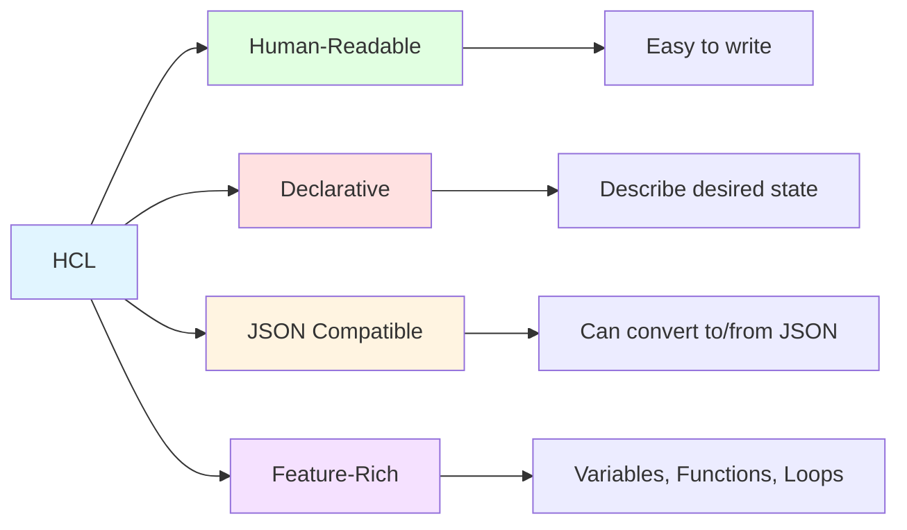

# What is HCL (HashiCorp Configuration Language)

## Summary

**HCL (HashiCorp Configuration Language)** is a declarative configuration language used by Terraform, Consul, Vault, and Nomad. Designed for humans and machines, HCL offers a human-readable syntax while maintaining JSON compatibility. It supports variables, functions, modules, and advanced features like for-expressions and dynamic blocks. HCL is the primary way to define infrastructure in Terraform, mapping directly to cloud provider resources.

## Detailed Explanation

### HCL Overview



### Key Characteristics

| Feature | Description | Example |
|----------|-------------|---------|
| **Declarative** | Describe WHAT you want, not HOW | `resource "aws_instance" "web" { ... }` |
| **Readable** | Clean, intuitive syntax | No braces confusion, clear structure |
| **JSON compatible** | Can convert HCL ↔ JSON | `terraform fmt -json` |
| **Type-safe** | Strong typing with validation | `type = map(string)` |
| **Nested blocks** | Hierarchical structure | Blocks within blocks |
| **Expressions** | Variables, functions, interpolation | `"${var.region}"` |
| **Comments** | Single-line and multi-line | `# comment`, `/* comment */` |

### HCL vs JSON

```hcl
# HCL - Human-readable
resource "aws_instance" "web" {
  ami           = "ami-0c55b159cbfafe1f0"
  instance_type = "t3.micro"

  tags = {
    Name        = "web-server"
    Environment = "production"
  }

  root_block_device {
    volume_size = 20
    volume_type = "gp3"
  }
}
```

```json
// JSON equivalent
{
  "resource": {
    "aws_instance": {
      "web": {
        "ami": "ami-0c55b159cbfafe1f0",
        "instance_type": "t3.micro",
        "tags": {
          "Name": "web-server",
          "Environment": "production"
        },
        "root_block_device": [{
          "volume_size": 20,
          "volume_type": "gp3"
        }]
      }
    }
  }
}
```

### Basic HCL Structure

```hcl
# Arguments - Key-value pairs within blocks
resource "aws_vpc" "main" {
  cidr_block = "10.0.0.0/16"     # Argument
  enable_dns_support = true           # Argument
}

# Blocks - Containers for related content
resource "aws_instance" "web" {    # Block type: resource
  ami           = "ami-..."          # Arguments
  instance_type = "t3.micro"

  tags {                              # Nested block
    Name = "web-server"
  }
}

# Block type: provider
provider "aws" {
  region = "us-east-1"
}

# Block type: variable
variable "instance_type" {
  type    = string
  default = "t3.micro"
}

# Block type: output
output "instance_ip" {
  value = aws_instance.web.public_ip
}

# Block type: data
data "aws_ami" "ubuntu" {
  most_recent = true
  filter {
    name   = "name"
    values = ["ubuntu/images/hvm-ssd/ubuntu-focal-20.04-amd64-server-*"]
  }
}
```

### Syntax Rules

```hcl
# Comments
# Single-line comment

/* Multi-line
   comment */

# Strings - Double quotes required
name = "web-server"
path = "/home/user/data"
# Template string with interpolation
message = "Server in ${var.region}"

# Numbers
instance_count = 3
cpu_limit = 0.5
# Scientific notation
value = 1.5e10

# Booleans
enabled = true
disabled = false

# Lists
availability_zones = ["us-east-1a", "us-east-1b", "us-east-1c"]

# Maps (dictionaries)
tags = {
  Name        = "web-server"
  Environment = "production"
  Owner       = "team-platform"
}

# Numbers in maps
sizes = {
  small  = 1
  medium = 2
  large  = 4
}

# Heredoc for multi-line strings
user_data = <<-EOT
  #!/bin/bash
  apt-get update
  apt-get install -y nginx
  systemctl start nginx
EOT
```

### Variables and References

```hcl
# Define variable
variable "instance_type" {
  type        = string
  default     = "t3.micro"
  description = "EC2 instance type"
}

# Reference variable with var.
resource "aws_instance" "web" {
  instance_type = var.instance_type
}

# Reference resource with <resource_type>.<name>.<attribute>
resource "aws_eip" "web_eip" {
  instance = aws_instance.web.id  # Reference aws_instance.web
}

# Nested attribute access
resource "aws_instance" "db" {
  ami           = "ami-..."
  subnet_id     = aws_subnet.private.id
}

# Reference module outputs
module "vpc" {
  source = "./modules/vpc"
}

resource "aws_subnet" "web" {
  vpc_id = module.vpc.vpc_id  # Module output
}
```

### Expressions and Functions

```hcl
# Conditional expression
instance_type = var.environment == "prod" ? "t3.large" : "t3.micro"

# Boolean logic
enabled = var.enable_monitoring && var.environment == "prod"

# String functions
name = "${var.project}-${var.environment}-server"
# Or HCL 2: name = "${var.project}-${var.environment}-server"

# Mathematical functions
count = (var.instance_count / 2) + 1

# Built-in functions
# String functions
upper("hello")           # => "HELLO"
lower("HELLO")           # => "hello"
substr("hello", 0, 2)   # => "he"
replace("hello", "l", "L")  # => "heLLo"

# Collection functions
length(["a", "b", "c"])           # => 3
element(["a", "b", "c"], 1)      # => "b"
slice(["a", "b", "c", "d"], 1, 3) # => ["b", "c"]

# Number functions
ceil(1.2)   # => 2
floor(1.8)   # => 1
pow(2, 3)    # => 8

# Map functions
lookup(map, key)  # Get value from map with default
merge(map1, map2)  # Merge maps

# Type conversion
toset(["a", "b", "a"])  # => ["a", "b"] (deduped)
tolist(["a", "b"])      # => ["a", "b"]
tomap({a = 1, b = 2})   # => {a = 1, b = 2}
```

### For-Expressions and For-Loops

```hcl
# For-expression with list
variable "subnets" {
  type    = list(string)
  default = ["10.0.1.0/24", "10.0.2.0/24", "10.0.3.0/24"]
}

# Create resources for each subnet
resource "aws_subnet" "private" {
  count      = length(var.subnets)
  vpc_id     = aws_vpc.main.id
  cidr_block = element(var.subnets, count.index)
}

# For-expression to transform list
locals {
  subnet_names = [for s in var.subnets : upper(replace(s, "/", "-"))]
  # => ["10.0.1.0-24", "10.0.2.0-24", "10.0.3.0-24"]
}

# For-expression with map
variable "instances" {
  type = map(object({
    ami           = string
    instance_type = string
  }))
  default = {
    web = {
      ami           = "ami-001"
      instance_type = "t3.micro"
    }
    db = {
      ami           = "ami-002"
      instance_type = "t3.medium"
    }
  }
}

locals {
  instance_ids = {
    for name, config in var.instances : name => config.ami
  }
}
```

### Dynamic Blocks

```hcl
# Dynamic blocks for nested blocks
variable "ingress_rules" {
  type = list(object({
    from_port   = number
    to_port     = number
    protocol    = string
    cidr_blocks = list(string)
  }))
  default = [
    {
      from_port   = 22
      to_port     = 22
      protocol    = "tcp"
      cidr_blocks = ["0.0.0.0/0"]
    },
    {
      from_port   = 80
      to_port     = 80
      protocol    = "tcp"
      cidr_blocks = ["0.0.0.0/0"]
    }
  ]
}

resource "aws_security_group" "web" {
  name = "web-sg"

  dynamic "ingress" {
    for_each = var.ingress_rules
    content {
      from_port   = ingress.value.from_port
      to_port     = ingress.value.to_port
      protocol    = ingress.value.protocol
      cidr_blocks = ingress.value.cidr_blocks
    }
  }
}
```

### Splat Expressions

```hcl
# Splat operator [*] extracts attributes from list
resource "aws_instance" "web" {
  count         = 3
  ami           = "ami-..."
  instance_type = "t3.micro"
}

# Get all instance IDs
locals {
  instance_ids = aws_instance.web[*].id
  # => ["i-001", "i-002", "i-003"]
}

# Legacy splat operator
locals {
  public_ips = aws_instance.web.*.public_ip
}

# Get all public DNS names
output "instance_dns" {
  value = aws_instance.web[*].public_dns
}
```

### Types

```hcl
# Primitive types
variable "v_string" {
  type    = string
  default = "hello"
}

variable "v_number" {
  type    = number
  default = 42
}

variable "v_bool" {
  type    = bool
  default = true
}

# Complex types
variable "v_list" {
  type    = list(string)
  default = ["a", "b", "c"]
}

variable "v_map" {
  type = map(string)
  default = {
    key1 = "value1"
    key2 = "value2"
  }
}

variable "v_set" {
  type    = set(string)
  default = ["a", "b", "c"]
}

variable "v_object" {
  type = object({
    name  = string
    count = number
    tags  = map(string)
  })
  default = {
    name  = "web"
    count = 1
    tags  = {}
  }
}

variable "v_tuple" {
  type = tuple([string, number, bool])
  default = ["web", 1, true]
}

# Type constraints
variable "v_string_length" {
  type        = string
  validation {
    condition     = length(var.v_string_length) > 0 && length(var.v_string_length) < 100
    error_message = "String must be 1-100 characters."
  }
}
```

### Locals

```hcl
# Locals - Named expressions for reuse
locals {
  common_tags = {
    Environment = var.environment
    ManagedBy   = "Terraform"
    Project     = var.project_name
  }

  subnet_cidrs = cidrsubnet("10.0.0.0/16", 8, 0)
}

resource "aws_vpc" "main" {
  cidr_block = "10.0.0.0/16"

  tags = local.common_tags
}

resource "aws_subnet" "private" {
  vpc_id     = aws_vpc.main.id
  cidr_block = local.subnet_cidrs

  tags = merge(local.common_tags, {
    Type = "private"
  })
}
```

### JSON Compatibility

```bash
# Convert HCL to JSON
terraform fmt -json main.tf

# JSON input is also valid
# main.tf.json
{
  "resource": {
    "aws_instance": {
      "web": {
        "ami": "ami-0c55b159cbfafe1f0",
        "instance_type": "t3.micro"
      }
    }
  },
  "terraform": {
    "required_providers": {
      "aws": {
        "source": "hashicorp/aws"
      }
    }
  }
}
```

### Common HCL Patterns

```hcl
# Pattern 1: Environment-specific configuration
variable "environment" {
  type    = string
  default = "dev"
}

locals {
  config = {
    dev = {
      instance_count = 1
      instance_type = "t3.micro"
    }
    prod = {
      instance_count = 3
      instance_type = "t3.large"
    }
  }
  current = local.config[var.environment]
}

resource "aws_instance" "app" {
  count         = local.current.instance_count
  instance_type = local.current.instance_type
}

# Pattern 2: Tag merging
locals {
  default_tags = {
    Environment = var.environment
    ManagedBy   = "Terraform"
  }
}

resource "aws_instance" "web" {
  # ... config ...

  tags = merge(local.default_tags, {
    Name = "web-server"
  })
}

# Pattern 3: Dynamic resource creation
variable "components" {
  type = list(string)
  default = ["web", "api", "worker"]
}

resource "aws_instance" "servers" {
  for_each = toset(var.components)

  ami           = "ami-..."
  instance_type = "t3.micro"

  tags = {
    Name = "server-${each.value}"
  }
}

# Pattern 4: Resource dependency chain
resource "aws_vpc" "main" {
  cidr_block = "10.0.0.0/16"
}

resource "aws_subnet" "public" {
  vpc_id     = aws_vpc.main.id  # Explicit dependency
  cidr_block = "10.0.1.0/24"
}

resource "aws_instance" "web" {
  subnet_id = aws_subnet.public.id  # Implicit dependency
  ami       = "ami-..."
}
```

## Interview Questions

**Q: What is HCL and why does Terraform use it?**
**A:** HCL (HashiCorp Configuration Language) is a declarative language designed for defining infrastructure. Terraform uses HCL because it's human-readable, supports advanced features (variables, functions, loops), is JSON-compatible, and maps cleanly to cloud provider APIs. HCL's declarative nature lets you describe desired state rather than imperative steps.

**Q: How is HCL different from JSON?**
**A:** HCL is more human-readable with cleaner syntax (no quotes for keys, better comments, heredocs). JSON is more verbose with strict quoting rules. Both are equivalent - HCL can be converted to/from JSON using `terraform fmt -json`. HCL is preferred for writing; JSON is used for programmatic generation.

**Q: What are the main block types in HCL?**
**A:** Main block types: `resource` (infrastructure resources), `data` (query existing resources), `provider` (provider configuration), `variable` (input parameters), `output` (return values), `locals` (local variables), `module` (reusable configurations), and `terraform` (Terraform settings).

**Q: How do you reference variables in HCL?**
**A:** Use the `var.` prefix: `var.variable_name`. For example, if you have `variable "instance_type"`, reference it as `var.instance_type`. This works in any expression within the same configuration.

**Q: What are for-expressions and when would you use them?**
**A:** For-expressions transform collections (lists, maps, sets). Syntax: `[for item in collection : expression]`. Use them to: transform lists (`[for s in names : upper(s)]`), create maps from lists (`[for s in list : s => length(s)]`), or filter collections (`[for i in list : i if i > 0]`).

**Q: What are dynamic blocks in HCL?**
**A:** Dynamic blocks allow creating nested blocks dynamically based on collections. Use `dynamic "block_name"` with `for_each` and `content`. Example: `dynamic "ingress" { for_each = var.rules; content { ... } }`. Useful for security groups rules, IAM policy statements, or other nested blocks where count varies.

**Q: What is the splat operator in HCL?**
**A:** The splat operator `[*]` extracts attributes from a list of objects. `resource[*].attribute` returns a list of attribute values. Example: `aws_instance.web[*].public_ip` gets all instance IPs. Legacy syntax: `resource.*.attribute`. Splat is cleaner and preferred.

**Q: How do you define and use locals in HCL?**
**A:** Define locals with `locals { name = value }`. Reference with `local.name`. Use locals for computed values, repeated expressions, or organization. Example: `locals { common_tags = { Environment = "prod" } }`, then `tags = local.common_tags`. Locals are evaluated at plan time, not apply.

**Q: What are the data types available in HCL?**
**A:** Primitive types: `string`, `number`, `bool`. Complex types: `list()`, `map()`, `set()`, `object({})`, `tuple([])`. Collections can be typed: `list(string)`, `map(number)`. Objects define structure: `object({ name = string, count = number })`. Tuples are fixed-length lists with specific types.

**Q: How does HCL handle references between resources?**
**A:** Use `<resource_type>.<name>.<attribute>` syntax. Example: `aws_instance.web.id` references the ID of an aws_instance resource named "web". Terraform automatically creates dependency graphs from these references, creating resources in correct order.

**Q: Can you mix HCL and JSON files in Terraform?**
**A:** Yes, Terraform accepts both `.tf` (HCL) and `.tf.json` (JSON) files. All files in the directory are merged into configuration. You can have both in same project, though it's less common. Use JSON when generating configuration programmatically.

**Q: What is the difference between `var.name` and `local.name`?**
**A:** `var.name` references an input variable defined with `variable "name"`, which can be set externally (CLI, files, environment). `local.name` references a local value defined with `locals { name = value }`, which is computed and scoped to current configuration. Variables are inputs, locals are intermediate computed values.
