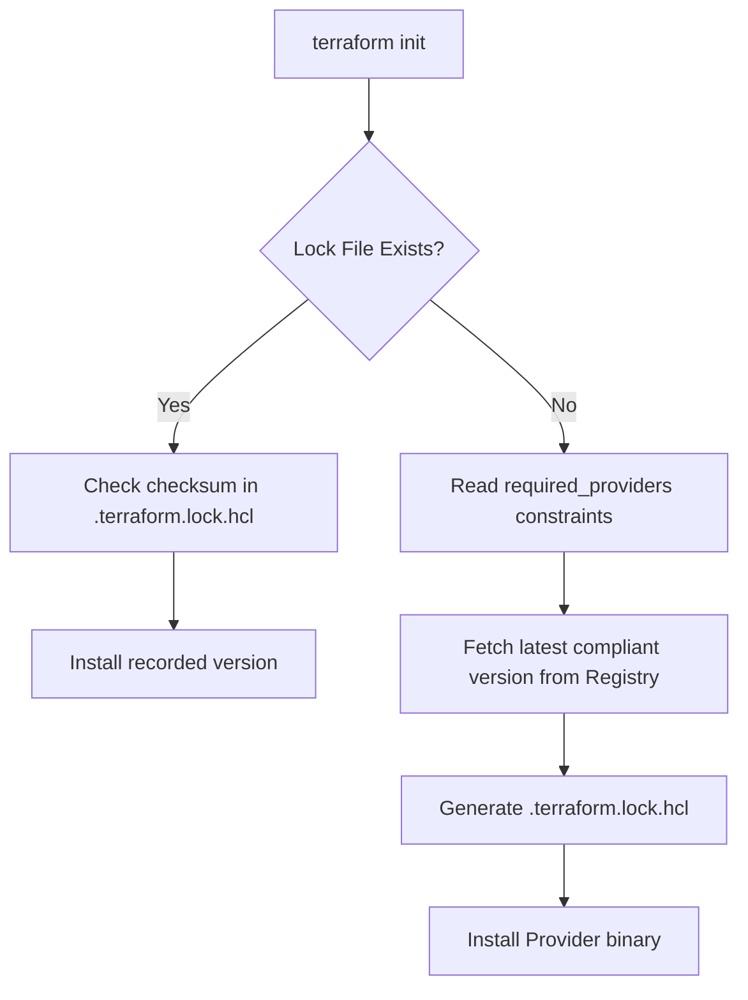

## Summary
Terraform provider versions allow users to pin or constrain the versions of external plugins (providers) used in their infrastructure code. This ensures reproducibility and prevents breaking changes from being introduced by unexpected provider updates. Versions are managed in the `terraform` block using the `required_providers` setting and are tracked in the dependency lock file (`.terraform.lock.hcl`).

## Detailed Explanation

### 1. The Core Concept
Terraform relies on providers to interact with APIs (AWS, Azure, Kubernetes, etc.). Since these providers are updated independently of Terraform Core, pinning their versions is critical for maintaining stable infrastructure. Without version constraints, `terraform init` would pull the latest version, which might contain breaking changes that invalidate your existing HCL code.

### 2. Configuration: `required_providers`
To specify provider requirements, you use a `terraform` configuration block. Each provider is defined with its **source** (where it is downloaded from) and a **version constraint**.

```hcl
terraform {
  required_providers {
    aws = {
      source  = "hashicorp/aws"
      version = "~> 5.0"
    }
  }
}
```

**Evidence** ([HashiCorp Docs](https://developer.hashicorp.com/terraform/language/providers/requirements)):
> Each Terraform module must declare which providers it requires, so that Terraform can install and use them.

### 3. Version Constraints Syntax
Terraform supports several operators to define acceptable version ranges:

| Operator | Description | Example |
| :--- | :--- | :--- |
| `=` or none | Exact version | `version = "5.1.0"` |
| `!=` | Exclude a specific version | `version = "!= 5.1.0"` |
| `>`, `>=`, `<`, `<=` | Comparison operators | `version = ">= 5.0, < 6.0"` |
| `~>` | **Pessimistic constraint** | `version = "~> 5.1"` (allows 5.x, but not 6.0) |

#### The Pessimistic Operator (`~>`)
The `~>` operator is the most common choice. It allows the rightmost component of the version number to increment.
*   `~> 5.1.0`: Allows `5.1.1`, `5.1.2`, but **not** `5.2.0`.
*   `~> 5.1`: Allows `5.2.0`, `5.99.0`, but **not** `6.0.0`.

### 4. Dependency Lock File (`.terraform.lock.hcl`)
When you run `terraform init`, Terraform creates a `.terraform.lock.hcl` file. This file records the exact version and checksum of the providers installed.
*   **Why it matters**: It ensures that every member of a team (and CI/CD) uses the exact same provider binary.
*   **Updating**: To update the lock file to a newer version (within your constraints), use:
    ```bash
    terraform init -upgrade
    ```

### 5. Go Perspective: Provider Implementation
While HCL is used to *consume* providers, Terraform providers themselves are written in **Go**. The version of a provider is typically defined in the provider's binary metadata during the build process, and the `terraform-plugin-sdk` handles how these versions are reported to Terraform Core.

For Go developers building custom providers, versioning is often managed via build-time tags or a `version.go` file:

```go
// Example of version management in a Go-based provider
package main

import (
	"github.com/hashicorp/terraform-plugin-sdk/v2/helper/schema"
	"github.com/hashicorp/terraform-plugin-sdk/v2/plugin"
)

var version = "1.0.0" // Typically set via -ldflags during build

func main() {
	plugin.Serve(&plugin.ServeOpts{
		ProviderFunc: func() *schema.Provider {
			return &schema.Provider{
				// ... implementation
			}
		},
	})
}
```

**Evidence** ([Terraform Provider Scaffolding](https://github.com/hashicorp/terraform-provider-scaffolding-framework)):
Custom providers use the `terraform-plugin-framework` where versions are part of the `Provider` interface metadata.

## Interview Questions

**Q: What is the purpose of the `.terraform.lock.hcl` file?**
**A:** The dependency lock file ensures that Terraform uses the exact same version and checksum of providers across different environments and team members. It prevents "it works on my machine" issues caused by different provider versions being downloaded during `terraform init`.

**Q: Explain the difference between `version = "> 5.0"` and `version = "~> 5.0"`.**
**A:** `> 5.0` allows any version strictly greater than 5.0, including major updates like 6.0, 7.0, etc. `~> 5.0` (pessimistic operator) allows only minor or patch updates within the 5.x range (e.g., 5.1, 5.2) but prevents upgrading to 6.0, which likely contains breaking changes.

**Q: How do you upgrade a provider to a new version if it is locked in the dependency file?**
**A:** You should first update the version constraint in your `required_providers` block if necessary, and then run `terraform init -upgrade`. This tells Terraform to ignore the current lock file and fetch the latest version that satisfies your constraints, updating the lock file in the process.

**Q: Can you use multiple version constraints for a single provider?**
**A:** Yes, you can specify multiple comma-separated constraints. For example, `version = ">= 5.0, < 5.10, != 5.5.0"` would allow any version from 5.0 up to (but not including) 5.10, while specifically excluding version 5.5.0.

## Workflow Diagram: Provider Initialization

