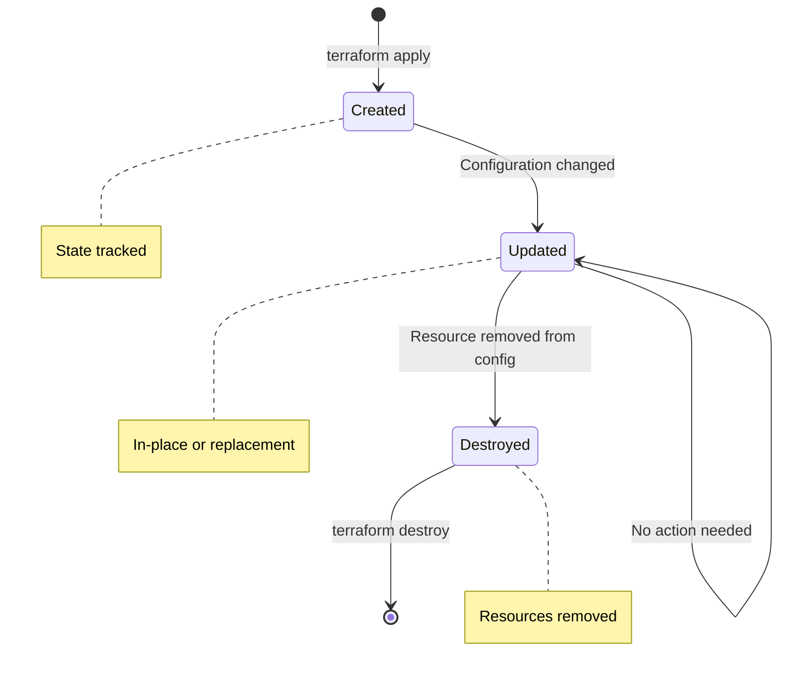

# Resource Behavior

## Summary

**Terraform resources** are infrastructure components (servers, networks, databases) that Terraform creates, updates, or destroys. Each resource has a type (provider prefix), a name, arguments (configuration), and attributes (read-only properties). Resources manage state, handle dependencies automatically, and can be created, updated, or destroyed based on configuration changes.

## Detailed Explanation

### Resource Structure

```hcl
# Resource syntax: resource "<type>" "<name>" { }

# <type>: provider prefix + resource type
# <name>: local identifier (unique within type)

resource "aws_instance" "web" {
  # Arguments (configuration)
  ami           = "ami-0c55b159cbfafe1f0"
  instance_type = "t3.micro"

  # Nested blocks
  tags = {
    Name = "web-server"
  }
}
```

### Resource Types

| Provider | Resource Types | Examples |
|----------|----------------|-----------|
| **AWS** | `aws_*` | `aws_instance`, `aws_vpc`, `aws_s3_bucket` |
| **Azure** | `azurerm_*` | `azurerm_virtual_machine`, `azurerm_resource_group` |
| **GCP** | `google_*` | `google_compute_instance`, `google_container_cluster` |
| **Kubernetes** | `kubernetes_*` | `kubernetes_pod`, `kubernetes_service` |
| **Null** | `null_*` | `null_resource`, `null_data_source` (for testing) |

### Resource Lifecycle



```bash
# Creation
resource "aws_instance" "web" {
  ami           = "ami-..."
  instance_type = "t3.micro"
}

# terraform apply
# + aws_instance.web  # Resource created

# Update (in-place)
resource "aws_instance" "web" {
  ami           = "ami-..."
  instance_type = "t3.large"  # Changed
}

# terraform apply
# ~ aws_instance.web  # Updated in-place (if provider supports)

# Update (replacement)
resource "aws_instance" "web" {
  ami           = "ami-new"  # Changed AMI
  instance_type = "t3.large"
}

# terraform apply
# -/+ aws_instance.web  # Destroy and recreate

# Destruction
# Remove resource from configuration
# terraform apply
# - aws_instance.web  # Resource destroyed
```

### Resource Attributes

```hcl
resource "aws_instance" "web" {
  ami           = "ami-0c55b159cbfafe1f0"
  instance_type = "t3.micro"

  tags = {
    Name = "web-server"
  }
}

# Read-only attributes (accessed after creation)
output "instance_id" {
  value = aws_instance.web.id
}

output "public_ip" {
  value = aws_instance.web.public_ip
}

output "private_dns" {
  value = aws_instance.web.private_dns
}
```

### Arguments vs Attributes

| Aspect | Arguments | Attributes |
|---------|-----------|------------|
| **Purpose** | Define desired state | Read properties of resource |
| **Set by** | User in configuration | Provider after creation |
| **Modifiable** | Yes (in configuration) | No (read-only) |
| **Example** | `instance_type = "t3.micro"` | `aws_instance.web.public_ip` |
| **Timing** | Plan time | Apply time (after creation) |

### Resource Dependencies

```hcl
# Implicit dependencies (automatic)
resource "aws_vpc" "main" {
  cidr_block = "10.0.0.0/16"
}

resource "aws_subnet" "public" {
  vpc_id     = aws_vpc.main.id  # Implicit dependency
  cidr_block = "10.0.1.0/24"
}

resource "aws_instance" "web" {
  subnet_id = aws_subnet.public.id  # Implicit dependency
  ami       = "ami-..."
}

# Explicit dependencies
resource "aws_instance" "db" {
  ami           = "ami-..."
  depends_on = [aws_vpc.main, aws_subnet.public]
}
```

### Resource State

```hcl
# State mapping
resource "aws_instance" "web" {
  ami           = "ami-..."
  instance_type = "t3.micro"
}

# In state file:
# {
#   "aws_instance.web": {
#     "id": "i-1234567890abcdef0",
#     "ami": "ami-...",
#     "instance_type": "t3.micro"
#   }
# }
```

### Create vs Update vs Destroy

```hcl
# Initial creation
resource "aws_instance" "web" {
  ami           = "ami-..."
  instance_type = "t3.micro"
}
# terraform apply → Resource created

# In-place update
resource "aws_instance" "web" {
  ami           = "ami-..."
  instance_type = "t3.medium"  # Can update without replacement
}
# terraform apply → Instance type changed (if supported)

# Force replacement
resource "aws_instance" "web" {
  ami           = "ami-new"  # AMI change requires replacement
  instance_type = "t3.medium"
}
# terraform apply → Old instance destroyed, new created

# Destroy
# Remove resource from config
# terraform apply → Instance terminated
```

### Multiple Resources of Same Type

```hcl
# Using unique names
resource "aws_instance" "web_1" {
  ami           = "ami-..."
  instance_type = "t3.micro"
}

resource "aws_instance" "web_2" {
  ami           = "ami-..."
  instance_type = "t3.micro"
}

resource "aws_instance" "db" {
  ami           = "ami-..."
  instance_type = "t3.medium"
}
```

### Resource with `count`

```hcl
variable "instance_count" {
  type    = number
  default = 3
}

resource "aws_instance" "web" {
  count         = var.instance_count
  ami           = "ami-..."
  instance_type = "t3.micro"

  tags = {
    Name = "web-${count.index}"
  }
}

# Creates: aws_instance.web[0], aws_instance.web[1], aws_instance.web[2]
```

### Resource with `for_each`

```hcl
variable "servers" {
  type = map(object({
    ami           = string
    instance_type = string
  }))
  default = {
    web = {
      ami           = "ami-001"
      instance_type = "t3.micro"
    }
    api = {
      ami           = "ami-001"
      instance_type = "t3.small"
    }
  }
}

resource "aws_instance" "servers" {
  for_each      = var.servers
  ami           = each.value.ami
  instance_type = each.value.instance_type

  tags = {
    Name = each.key
  }
}

# Creates: aws_instance.servers["web"], aws_instance.servers["api"]
```

### Resource Timeouts

```hcl
resource "aws_instance" "web" {
  ami           = "ami-..."
  instance_type = "t3.micro"

  # Custom timeouts
  timeouts {
    create = "10m"
    delete = "20m"
    update = "15m"
  }
}
```

### Resource Provisioners

```hcl
resource "aws_instance" "web" {
  ami           = "ami-..."
  instance_type = "t3.micro"

  # File provisioner (copy file to instance)
  provisioner "file" {
    source      = "script.sh"
    destination = "/tmp/script.sh"

    connection {
      type        = "ssh"
      user        = "ubuntu"
      private_key = file("~/.ssh/id_rsa")
      host        = self.public_ip
    }
  }

  # Remote-exec provisioner (run command on instance)
  provisioner "remote-exec" {
    inline = [
      "chmod +x /tmp/script.sh",
      "/tmp/script.sh"
    ]

    connection {
      type        = "ssh"
      user        = "ubuntu"
      private_key = file("~/.ssh/id_rsa")
      host        = self.public_ip
    }
  }
}
```

### Resource `ignore_changes`

```hcl
resource "aws_instance" "web" {
  ami           = "ami-..."
  instance_type = "t3.micro"

  # Ignore specific attribute changes
  lifecycle {
    ignore_changes = [tags, user_data]
  }
}

# Useful for:
# - Managed by external tools
# - Temporary changes
# - Secrets managed separately
```

### Resource `prevent_destroy`

```hcl
resource "aws_s3_bucket" "critical_data" {
  bucket = "my-critical-bucket"

  lifecycle {
    prevent_destroy = true
  }
}

# Requires explicit removal:
# terraform state rm aws_s3_bucket.critical_data
# Then manually delete resource
```

### Complete Example

```hcl
# main.tf
terraform {
  required_providers {
    aws = {
      source  = "hashicorp/aws"
      version = "~> 5.0"
    }
  }
}

provider "aws" {
  region = var.region
}

variable "region" {
  type    = string
  default = "us-east-1"
}

variable "vpc_cidr" {
  type    = string
  default = "10.0.0.0/16"
}

variable "instance_count" {
  type    = number
  default = 2
}

# VPC (creates first)
resource "aws_vpc" "main" {
  cidr_block = var.vpc_cidr

  tags = {
    Name = "main-vpc"
  }
}

# Subnet (depends on VPC)
resource "aws_subnet" "public" {
  vpc_id     = aws_vpc.main.id  # Implicit dependency
  cidr_block = cidrsubnet(var.vpc_cidr, 8, 0)

  tags = {
    Name = "public-subnet"
  }
}

# Instances (depends on subnet)
resource "aws_instance" "web" {
  count         = var.instance_count
  ami           = "ami-0c55b159cbfafe1f0"
  instance_type = "t3.micro"
  subnet_id     = aws_subnet.public.id  # Implicit dependency

  tags = {
    Name = "web-${count.index}"
  }
}

# Output attributes
output "vpc_id" {
  value = aws_vpc.main.id
}

output "instance_ids" {
  value = aws_instance.web[*].id
}

output "instance_public_ips" {
  value = aws_instance.web[*].public_ip
}
```

## Interview Questions

**Q: What is a Terraform resource and how is it defined?**
**A:** A Terraform resource is an infrastructure component (server, network, database) that Terraform manages. Defined using `resource "type" "name" { }` syntax. Type is provider-specific (e.g., `aws_instance`), name is a local identifier. Arguments define desired configuration.

**Q: What's the difference between resource arguments and attributes?**
**A:** Arguments are configuration values you set in Terraform code (e.g., `instance_type = "t3.micro"`). Attributes are read-only properties returned by provider after creation (e.g., `aws_instance.web.public_ip`). You write arguments, you read attributes (in outputs or other resources).

**Q: How does Terraform manage resource dependencies?**
**A:** Terraform automatically creates dependencies when one resource references another (e.g., `subnet_id = aws_subnet.public.id`). It builds a dependency graph and creates/updates resources in correct order. You can also explicitly set dependencies using `depends_on` meta-argument.

**Q: What happens when you change a Terraform resource's configuration?**
**A:** When configuration changes, Terraform determines if change requires in-place update or replacement. In-place: modify existing resource (e.g., change tags). Replacement: destroy old and create new (e.g., change AMI). Some attributes always trigger replacement. Changes are shown in plan with `~` (update) or `-/+` (replace).

**Q: How do you create multiple resources of the same type?**
**A:** Use unique names within same type: `resource "aws_instance" "web_1" { }`, `resource "aws_instance" "web_2" { }`. Better: use `count` or `for_each` meta-arguments for dynamic creation: `resource "aws_instance" "web" { count = 3 }` creates `web[0]`, `web[1]`, `web[2]`.

**Q: What is resource state in Terraform?**
**A:** Resource state is stored in state file and maps Terraform resources to actual infrastructure. Contains resource ID, attributes, and metadata. Terraform uses state to plan changes by comparing configuration to actual state. Critical for operations like plan, apply, and destroy.

**Q: How do `count` and `for_each` work with resources?**
**A:** `count` creates numbered instances: `resource "aws_instance" "web" { count = 3 }` creates `web[0]`, `web[1]`, `web[2]`. `for_each` creates map of instances: `for_each = var.servers` creates `servers["key1"]`, `servers["key2"]`. `for_each` is preferred for non-numeric keys.

**Q: What is a resource timeout in Terraform?**
**A:** Resource timeouts define how long Terraform waits for create/update/delete operations. Default timeouts vary by provider/resource type. Can be customized: `timeouts { create = "10m", delete = "20m" }`. Useful for slow operations (large instances, complex infrastructure).

**Q: What is the difference between implicit and explicit dependencies?**
**A:** Implicit dependencies are automatic from resource references (e.g., `subnet_id = aws_subnet.public.id`). Terraform infers dependency. Explicit dependencies are manually defined using `depends_on` meta-argument: `depends_on = [aws_vpc.main]`. Use explicit for non-obvious dependencies or control execution order.

**Q: How do you access resource attributes in outputs or other resources?**
**A:** Use `<resource_type>.<name>.<attribute>` syntax: `aws_instance.web.public_ip`, `aws_vpc.main.id`. Attributes are read-only and only available after resource is created. Use in `output` blocks or reference from other resources to create dependencies.

**Q: What happens when you remove a resource from Terraform configuration?**
**A:** When resource is removed from configuration and you run `terraform apply`, Terraform destroys the corresponding infrastructure. The operation shows as `-resource.name` in plan output. State file is updated to remove the resource. Confirmation required unless using `-auto-approve`.
