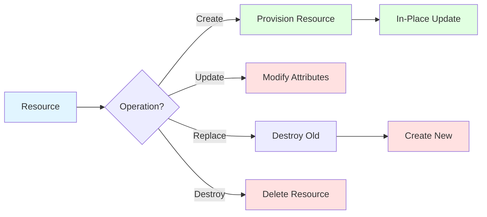

# Resource Lifecycle

## Summary

**Resource lifecycle** refers to how Terraform creates, updates, destroys, and replaces resources over time. Terraform tracks each resource's state through state file. Lifecycle includes: initial creation, in-place updates (modify existing), replacements (destroy old, create new), and final destruction. Understanding lifecycle is critical for managing changes and avoiding downtime.

## Detailed Explanation

### Lifecycle States

```mermaid
stateDiagram-v2
    [*] --> Created: terraform apply
    Created --> In-Place Update: Configuration change
    Created --> Replacement: ForceNew attribute change
    In-Place Update --> Created: No action needed
    Replacement --> Created: New resource ready
    Created --> Destroyed: Resource removed from config
    Destroyed --> [*]: terraform destroy

    note right of Created: New resource created
    note right of In-Place Update: Existing resource modified
    note right of Replacement: Old destroyed, new created
    note right of Destroyed: Resource deleted
```

### Create vs Update vs Replace

```bash
# CREATE: Resource doesn't exist
# terraform apply
# + aws_instance.web  # New resource created

# UPDATE (In-Place): Attribute changed, provider supports in-place modification
# terraform apply
# ~ aws_instance.web  # Updated in-place (same ID)

# REPLACE: Critical attribute changed, provider can't update in-place
# terraform apply
# -/+ aws_instance.web  # Destroy old, create new (new ID)
```

```hcl
# In-place update
resource "aws_instance" "web" {
  ami           = "ami-..."
  instance_type = "t3.micro"
}

# Change to in-place update
resource "aws_instance" "web" {
  ami           = "ami-..."
  instance_type = "t3.small"  # Only type changes
}
# Result: ~ aws_instance.web (same ID, updated)

# Replacement
resource "aws_instance" "web" {
  ami           = "ami-..."
  instance_type = "t3.micro"
}

# Change AMI (always causes replacement)
resource "aws_instance" "web" {
  ami           = "ami-new"  # AMI change
  instance_type = "t3.micro"
}
# Result: -/+ aws_instance.web (destroyed and created)
```

### Lifecycle Operations



### Create Operation

```hcl
# Initial creation
resource "aws_vpc" "main" {
  cidr_block = "10.0.0.0/16"
  tags       = { Name = "main-vpc" }
}

# First terraform apply
# + aws_vpc.main

# Resource enters created state
# Provider creates resource
# Terraform stores ID in state
```

### In-Place Update

```hcl
# Resource exists, update in-place
resource "aws_instance" "web" {
  ami           = "ami-12345678"
  instance_type = "t3.micro"
}

# Change to update in-place
resource "aws_instance" "web" {
  ami           = "ami-12345678"
  instance_type = "t3.small"  # Only type changes
  monitoring    = true           # Add monitoring
}

# Second terraform apply
# ~ aws_instance.web

# Only monitoring flag added
# Same resource ID: i-12345678
# No downtime
```

### Replacement Operation

```hcl
# Change requires replacement (e.g., AMI, instance type if provider doesn't support update)
resource "aws_instance" "web" {
  ami           = "ami-12345678"
  instance_type = "t3.micro"
}

# Change AMI (triggers replacement)
resource "aws_instance" "web" {
  ami           = "ami-87654321"  # New AMI
  instance_type = "t3.micro"
}

# Third terraform apply
# -/+ aws_instance.web

# Old instance: i-12345678 (destroyed)
# New instance: i-98765432 (created)
# Potential downtime during replacement
```

### Destroy Operation

```hcl
# Remove resource from configuration
# resource "aws_instance" "web" is deleted from this file

# terraform apply
# - aws_instance.web

# Provider deletes resource
# Terraform removes from state
```

### ForceNew Attributes

| Resource | ForceNew Attributes (Trigger Replacement) |
|-----------|-------------------------------------|
| **aws_instance** | `ami`, `instance_type`, `kernel_id` |
| **aws_vpc** | `cidr_block`, `instance_tenancy` |
| **aws_ebs_volume** | `size`, `type`, `iops` |
| **aws_db_instance** | `storage_type`, `engine`, `engine_version` |
| **aws_s3_bucket** | N/A (no ForceNew) |
| **azurerm_virtual_machine** | `location`, `resource_group_name` |
| **google_compute_instance** | `machine_type`, `image` |

### Lifecycle Events

```bash
# Plan shows lifecycle action
terraform plan

# + aws_instance.web       # Create
# ~ aws_instance.web       # Update (in-place)
# -/+ aws_instance.web     # Replace (destroy + create)
# - aws_instance.web       # Destroy

# Apply shows actual operation
terraform apply

# aws_instance.web: Creating...
# aws_instance.web: Creation complete after 2s [id=i-123]
```

### Zero Downtime Replacement

```hcl
# Pattern: Create new before destroying old
locals {
  instance_name = "web-server"
}

resource "null_resource" "ip_record" {
  triggers = {
    instance_id = aws_instance.web.id
    ip_address  = aws_instance.web.public_ip
  }
}

resource "aws_route53_record" "web" {
  zone_id = var.zone_id
  name    = local.instance_name
  type    = "A"
  ttl     = 300

  records = [null_resource.ip_record.triggers.ip_address]
}

resource "aws_instance" "web" {
  ami           = "ami-..."
  instance_type = "t3.micro"
  lifecycle {
    create_before_destroy = true  # New record before old deleted
  }
}

# When AMI changes:
# 1) Null resource triggers (IP record updated)
# 2) New DNS record created (create_before_destroy)
# 3) Old instance destroyed
# 4) New instance created
# DNS always points to active instance
```

### Lifecycle Best Practices

```hcl
# ✅ DO: Understand when replacement occurs
# Review provider documentation for ForceNew attributes

# ❌ DON'T: Assume in-place updates work
# Test in non-prod first

# ✅ DO: Plan replacements during maintenance windows
# Schedule changes during low-traffic periods

# ❌ DON'T: Ignore replacement warnings
# Review plan for -/+ changes

# ✅ DO: Use create_before_destroy for zero downtime
# For critical infrastructure like DNS records

# ❌ DON'T: Change multiple ForceNew attributes at once
# Causes multiple unnecessary replacements
```

### Lifecycle in State File

```json
{
  "version": 4,
  "serial": 1,
  "lineage": [
    {
      "resource": {
        "aws_instance.web": {
          "schema_version": 0,
          "instances": [
            {
              "attributes_flat": {
                "ami": "ami-...",
                "instance_type": "t3.micro"
              },
              "id": "i-12345678",
              "tainted": false
            }
          ]
        }
      }
    }
  ]
}
```

### Lifecycle Timing

| Phase | Description | Duration |
|-------|-------------|----------|
| **Plan** | Calculate changes | Seconds |
| **Refresh** | Query provider for actual state | Seconds to minutes |
| **Create/Update** | Provider API calls | Seconds to minutes |
| **State Update** | Save to state file | Milliseconds |

## Interview Questions

**Q: What are the different lifecycle states for Terraform resources?**
**A:** Resource lifecycle states: 1) **Created** - new resource exists, 2) **In-Place Updated** - existing resource modified without ID change, 3) **Replaced** - old resource destroyed and new one created (ID change), 4) **Destroyed** - resource removed from configuration and deleted. Terraform tracks these via state file.

**Q: What's the difference between in-place update and resource replacement?**
**A:** In-place update: Provider modifies existing resource (same ID), typically faster, no downtime. Example: change instance tags, monitoring. Replacement: Provider destroys old resource and creates new one (new ID), may cause downtime. Triggered by changing ForceNew attributes like AMI, instance type.

**Q: What attributes typically trigger resource replacement in Terraform?**
**A:** ForceNew attributes vary by provider/resource type. Common AWS triggers: `ami`, `instance_type`, `kernel_id` for EC2; `cidr_block`, `instance_tenancy` for VPC; `storage_type`, `iops` for EBS volumes. Provider documentation specifies which changes require replacement vs support in-place updates.

**Q: How do you achieve zero downtime when replacing Terraform resources?**
**A:** Zero downtime strategy: create new resource before destroying old. Use `create_before_destroy = true` lifecycle block with `null_resource` triggering on old resource. Example: create new DNS record before destroying instance, ensure DNS always points to active IP. New record created before old destroyed due to lifecycle block.

**Q: What does the `~` symbol mean in terraform plan output?**
**A:** `~` indicates in-place update. Resource will be modified without changing its identity (ID). Example: `~ aws_instance.web` means instance attributes will be updated (e.g., tags, monitoring) but same instance ID continues to exist. Downtime minimal or zero.

**Q: What does the `-/+` symbol mean in terraform plan output?**
**A:** `-/+` indicates resource replacement. `-` means old resource will be destroyed, `+` means new resource will be created. Resource ID changes. Example: `-/+ aws_instance.web` means old instance destroyed, new one created with different ID. May cause brief downtime.

**Q: How does Terraform track resource lifecycle in the state file?**
**A:** State file contains: resource ID, attributes, schema version, lineage (history). Each apply updates state with new resource state. Lineage tracks version history for rollback. Tainted flag marks resources with errors. State is source of truth for lifecycle operations.

**Q: What are best practices for managing Terraform resource lifecycle?**
**A:** Best practices: 1) Understand which changes trigger replacement (review provider docs), 2) Plan replacements during maintenance windows, 3) Use `create_before_destroy` for zero-downtime deployments (DNS, load balancers), 4) Test in non-prod before production changes, 5) Review plan carefully for `-/+` replacement operations, 6) Use lifecycle blocks to customize behavior.

**Q: How do you handle resource tainting in Terraform lifecycle?**
**A:** Resources marked as tainted when previous apply failed but left partial state. Taint indicates resource in uncertain state. Commands: `terraform taint <resource>` marks tainted, `terraform untaint <resource>` clears taint. Tainted resources recreated on next apply (`-/+` in plan). Use when fixing failed apply manually.

**Q: What is resource lineage in Terraform state?**
**A:** Lineage is a history tracker in state file. Each apply creates new lineage with random string. State shows parent-child relationships between versions. Enables rollback to previous states. Use with `-refresh-only` to check for drift. Lineage prevents state rollback unless explicitly requested (`terraform apply -refresh-only`).
