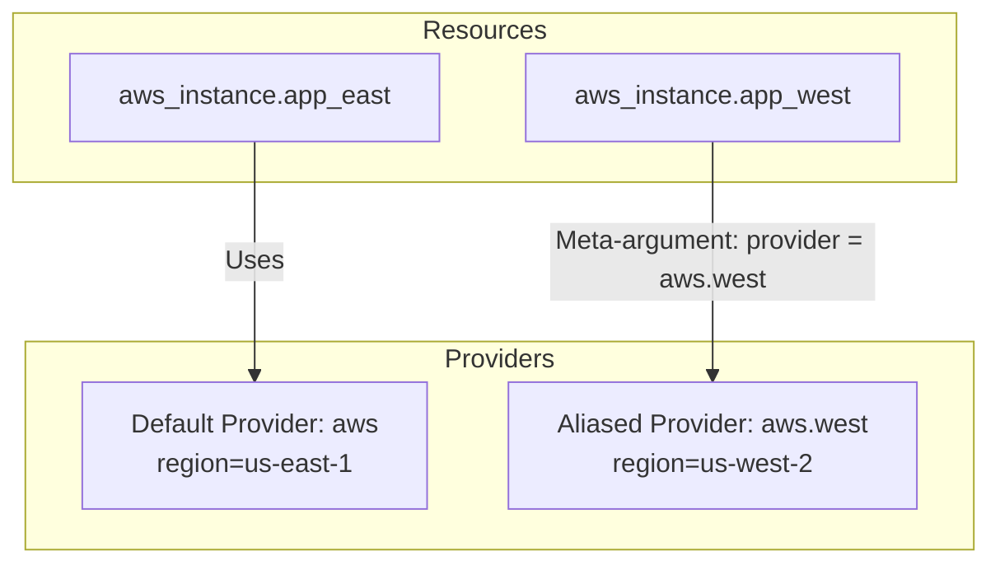

## Summary
The `provider` meta-argument in Terraform is used to specify which provider configuration should be used for a specific resource or module. By default, Terraform maps a resource to the default provider configuration of its type (e.g., `aws_instance` uses the default `aws` provider). This meta-argument is essential in multi-region or multi-account deployments where multiple instances of the same provider are defined using **aliases**.

## Detailed Explanation

### What is the `provider` meta-argument?
In Terraform, a provider block defines how to interact with a specific API (like AWS, Azure, or GCP). While most projects use a single default configuration for each provider, complex infrastructures often require interacting with multiple regions or different accounts simultaneously.

The `provider` meta-argument allows you to override the default selection and explicitly point a resource to a specific configuration instance.

### Multi-Region and Multi-Account Scenarios
When managing resources across multiple regions, you define multiple `provider` blocks for the same provider, using the `alias` argument to distinguish them.

#### HCL Syntax Example:
```hcl
# Default provider (e.g., US East)
provider "aws" {
  region = "us-east-1"
}

# Alternate provider configuration using an alias
provider "aws" {
  alias  = "west"
  region = "us-west-2"
}

# Resource using the default provider
resource "aws_instance" "app_east" {
  ami           = "ami-12345678"
  instance_type = "t2.micro"
}

# Resource using the aliased provider
resource "aws_instance" "app_west" {
  provider      = aws.west
  ami           = "ami-87654321"
  instance_type = "t2.micro"
}
```

### Resource Relationship Diagram


## Go Application (Conceptual Mapping)

### Conceptual Mapping
In Terraform, the `provider` meta-argument selects a specific **instance** of a configured provider. In Go, this is conceptually equivalent to **Dependency Injection** or **Multiple Client Instances**. 

Instead of relying on a global singleton client, you create multiple client instances (e.g., AWS S3 clients), each configured with its own region, credentials, or custom endpoint. You then pass the specific client instance to the function or service that needs it.

### Example: Multiple AWS SDK for Go v2 Clients
In Go, to connect to different regions, you initialize separate `aws.Config` objects and create distinct service clients.

```go
package main

import (
	"context"
	"fmt"
	"log"

	"github.com/aws/aws-sdk-go-v2/aws"
	"github.com/aws/aws-sdk-go-v2/config"
	"github.com/aws/aws-sdk-go-v2/service/s3"
)

func main() {
	ctx := context.TODO()

	// Configuration for Region 1 (us-east-1) - Like the "default" provider
	cfgEast, err := config.LoadDefaultConfig(ctx, config.WithRegion("us-east-1"))
	if err != nil {
		log.Fatalf("unable to load config, %v", err)
	}
	s3EastClient := s3.NewFromConfig(cfgEast)

	// Configuration for Region 2 (us-west-2) - Like the "aliased" provider
	cfgWest, err := config.LoadDefaultConfig(ctx, config.WithRegion("us-west-2"))
	if err != nil {
		log.Fatalf("unable to load config, %v", err)
	}
	s3WestClient := s3.NewFromConfig(cfgWest)

	// Usage: Pass the specific client instance to your logic
	printBucketCount(ctx, s3EastClient, "US-East-1")
	printBucketCount(ctx, s3WestClient, "US-West-2")
}

func printBucketCount(ctx context.Context, client *s3.Client, regionName string) {
	output, err := client.ListBuckets(ctx, &s3.ListBucketsInput{})
	if err != nil {
		fmt.Printf("Error listing buckets in %s: %v\n", regionName, err)
		return
	}
	fmt.Printf("Found %d buckets in %s\n", len(output.Buckets), regionName)
}
```

## Interview Questions

**Q: What is the purpose of the `provider` meta-argument in a Terraform resource?**
**A:** It is used to explicitly select a non-default provider configuration for a resource. This is primarily used when you have multiple configurations for the same provider (e.g., for different regions or AWS accounts) defined using aliases.

**Q: How do you declare an alternate provider configuration in Terraform?**
**A:** You declare another `provider` block for the same provider name and include an `alias` argument. For example: `provider "aws" { alias = "dev"; region = "us-west-1" }`.

**Q: If you don't specify the `provider` meta-argument, how does Terraform decide which provider to use?**
**A:** Terraform uses a default provider selection based on the resource type's prefix. For example, a resource of type `google_compute_instance` will automatically use the default `google` provider configuration.

**Q: Can you pass aliased providers to a child module?**
**A:** Yes, you use the `providers` argument (plural) in the `module` block to map the parent's providers to the child module's requirements. Example: `providers = { aws = aws.west }`.

**Q: What is the difference between a default provider and an aliased provider?**
**A:** A default provider block does not have an `alias` argument and is used automatically by resources of that type. An aliased provider has a unique `alias` and must be explicitly referenced using the `provider` meta-argument in resources or modules.
