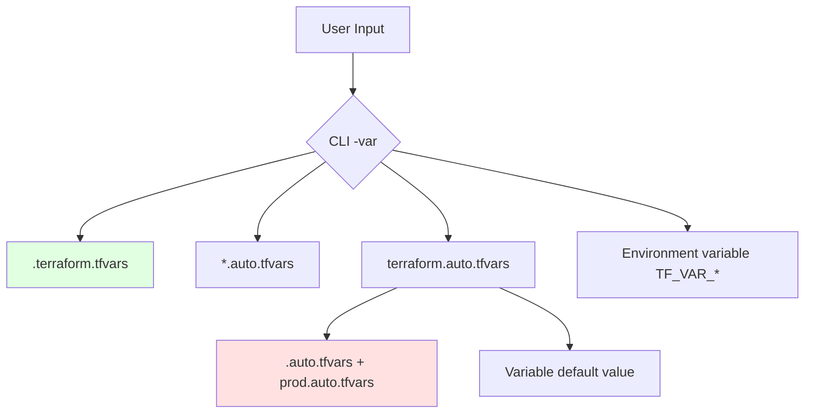

# Variable Definition Files

## Summary

**Variable definition files** (`*.tfvars` files) provide a way to set variable values without modifying main Terraform files. Terraform automatically loads any file ending in `.tfvars` or `.auto.tfvars` suffix. This enables environment-specific configuration, secrets management (separate uncommitted files), and cleaner separation of values from code.

## Detailed Explanation

### Variable File Types

```bash
# Standard .tfvars (not auto-loaded)
# terraform.tfvars

# Auto-loaded files (alphabetically loaded)
terraform.auto.tfvars
# prod.auto.tfvars
# staging.auto.tfvars

# Environment-specific override
dev.tfvars
# staging.tfvars
# prod.tfvars
```

### File Loading Priority



| Priority | Source | Example |
|----------|-------|---------|
| **1** | CLI `-var` flag | `terraform apply -var="region=us-east-1"` |
| **2** | `TF_VAR_*` env vars | `export TF_VAR_region=us-east-1` |
| **3** | `.auto.tfvars` | `prod.auto.tfvars` (auto-loaded) |
| **4** | `*.tfvars` (explicit) | `terraform apply -var-file=terraform.tfvars` |
| **5** | `.auto.tfvars` | `prod.auto.tfvars` (same name, overr) |
| **6** | Default value | `default = "value"` in variable block |

### Basic .tfvars File

```bash
# terraform.tfvars
region        = "us-east-1"
environment   = "production"
instance_count = 3
instance_type = "t3.micro"

# Same as CLI:
# terraform apply -var="region=us-east-1" -var="environment=production" -var="instance_count=3" -var="instance_type=t3.micro"
```

### Auto-Loaded .tfvars Files

```bash
# prod.auto.tfvars (auto-loaded)
instance_count = 5
instance_type  = "t3.large"

# dev.auto.tfvars (auto-loaded)
instance_count = 1
instance_type = "t3.micro"

# Files load in alphabetical order:
# dev.auto.tfvars
# prod.auto.tfvars
# staging.auto.tfvars
# terraform.tfvars (if exists, not auto-loaded)
```

### Environment-Specific Files

```bash
# dev.tfvars
region        = "us-east-1"
instance_count = 1

# staging.tfvars
region        = "us-west-2"
instance_count = 2

# prod.tfvars
region        = "us-east-1"
instance_count = 5
instance_type = "t3.large"

# Apply with specific environment
# terraform apply -var-file=prod.tfvars
```

### Complex Values in .tfvars

```bash
# terraform.tfvars
# Map
instance_types = {
  dev  = "t3.micro"
  prod = "t3.large"
}

# List
availability_zones = [
  "us-east-1a",
  "us-east-1b",
  "us-east-1c"
]

# Object
database_config = {
  engine     = "postgres"
  version    = "14"
  port       = 5432
}
```

### Using .tfvars Files

```bash
# Load dev variables
terraform apply -var-file=dev.tfvars

# Load production variables
terraform apply -var-file=prod.tfvars

# Override multiple variables
terraform apply \
  -var="instance_type=t3.large" \
  -var-file=custom.tfvars
```

### JSON Format .tfvars

```json
// terraform.tfvars.json (alternative JSON format)
{
  "instance_type": "t3.micro",
  "region": "us-east-1",
  "instance_count": 3
}

// Apply with JSON file
terraform apply -var-file=terraform.tfvars.json
```

### Variable Precedence

```hcl
# variable definition file overrides CLI and environment
# Priority (highest to lowest):
# 1. CLI -var flag
# 2. TF_VAR_* environment variables
# 3. *.auto.tfvars files (alphabetical)
# 4. *.tfvars files (explicit -var-file)
# 5. terraform.tfvars (explicit, alphabetical)
# 6. Variable default value
```

```bash
# Test precedence
# 1) Variable default = "dev"
terraform apply -var="environment=prod"
# Result: environment = "prod" (overrides default)

# 2) CLI -var flag beats .auto.tfvars
export TF_VAR_region=us-east-1
terraform apply -var="region=us-west-2"
# Result: region = "us-west-2" (overriding prod.auto.tfvars)
```

### CI/CD Integration

```yaml
# .github/workflows/deploy.yml
name: Deploy Infrastructure

on:
  push:
    branches: [main]
    paths:
      - 'terraform/**'

jobs:
  plan:
    runs-on: ubuntu-latest
    steps:
      - uses: actions/checkout@v3

      - name: Configure variables
        run: |
          echo "region=us-east-1" > prod.tfvars

      - name: Terraform Init
        run: terraform init

      - name: Terraform Plan
        run: terraform plan -out=tfplan

  - name: Comment plan with outputs
        run: |
          terraform output -json > outputs.json
          echo "Outputs:" >> $GITHUB_STEP_SUMMARY
          cat outputs.json >> $GITHUB_STEP_SUMMARY

  apply:
    runs-on: ubuntu-latest
    if: github.ref == 'refs/heads/main'
    steps:
      - uses: actions/checkout@v3

      - name: Configure production variables
        run: |
          echo "region=us-east-1" > prod.tfvars

      - name: Terraform Apply
        run: terraform apply -auto-approve
```

### Best Practices

```hcl
# ✅ DO: Use .tfvars for environment-specific values
# prod.tfvars for production
# dev.auto.tfvars for development

# ✅ DO: Separate secrets into untracked files
# secrets.tfvars (not committed to git)
# Add to .gitignore

# ✅ DO: Document all variables in .tfvars
# Include comments explaining each variable

# ❌ DON'T: Commit .tfvars files with secrets
# .gitignore prevents accidental commits

# ✅ DO: Use meaningful variable names in .tfvars
# project_name, environment, instance_count

# ❌ DON'T: Use .auto.tfvars for files committed to git
# Auto-loaded files override explicitly specified files

# ✅ DO: Use JSON .tfvars for automation
# terraform.tfvars.json for CI/CD generation

# ❌ DON'T: Mix CLI vars and .tfvars for same value
# Leads to confusion about which value wins
```

### Complete Example

```bash
# terraform.tfvars
# Production environment
region        = "us-east-1"
environment   = "production"
instance_count = 5
instance_type = "t3.large"

# Tags for all resources
tags = {
  Environment = "production"
  ManagedBy   = "Terraform"
}

# Database configuration
database = {
  engine     = "postgres"
  version    = "14"
  instance_class = "db.t3.micro"
}
```

```hcl
# main.tf
variable "environment" {
  type    = string
  default = "dev"

  # Default empty - relies on .tfvars
variable "instance_count" {
  type    = number
}

# Load .tfvars file based on environment
# terraform automatically loads:
# - dev.auto.tfvars (if exists) OR terraform.tfvars
# - prod.auto.tfvars (if exists) OR terraform.tfvars
```

resource "aws_instance" "web" {
  count         = var.instance_count
  instance_type = var.instance_type

  tags = merge(var.tags, {
    Name = "${var.environment}-web-${count.index}"
  })
}
```

```bash
# Select environment to deploy
# Dev environment
terraform apply -var-file=dev.auto.tfvars

# Production environment
terraform apply -var-file=prod.auto.tfvars
```

## Interview Questions

**Q: What are .tfvars files in Terraform?**
**A:** `.tfvars` files contain variable definitions (without `variable` blocks). Terraform auto-loads any file with `.tfvars` suffix (`terraform.tfvars`, `prod.auto.tfvars`) plus any file ending in `.tfvars`. Used for environment-specific configuration and separating values from code without modifying main `.tf` files.

**Q: What's the difference between `.tfvars` and `.auto.tfvars` files?**
**A:** `.tfvars` files are NOT auto-loaded, must be explicitly specified with `-var-file`. `.auto.tfvars` files are automatically loaded in alphabetical order. If multiple `.auto.tfvars` files have same name (e.g., `prod.auto.tfvars` from different directories), last loaded wins. Recommended: use `.auto.tfvars` with unique names.

**Q: How do variable definition files integrate with Terraform's state management?**
**A:** Variable values from `.tfvars` files are treated like any other variable source. When you run `terraform apply`, Terraform merges all variable sources (CLI vars, `.tfvars` files, environment vars, defaults). State file records which source provided each value. Changing variable source (e.g., from `.tfvars` to default) changes plan, affecting apply.

**Q: Can you use JSON format for Terraform .tfvars files?**
**A:** Yes, Terraform supports `terraform.tfvars.json` file with JSON syntax. Useful for: 1) Programmatic generation of `.tfvars` files in CI/CD, 2) Tools that output JSON naturally, 3) Easier for complex data structures (lists, objects), 4) Copy-pasting from documentation examples.

**Q: What are best practices for organizing .tfvars files?**
**A:** Best practices: 1) Use separate files per environment (`dev.tfvars`, `prod.tfvars`), 2) Use `.auto.tfvars` for environments deployed regularly (CI/CD, pipelines), 3) Never commit `.tfvars` files with secrets (add to `.gitignore`), 4) Document all variables with comments, 5) Use meaningful variable names, 6) Organize logically (group related variables), 7) Validate `.tfvars` with `terraform validate` before using.

**Q: How do you override variables from `.tfvars` files with CLI flags?**
**A:** CLI `-var` flags have highest priority, overriding `.tfvars`, environment variables, and default values. Example: `terraform apply -var="region=us-west-2" -var="instance_count=10"` overrides region and instance_count from `.tfvars` file. Useful for one-off changes or testing without modifying `.tfvars` files.

**Q: What's the relationship between environment variables (TF_VAR_*) and .tfvars files?**
**A:** Both can set variables. `TF_VAR_region=us-east-1` and `region = "us-east-1"` in `.tfvars` file produce same result. Difference: Environment variables are available globally (shell session), `.tfvars` files are per-directory and project-scoped. Choose based on use case: env vars for local development, `.tfvars` for CI/CD.

**Q: How do you handle sensitive data in .tfvars files?**
**A:** Best practice: Don't put secrets in `.tfvars` files at all. Options: 1) Use environment variables (`TF_VAR_db_password`) and reference in config, 2) Use secret managers (Vault, AWS Secrets Manager, SSM Parameter Store), 3) Commit `.tfvars.secrets` file to git but add to `.gitignore`, 4) Use Terraform data sources for secrets (`data "aws_secretsmanager_secret"`).

**Q: Can you use expressions or functions in .tfvars files?**
**A:** Yes, `.tfvars` files support Terraform expressions and functions, just like regular `.tf` files. Example: `instance_count = var.instance_count * 2` or `instance_type = var.environment == "prod" ? "t3.large" : "t3.micro"`. All expressions are evaluated at plan time.

**Q: How does Terraform handle multiple `.tfvars` files?**
**A:** Terraform loads all `.tfvars` files it finds in alphabetical order. If multiple files define the same variable, the last loaded wins. This allows `base.tfvars` for defaults with environment-specific overrides (`dev.auto.tfvars`, `prod.auto.tfvars`). Use unique names to avoid conflicts across different directories.
