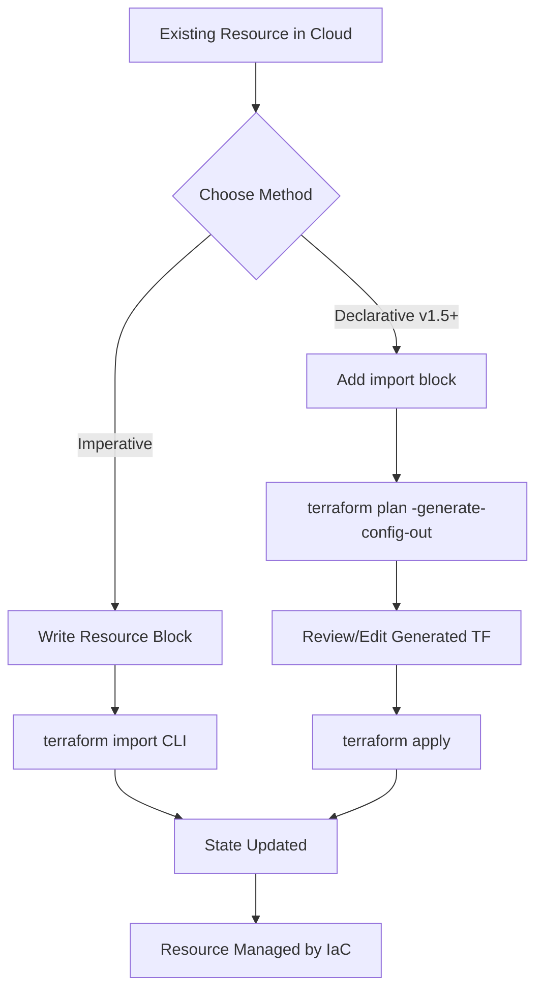

# Import Existing Resources

## Summary

**Terraform Import** is the process of bringing existing infrastructure—manually created via a cloud console, CLI, or other tools—under Terraform management. It bridges the gap between unmanaged resources and Infrastructure as Code (IaC). Importing maps real-world resource IDs to Terraform state addresses, allowing Terraform to track and manage their lifecycle (updates, deletions, etc.).

## Detailed Explanation

### Workflow Diagram



Historically, Terraform import was a purely CLI-driven, imperative process. Since Terraform **v1.5.0**, a declarative **`import` block** was introduced, significantly simplifying the workflow by allowing code generation and plan-driven imports.

### 1. `terraform import` (CLI Command)
- **Nature**: Imperative/Procedural.
- **Workflow**: Requires you to manually write the `resource` block in your `.tf` files first, then run the command to link it to the state.
- **Immediate Action**: Modifies the state file immediately upon success.
- **Limitation**: Does not generate configuration; you must guess or reverse-engineer the resource attributes to match the state.

### 2. `import` Block (HCL Primitive - Recommended)
- **Nature**: Declarative.
- **Workflow**: You add an `import` block to your configuration.
- **Deferred Action**: State is only updated during `terraform apply`.
- **Code Generation**: Can automatically generate the `resource` configuration using `terraform plan -generate-config-out`.

### Comparison Table

| Feature | `terraform import` CLI | `import` Block (v1.5+) |
| :--- | :--- | :--- |
| **Configuration** | Must exist before import | Can be generated automatically |
| **State Update** | Immediate | During `terraform apply` |
| **Workflow** | CLI-driven (imperative) | Code-driven (declarative) |
| **Visibility** | Hidden in command history | Visible in code (as a record) |
| **Best for** | Quick, single-resource fixes | Bulk imports, new environments |

---

## Go (Golang) Application: Custom Providers

When developing a custom Terraform provider in Go, you must implement the import logic for your resources.

### Plugin Framework (Modern)
In the `terraform-plugin-framework`, a resource implements the `resource.ResourceWithImportState` interface.

```go
import (
	"context"
	"github.com/hashicorp/terraform-plugin-framework/path"
	"github.com/hashicorp/terraform-plugin-framework/resource"
)

func (r *myResource) ImportState(ctx context.Context, req resource.ImportStateRequest, resp *resource.ImportStateResponse) {
	// Simple passthrough: maps the 'id' provided in the command to the 'id' attribute in state
	resource.ImportStatePassthroughID(ctx, path.Root("id"), req, resp)
}
```

For complex IDs (e.g., `project/region/name`), you can manually parse the input:

```go
func (r *complexResource) ImportState(ctx context.Context, req resource.ImportStateRequest, resp *resource.ImportStateResponse) {
	idParts := strings.Split(req.ID, "/")

	if len(idParts) != 2 {
		resp.Diagnostics.AddError("Invalid ID", "Expected project/name")
		return
	}

	resp.Diagnostics.Append(resp.State.SetAttribute(ctx, path.Root("project"), idParts[0])...)
	resp.Diagnostics.Append(resp.State.SetAttribute(ctx, path.Root("name"), idParts[1])...)
}
```

### SDKv2 (Legacy)
In `terraform-plugin-sdk/v2`, the `Importer` field is defined within the `schema.Resource` struct.

```go
Importer: &schema.ResourceImporter{
	State: schema.ImportStatePassthrough,
},
```

---

## The Import Process (v1.5+)

The modern workflow using the `import` block follows these steps:

### Step 1: Add the `import` block
Define which resource you want to import and where it should live in your state.

```hcl
import {
  to = aws_instance.example
  id = "i-1234567890abcdef0"
}
```

### Step 2: Generate Configuration
Run the plan command with the `-generate-config-out` flag. Terraform will query the provider for the resource's current settings and write the HCL code to the specified file.

```bash
terraform plan -generate-config-out=generated_resources.tf
```

### Step 3: Review and Refine
Inspect `generated_resources.tf`. Terraform often generates all possible attributes (including defaults). You should:
- Remove unnecessary or default attributes.
- Replace hardcoded values with variables or references.
- Ensure the configuration matches your organizational standards.

### Step 4: Apply the Import
Run `terraform apply` to finalize the mapping in the state file.

```bash
terraform apply
```

*Note: After a successful apply, the `import` block can be removed from your code, as the resource is now tracked in the state.*

---

## Best Practices

1. **State Backup**: Always backup your state file before performing imports, especially when using the legacy CLI command.
2. **Review Generated Code**: Never blindly accept generated config. It may include deprecated fields or environment-specific values (like hardcoded IDs) that should be variables.
3. **Provider Documentation**: Each resource has a specific "Import" section at the bottom of its documentation page in the Terraform Registry. Check this for the correct ID format (e.g., some resources require `vpc_id:subnet_id`).
4. **Incremental Imports**: Import resources in logical groups (e.g., VPC first, then subnets, then instances) to manage dependencies correctly.
5. **Handle Drift**: If the resource was modified manually, importing it will capture its *current* state. Ensure your final config matches what you want to maintain, or Terraform will try to "revert" manual changes on the next apply.

---

## Code Examples

### Example A: Importing an S3 Bucket (Declarative)

```hcl
# 1. Add this to your main.tf
import {
  to = aws_s3_bucket.legacy_data
  id = "my-existing-bucket-name"
}

# 2. Run: terraform plan -generate-config-out=s3.tf
# 3. Review s3.tf and run: terraform apply
```

### Example B: Legacy CLI Import

```bash
# First, create an empty resource block in your code:
# resource "aws_vpc" "main" {}

terraform import aws_vpc.main vpc-0a1b2c3d4e5f6g
```

---

## Interview Questions

**Q: What is the main difference between `terraform import` and the `import` block?**
**A:** `terraform import` is a CLI command that modifies state immediately and requires manual config creation. The `import` block is a declarative code element that supports automatic config generation and only modifies state during the standard `apply` workflow.

**Q: Does importing a resource into Terraform create the resource in the cloud?**
**A:** No. Import only maps *existing* infrastructure into the Terraform state. It assumes the resource already exists.

**Q: Can you import multiple resources at once?**
**A:** Yes, by defining multiple `import` blocks in your HCL files and running a single `terraform plan/apply`. The legacy CLI command only supports one resource at a time.

**Q: What happens if you run `terraform plan` after adding an `import` block but without the `-generate-config-out` flag?**
**A:** If the `resource` block already exists, Terraform will show a plan to import it. If the `resource` block is missing, Terraform will return an error stating that the target address does not exist.

**Q: Why might you keep an `import` block in your code?**
**A:** While usually removed after the first apply, keeping it (with the ID) can serve as documentation or ensure that if the state is ever lost or recreated, the resource is explicitly mapped rather than being recreated.

---

## Roadmap Context

In the [roadmap.sh/devops](https://roadmap.sh/devops) and [roadmap.sh/terraform](https://roadmap.sh/terraform) guides, **Importing Resources** is a critical skill under **State Management**. It is essential for:
- **Cloud Migration**: Moving legacy workloads to IaC.
- **Refactoring**: Moving resources between modules or state files.
- **Disaster Recovery**: Re-syncing state if a backend fails without backups.

